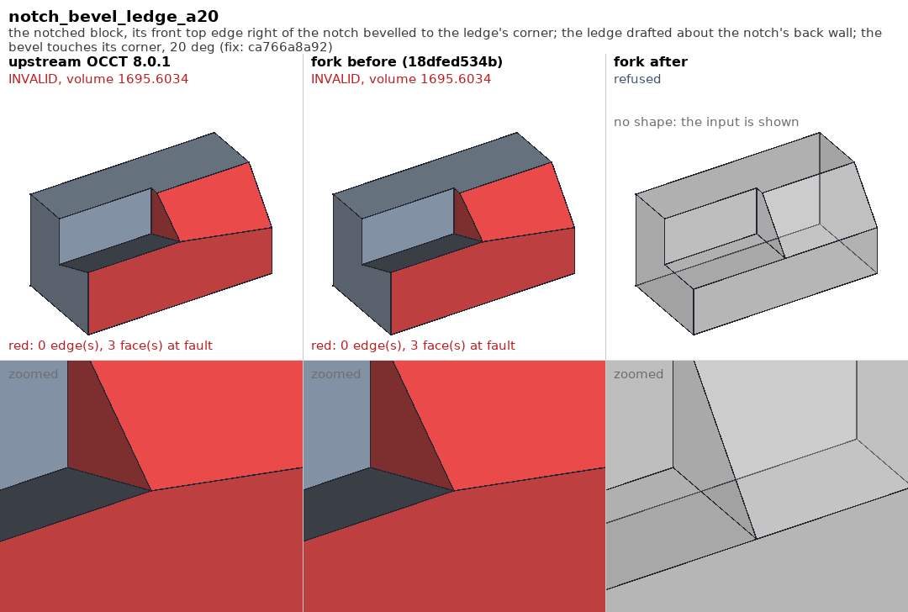
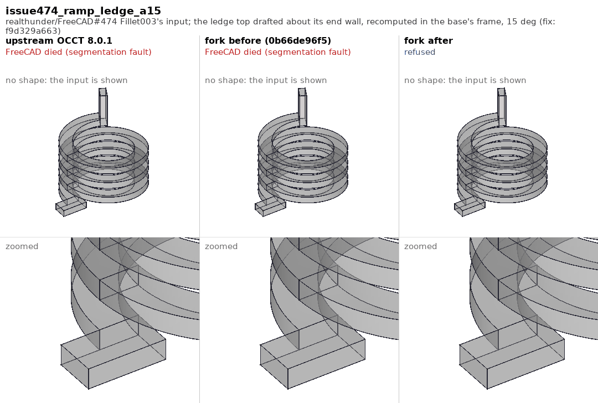
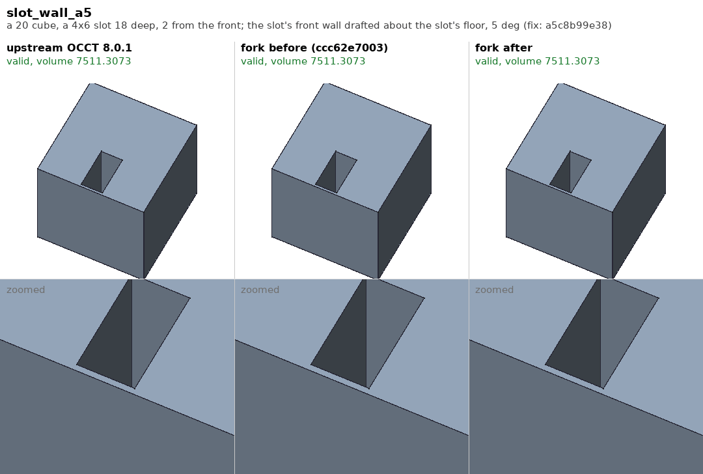
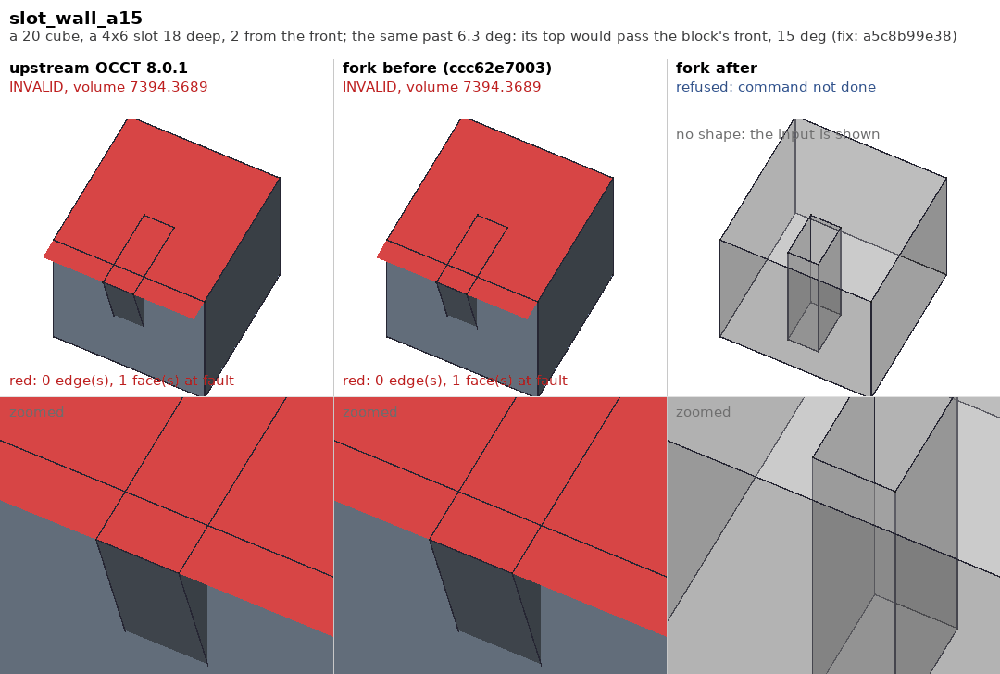
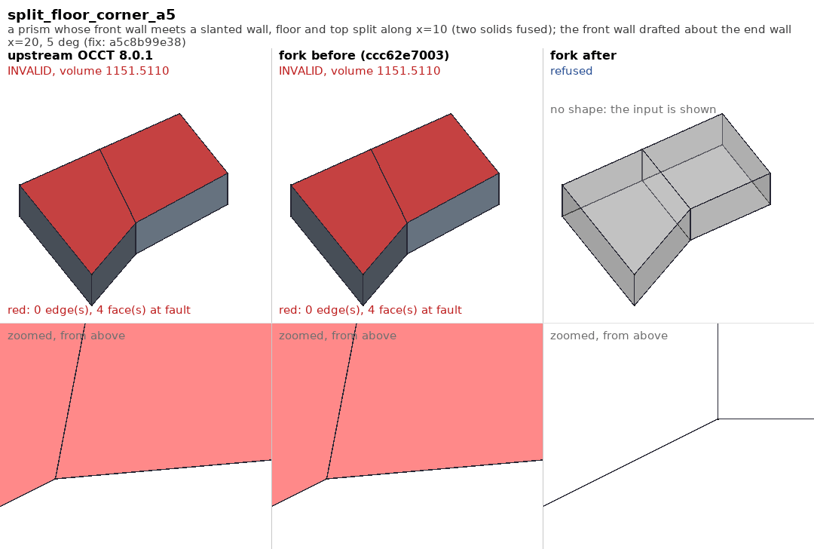
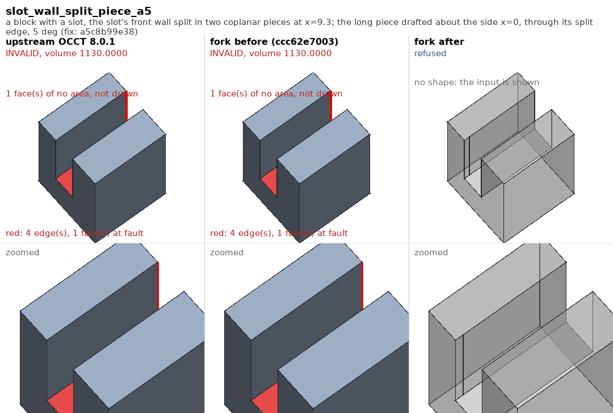
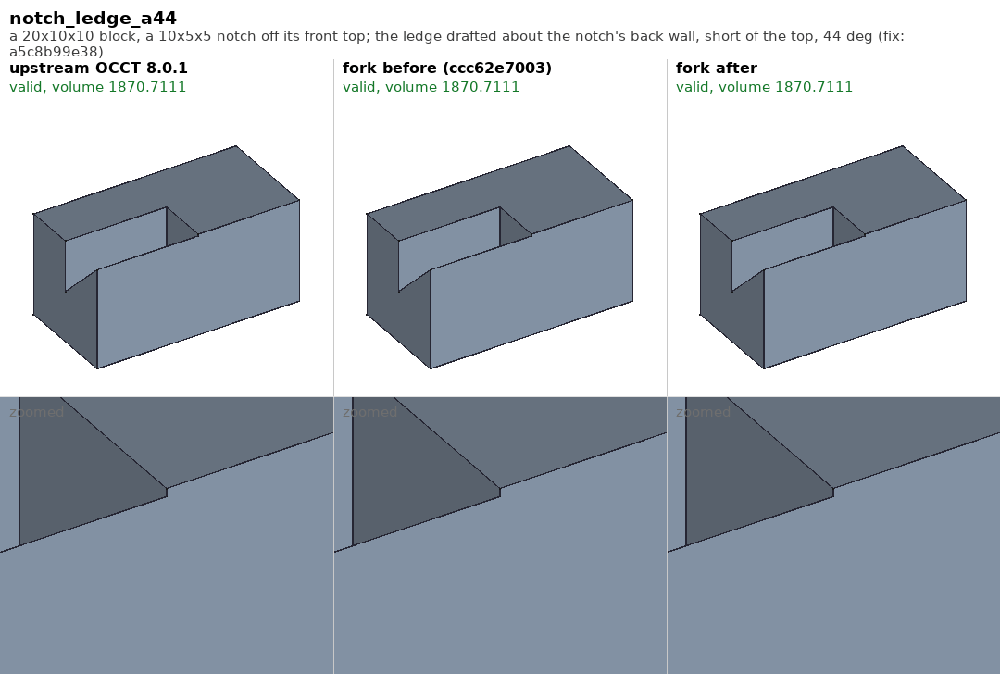
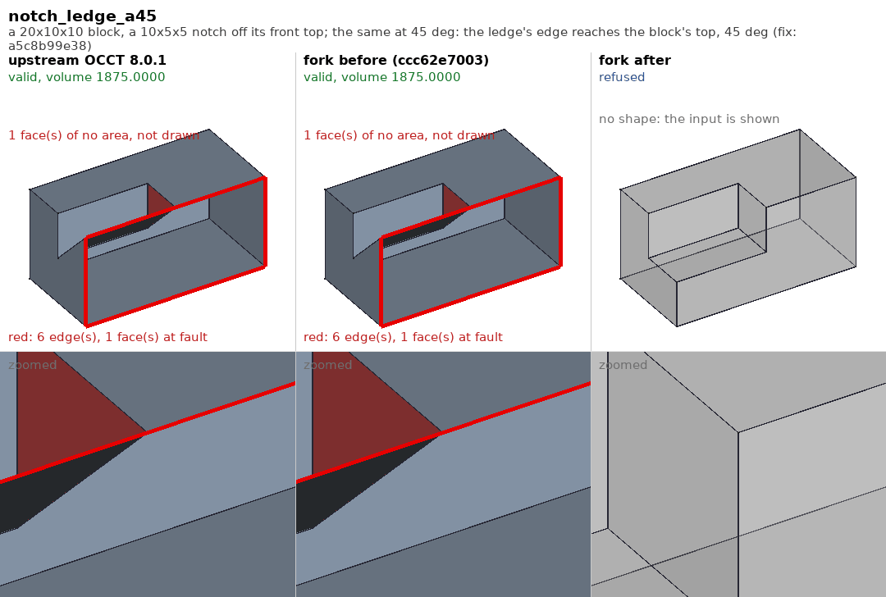
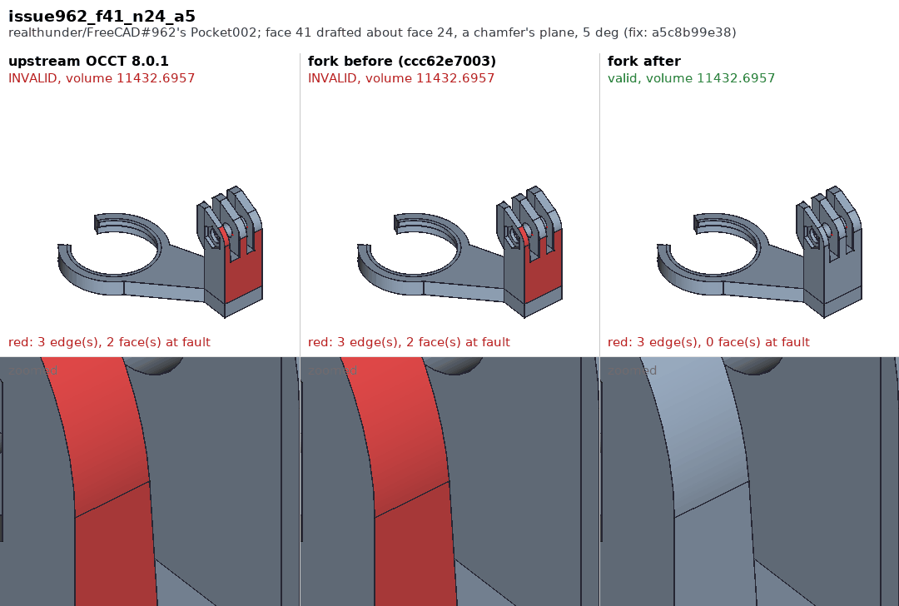

# Drafts in the OCCT fork, before and after

FreeCAD's Draft -- `PartDesign::Draft` -- is OCCT's
`BRepOffsetAPI_DraftAngle`, the `Draft` package in `TKOffset`. It is a
geometry-only modification (`Draft_Modification`, a `BRepTools_Modifier`):
each face gets a new surface, each edge a new curve and each vertex a new
point, and the topology stays as it was. A draft that needs an edge added
or taken away therefore cannot be made by it -- and upstream hands such a
draft back anyway, as an invalid solid, which PartDesign does not check. This
page shows each fix the fork makes to drafts, in pictures. The case-by-case
reference and the history are `../README.md`; the suite is `../run_tests.py`.

## Reading a picture

Each picture is one case: the shape, the face drafted, the neutral plane,
the angle and the fork commit that fixed it. The draft goes through a
PartDesign Draft feature on a `Part::Feature` base, as a user's does.

Three columns:

- **upstream OCCT 8.0.1** -- upstream's `Draft` files (the fork's at
  `18dfed534b`, before it first touched them), compiled into a scratch
  `TKOffset` and loaded ahead of the installed one, the rest of the fork as
  it is.
- **fork before** -- the fork's `Draft` files at the commit just before the
  fix, the same way.
- **fork after** -- the fork as installed.

Two rows: the whole result, and the result zoomed where the fault is.

Under each column heading: "valid, volume V" in green; "INVALID, volume V"
in red; "refused" in blue -- the draft failed and PartDesign reported it,
the outcome wanted when no draft by moving the geometry exists -- or
"FreeCAD died" in red. A draft with no shape shows its input, greyed. Faces
that fail `isValid()` are drawn red; red edges are edges not used once each
way round by the faces; faces of no area are left out, and the panel says
how many.

## The fixes

### A corner moved off a face the draft does not reach (`ca766a8a92`, realthunder/FreeCAD#334)

A block with a notch off its front top; the ledge is drafted about the
notch's back wall. The block's front top edge right of the notch is
bevelled, and the bevel touches the ledge at the ledge's front corner only.
That corner is a vertex of four faces, the bevel one the draft does not
reach: the corner moves with the ledge, the bevel keeps its plane, and two
of its edges run off it -- the bevel and the faces beside it come out red, at
any angle. The true result needs a new edge there. `Draft_Modification::
Perform` now checks each vertex's new point against the surface of every
face at it and stops with `Draft_VertexRecomputation` when one misses it.
#334's own Draft001 and Draft003 are this corner; their faults lie inside
the part, where no view reaches, so the suite has them and the picture is
the notch.

### A ledge lifted off a helical ramp (`f9d329a663`, realthunder/FreeCAD#474)

#474's Fillet003 input: a flat ledge top meets a helical ramp. Drafted
about its end wall at 15 deg, the ledge lifts off the ramp; the only branch
of the plane-ramp intersection is 9 away, the edge's rebuilt curve came out
null, and FreeCAD died on it -- once the Draft is recomputed in its base's
frame, which every recompute after the first is. `SmartParameter` now says
when the rebuild fails, and the draft is refused.

### Drafts that need a new edge, and a vertex a hair off its edge (`d834f16cb0`, `88571c23a3`, `a5c8b99e38`, realthunder/FreeCAD#962)

A draft sweep -- every planar face of 29 shapes against each planar face
beside it as the neutral plane, at 5, 15 and 60 deg, 8982 drafts -- left
893 invalid results after the two fixes above. Three commits leave none:
854 are refused, 39 come out valid, and the 3510 valid results are the same
to the last digit.

A slot 2 from a block's front, its front wall drafted about the slot's
floor. At 5 deg the wall's top swings 1.6 toward the front: a valid result
in all three columns, 2 x 18^2 tan(a) taken out.

Past 6.3 deg the top would pass the block's front: the true result needs
the slot to break through, new edges. Upstream drafts the wall anyway, and
the top face's outline runs out past the front and crosses itself. The
draft never touches the top face, so no test of a vertex or an edge sees
this -- the commonest invalid result of the sweep (663 of 893, most at 60
deg). `BRepOffsetAPI_DraftAngle::Build` now checks every face the draft
rebuilt; one valid in the input and invalid in the result makes the draft
not done.

A wall split in coplanar pieces -- two solids fused, not refined -- keeps
its split edge, which the draft leaves alone. Here the floor and the top
are split along x=10 from the corner where the front wall meets a slanted
wall; the front wall is drafted about the end wall. The corner slides along
the slanted wall, 1.75 past the split, while the split edge stays on x=10:
seen from above, the top's split edge is skewed to reach the corner it has
lost. `Perform` now checks each vertex's new point against the curve of
every edge the draft leaves alone, as it did against the faces.

One piece of a slot's wall, split at x=9.3, drafted about the side x=0: the
piece swings about its edge on the side, and its edge on the split -- the
line where the drafted piece meets the other piece -- becomes that same
line. The piece's top and bottom edges shrink to points and the face to
nothing (not drawn); the solid's volume is the input's. An edge the draft
shrinks to a point is refused now, as one that turns round already was.

The same check meets the notch's ledge (the #334 block without the bevel)
drafted until its front edge reaches the block's top, at 45 deg: the notch's
front edge shrinks to nothing. The result passed `isValid()` in memory, with
a zero-length edge; written and read back -- as it is to draw it -- a face
of no area and red edges remain. At 44 deg all three columns agree.

#962's Pocket002, a wall drafted about a chamfer's plane: the corner of a
split edge is placed by another edge's curve and misses the split edge by
3.4e-7, three times its tolerance -- the two faces at it red, though
nothing is wrong to the eye. `Draft_Modification::NewPoint` now gives the
vertex a tolerance covering its distance to each of its edges' curves, up to
the 100 times its tolerance `Perform` accepts. The result is valid, the
volume unchanged.

## Making the pictures

`tests/fork/draft/pictures/make_pictures.sh` does it all, on macOS or Linux:

1. The fillet pictures' `mkold.sh` builds a scratch `TKOffset` per column,
   the `Draft` files (`DRAFT_FILES` in `cases.py`) as of the column's commit
   and the rest as the build tree has it, from the tree's own compile
   commands.
2. `compute.py` drafts one case of `cases.py` per `FreeCADCmd` process --
   a build that dies on a case (#474's before) loses that case only -- with
   the libraries loaded ahead of the installed ones (`DYLD_LIBRARY_PATH`,
   set inside the run wrapper, on macOS; `LD_PRELOAD` on Linux), keeping the
   input, the result and a `.json` of what came out.
3. `compose.py jobs` lists the panels, the fillet pictures' `render.py`
   draws them in the FreeCAD GUI, and `compose.py` lays them out.

`../../fillet/pictures/doc_html.py <out.html> draft` renders this page.
