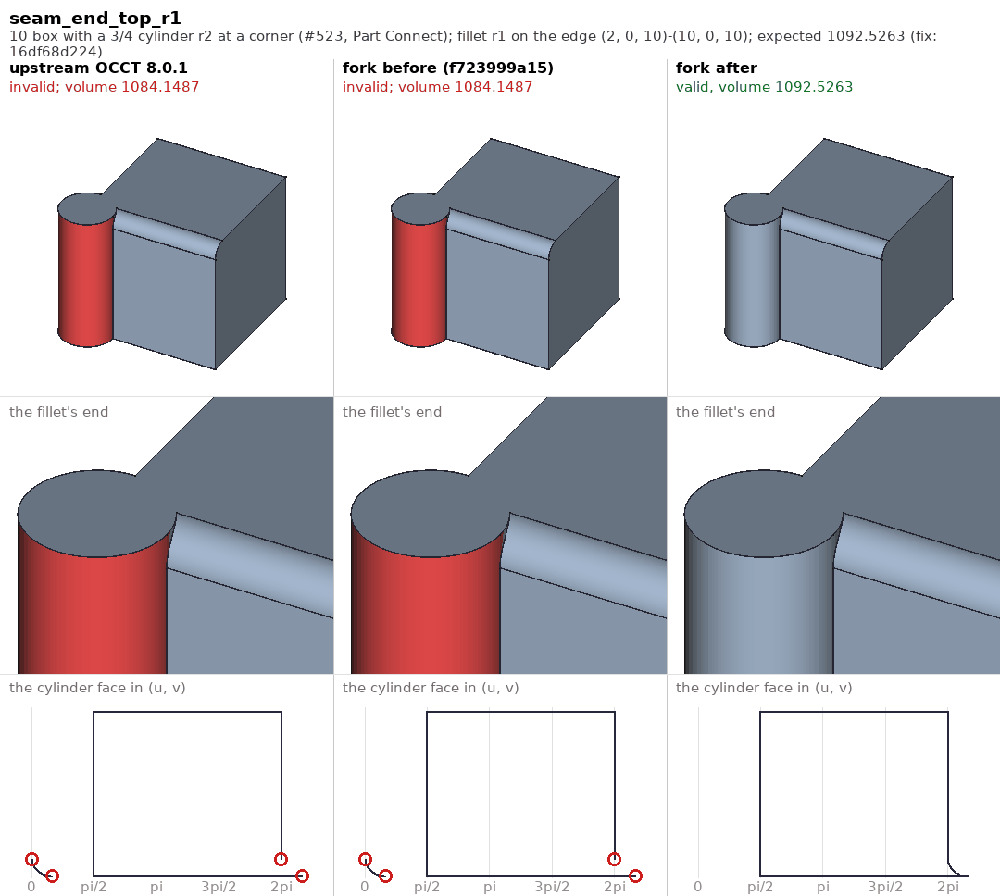
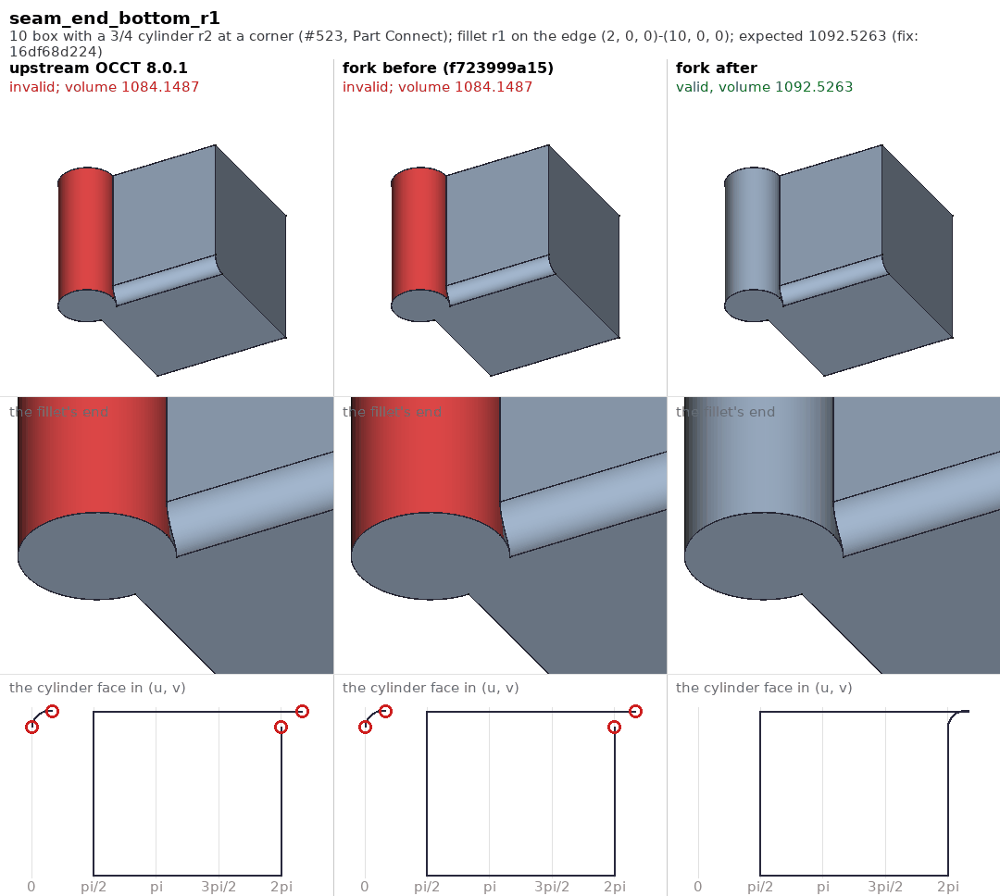
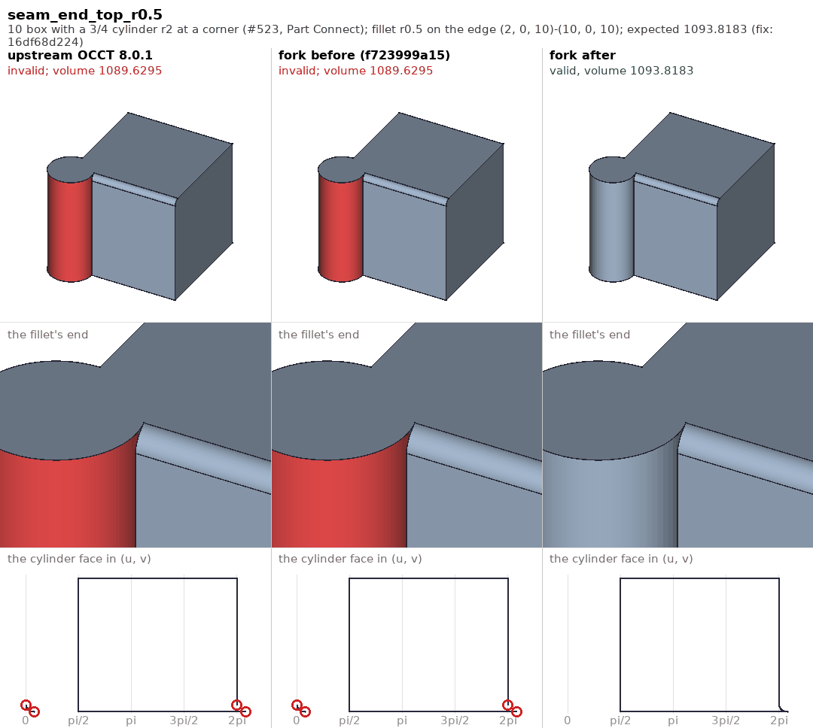
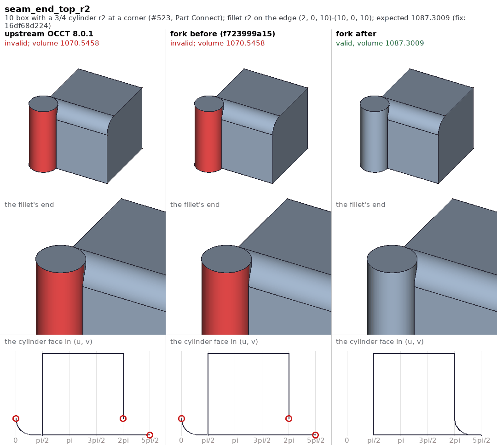

# Fillets in the OCCT fork, before and after

FreeCAD's Fillet -- `Part::Fillet`, `PartDesign::Fillet`, `Shape.makeFillet()`
-- is OCCT's `BRepFilletAPI_MakeFillet`, the `ChFi3d` builder in `TKFillet`.
Fillets, chamfers and drafts are among FreeCAD's most reported kernel
failures; `../../occ-issues/` holds the reports with their models. This page
shows each fix the fork makes to fillets, in pictures. The case-by-case
reference and the history are `../README.md`; the suite is
`../run_tests.py`.

## Reading a picture

Each picture is one case of the suite: the shape, the edge filleted (by its
two ends), the radius, the expected volume and the fork commit that fixed it.

Three columns:

- **upstream OCCT 8.0.1** -- upstream's `TKFillet` files at the fork's base
  (`91be8c4c71`), compiled into a scratch `TKFillet` and loaded ahead of the
  installed one, the rest of the fork as it is.
- **fork before** -- the fork's `TKFillet` at the commit just before the fix
  (named in the heading), the same way.
- **fork after** -- the fork now.

Three rows:

- the whole result;
- the result zoomed on the fillet's end, where the fault is;
- the face at the fillet's end drawn in its own (u, v) parameters -- each
  edge's pcurve on it, as the face's wire holds the edge, which is what
  `BRepCheck` reads. A closed wire is a closed outline; an end of a pcurve
  that meets no other pcurve's end is circled red. The gridlines are at
  multiples of pi/2 in u.

Under each column heading: "valid, volume V" in green, or what was wrong in
red. Faces that fail `isValid()` are drawn red; red edges are edges not
used once each way round by the faces (none in these).

## The fixes

### A seam left on a piece of a closed face (`16df68d224`, realthunder/FreeCAD#523)

The model is a 10 box with a three-quarter cylinder of radius 2 at the
corner on the z axis, joined by Part's Connect. The cylinder's seam is the
line x=2, y=0, where the cylinder meets the box's side, and the boolean kept
that line as an edge with **both** pcurves on the cylinder -- u=0 and
u=2 pi -- though the three-quarter face holds it once and runs from pi/2 to
2 pi. A fillet on the box edge along y=0, which ends at that line, comes out
"Unorientable" at every radius: the cylinder face, red in the first two
columns, does not close. Its third row shows why: the cap the fillet's end
cuts out of the cylinder was computed near u=0, a period away from the face,
four ends open. After the fix the cap continues the face past 2 pi and the
outline closes.

`ChFi3d_Builder::PerformOneCorner` read the pcurve of the edge at the
fillet's end with `BRep_Tool::CurveOnSurface`, which, for an edge with two
pcurves on the face's surface, chooses by the orientation of the edge it is
handed; it was handed the edge as the fillet data carries it, not as the
face holds it. Now an edge closed on the face but not really closed
(`BRepTools::IsReallyClosed`) is read as the face holds it.

The geometry is the same in all three columns, which is the point: nothing
in the shape looked wrong, the face's parameters were. The fixed volumes
equal those of the same fillet on the edge across the box's diagonal, which
does not end on a seam (1092.5263 at radius 1).

At radius 2, the cylinder's own radius, the cap reaches the face's far end
as well (u = 5 pi/2, which is pi/2 a period on). The top is right now; the
bottom, its mirror image, is still invalid (`seam_end_bottom_r2`, XFAIL).

### A fillet line collapsed to a point (`214d858dc3`)

Not pictured: there is no result to show. A fillet of radius 2 on the
cylinder's top or bottom arc has no line on the top face, only a point; the
corner code dereferenced the missing curve and the process died. It is
refused now (`StdFail_NotDone`); the suite's `arc_*_r2_no_crash`.

## Making the pictures

`tests/fillet/pictures/make_pictures.sh` does it all, on Linux or macOS;
a few minutes, most of it building one library per column:

1. `mkold.sh` builds scratch `TKFillet` libraries -- upstream's files that
   differ from the fork, at `91be8c4c71`, and the fork's sources at each
   stage's "before" commit (`STAGES` in `cases.py`) -- from the build tree's
   own compile commands (`oldbuild.py`).
2. `compute.py` runs every case of `cases.py` under `FreeCADCmd`, once per
   library set and once on the fork as built, keeping each result as a
   `.brep`, the (u, v) outline of the face `UVFACE` picks, and a
   `results.json`. The libraries are loaded ahead of the installed ones with
   `LD_PRELOAD` on Linux and `DYLD_LIBRARY_PATH` on macOS -- set inside the
   run wrapper with `env`, since macOS strips `DYLD_*` from `/bin/bash`.
3. `compose.py jobs` lists the panels, `render.py` draws them in the FreeCAD
   GUI (under `xvfb-run` on Linux; on macOS on the display, run as a
   `.FCMacro`), and `compose.py` lays them out with the (u, v) row (Pillow,
   from the FreeCAD conda env).

The renderer draws with Coin, not the bgfx renderer: on macOS `saveImage`
cannot capture a Metal frame and falls back to a black one. Edges are marked
red by counting their uses through the faces' wires; `isSeam()` would count
an edge like #523's leftover seam twice in a face that holds it once.
