# Fillets in the OCCT fork, before and after

FreeCAD's Fillet -- `Part::Fillet`, `PartDesign::Fillet`, `Shape.makeFillet()`
-- is OCCT's `BRepFilletAPI_MakeFillet`, the `ChFi3d` builder in `TKFillet`.
Fillets, chamfers and drafts are among FreeCAD's most reported kernel
failures; `../../occ-issues/` holds the reports with their models. This page
shows each fix the fork makes to fillets, in pictures. The case-by-case
reference and the history are `../README.md`; the suite is
`../run_tests.py`.

## Reading a picture

Each picture is one case of the suite: the shape, the edge filleted (by its
two ends), the radius, the expected volume and the fork commit that fixed it.

Three columns:

- **upstream OCCT 8.0.1** -- upstream's `TKFillet` files at the fork's base
  (`91be8c4c71`), compiled into a scratch `TKFillet` and loaded ahead of the
  installed one, the rest of the fork as it is -- but for the files of other
  toolkits a fix here changed, which are upstream's too (`GeomPlate`'s, in
  `TKGeomAlgo`).
- **fork before** -- the fork's `TKFillet` (and, for a fix outside it, that
  toolkit) at the commit just before the fix (named in the heading), the
  same way.
- **fork after** -- the fork now.

Three rows:

- the whole result;
- the result zoomed on the fillet's end, where the fault is;
- one face of the result drawn in its own (u, v) parameters, the face the
  fault is in (its label names it) -- each edge's pcurve on it, as the
  face's wire holds the edge, which is what `BRepCheck` reads. A closed wire
  is a closed outline; an end of a pcurve that meets no other pcurve's end
  is circled red. On a cylinder the gridlines are at multiples of pi/2 in u.

Under each column heading: "valid, volume V" in green, or what was wrong in
red. Faces that fail `isValid()` are drawn red; red edges are edges not
used once each way round by the faces.

## The fixes

### A seam left on a piece of a closed face (`16df68d224`, realthunder/FreeCAD#523)

The model is a 10 box with a three-quarter cylinder of radius 2 at the
corner on the z axis, joined by Part's Connect. The cylinder's seam is the
line x=2, y=0, where the cylinder meets the box's side, and the boolean kept
that line as an edge with **both** pcurves on the cylinder -- u=0 and
u=2 pi -- though the three-quarter face holds it once and runs from pi/2 to
2 pi. A fillet on the box edge along y=0, which ends at that line, comes out
"Unorientable" at every radius: the cylinder face, red in the first two
columns, does not close. Its third row shows why: the cap the fillet's end
cuts out of the cylinder was computed near u=0, a period away from the face,
four ends open. After the fix the cap continues the face past 2 pi and the
outline closes.

`ChFi3d_Builder::PerformOneCorner` read the pcurve of the edge at the
fillet's end with `BRep_Tool::CurveOnSurface`, which, for an edge with two
pcurves on the face's surface, chooses by the orientation of the edge it is
handed; it was handed the edge as the fillet data carries it, not as the
face holds it. Now an edge closed on the face but not really closed
(`BRepTools::IsReallyClosed`) is read as the face holds it.

The geometry is the same in all three columns, which is the point: nothing
in the shape looked wrong, the face's parameters were. The fixed volumes
equal those of the same fillet on the edge across the box's diagonal, which
does not end on a seam (1092.5263 at radius 1).

At radius 2, the cylinder's own radius, the cap reaches the face's far end
as well (u = 5 pi/2, which is pi/2 a period on). The top is right now; the
bottom, its mirror image, stayed invalid -- not for its geometry, which is
the top's, but for a crossing of 2e-9 that BRepCheck saw on one and not the
other -- until "A corner's curve kept on its face", below.

### A fillet line collapsed to a point (`214d858dc3`)

Not pictured: there is no result to show. A fillet of radius 2 on the
cylinder's top or bottom arc has no line on the top face, only a point; the
corner code dereferenced the missing curve and the process died. It is
refused now (`StdFail_NotDone`); the suite's `arc_*_r2_no_crash`.

### A corner whose faces are split in coplanar pieces (`cf96757c36`, realthunder/FreeCAD#962)

A PartDesign body without Refine keeps a wall as several coplanar faces, cut
apart by the booleans that made it. #962's Fillet (radius 0.8, twelve edges)
was invalid, and five of its edges were invalid alone. Four of them are the
outer edges of slots cut down to a floor: the fillet ends on the floor, which
it has to extend into its end -- `PerformOneCorner`'s OnSame corner. The
slot's wall is two faces there, its piece at the outer face 0.692 wide (0.787
for the other pair of slots), and from that radius on the corner went wrong.

The corner is built from the face holding the fillet's common point on the
floor, the face on the other side, and the edge between the floor and that
other face, which is extended to the fillet. With the fillet wider than the
wall's narrow piece, the common point lies on the next piece, and the corner
took the narrow piece's own bottom edge as the edge to extend. In the
pictures the narrow piece survives whole, red, and the floor keeps its
bottom edge, dangling: the third row's open end. The fix extends the edge
between the floor and the far face, and removes the edges of the floor
between the vertex and the common point the way the filleted edge itself
goes. The block below is the same thing made small -- a slot whose wall is
split 0.7 from the outer face -- and it comes out as the unsplit slot does.

The fifth edge, 50, ends under a chamfer, and there the split is on the
other side: the wall beside the edge (y=10.2) is two faces, and the edge to
extend belongs to the other one. Its orientation in the wall was not looked
up -- it defaulted to forward -- and the wall, red, lost the fillet's line.
The third row looks the same in all three columns: the wall's outline closes
in each, and what was wrong was the direction of one of its edges, which an
outline does not show.

The most ordinary case of the three needs no slot: a fin padded flush with a
block's side, its vertical edge filleted down to the block. The outer face is
two faces, the fin's and the block's, split at the block's top, and the
fillet's line on the fin's face ends on that split. The corner moved that
end off the edge and gave the extension -- which runs along the split -- to
the fin's face: the fin's face, red, holds the whole split edge and no
fillet line (the third row's stray stroke). Now the end stays on the edge,
and the extension bounds the block's face. The volume was right all along;
only the faces were not.

### A seam two corners cut at its two ends (`b38f0d910c`, realthunder/FreeCAD#962)

With those fixed, #962's Fillet was still invalid with all twelve edges, from
two of them: the edges at the foot of the block where the arm meets it, each
fine alone. The bottom is two faces, the arm's and the block's, split along
x=38.5. The convex fillet on one edge cuts that seam short; the concave one
on the other meets the seam's line just past its end, and the corner gave
the seam that point anyway, outside the edge -- alone the face rebuild turns
that into a longer edge, but with the other corner's cut on the same edge it
built both versions, the cut one and the longer one. In the pictures the
bottom faces are red and the arm's bottom has an extra stroke along the seam
with two loose ends. Now the piece of the seam's line past its end is a
curve of its own, and the seam is left to the other corner. It happens with
the seam running one way only, as here.

### A fillet ending on a wall kept in coplanar pieces (`2ac4fee0c6`)

The two shapes of the corner fix put together: the fin flush with the
block's side, its wall split 0.7 from the outer face as the slot's. With the
fillet wider than the wall's narrow piece, its line on the wall runs on the
wide piece, whose edge on the floor stops short of the vertex the fillet
ends at. The fillet stopped where the fin's face ends, and both the restart
of its walk and the corner took that edge for an obstacle, not for the end
of the wall: the walk failed, upstream and in the fork alike, and both
columns show the input. Now the edge counts as the wall's own, reaching
the vertex through the narrow piece, and the corner is the slot's: the
narrow piece goes, and the block's top closes around the fillet's end. The
volume is the unsplit fin's.

A radius equal to the narrow piece's width, 0.7, where the fillet's line on
the wall runs along the split itself, stayed open; see the last fix below.

### A corner plate whose boundary curve missed its first surface (`2b9df66c48`, realthunder/FreeCAD#962)

Edge 36 of #962 alone, below radius 0.42. The edge is shallow -- the arm's
side meets the block's side at 21 degrees -- and at its top five faces
meet: the arm's top, the block's wall above the arm, and the block's side
going on upward as a second, coplanar face. The fillet fills that corner
with a `GeomPlate` patch. At small radii one of the patch's boundary
curves had no projection at all on the plate's first surface, and the
projection threw where the plate would have tried another surface: upstream
and the fork alike, both columns show the input. The fix is in
`GeomPlate` (`TKGeomAlgo`), so these two columns carry upstream's and the
earlier fork's `GeomPlate` as well. Now the plate falls back on a plane, and
the patch closes the fillet's end: in the zoom, the narrow fillet strip up
the edge and the small patch at its top; in the third row, the patch's
outline, closed, with a hook where two of its boundary curves meet. The
small block is the same corner made small; it failed the same way.

The fix lets five other fillets of the sweep get past their plate, and they
fail further on, as an invalid shape instead of an exception (see
`../README.md`). Also open: the same corner with the block's side one face
(`arm_on_tall_block_whole_r0.5`), invalid at every radius, before the fix
as after -- fixed since, below.

### A corner plate folded to stay tangent (`fb9200b0fd`, realthunder/FreeCAD#962)

Edge 56 of #962 alone gave a valid solid whose volume nobody could agree
on: 5.04 taken by GProp's default integration, 2.0 by its adaptive one,
3.5 by a mesh, where its mirror image, edge 50, takes 2.4 by all three.
Its foot is the five-face corner of the previous fix, filled by a
`GeomPlate` patch held tangent to the stripe. To stay tangent where the
stripe meets the faces at a sharp angle, the plate folded -- the lump at
the fillet's foot in the first two zooms -- missing its own boundary by
0.09 on a fillet of 0.8; its approximation then strayed 0.48, and the
corner kept edges of tolerance up to 1.18. Its control points reach so far
out that the face's bounding box is 158 across, on a corner of 0.8. Such
plates are common: of the 495 the every-edge sweep builds, 87 miss their
boundary by more than 0.1. A plate missing it by more than 1% of the
smallest radius at the corner -- a setting,
`ChFi3d_Builder::SetPlateG0FallbackRatio()`, FreeCAD's Part preference
`FilletPlateG0FallbackRatio`; at first a fixed 1e-3, which also creased
large fillets whose plates were tangent within half a percent -- is now
built again on positions alone and taken if it fits better: the foot
flares into the corner cleanly. The third row looks much the same in all
three columns -- the old outline's loop, where one pcurve crosses itself
near its end, is a few thousandths across, too small to see here; the zoom's lump is
what shows the fold. The volume is edge 50's.

The Fillet003 input of #474 is one of the 17 results the change turns valid:
edge 6's corner plate missed by 1.8 at radius 2, its fillet was invalid at
every radius, with a face of no area and edge tolerances up to 36. In the
third row the old plate's outline is a sliver -- its boundary curves lie
almost on one line of a surface whose bounding box is 28 across, for a
corner of 0.8.

Edge 50's and #962's whole-Fillet pictures above changed with it: their
"fork after" corners are the rebuilt plates now (tolerances 0.009 where they
were 0.195). One result went the other way -- #962's edge 33 at radius 0.3,
rejected by `BRepCheck` with the new plate. That was not the plate's fault:
see the next fix.

### A plate boundary stored backwards (`3fa9420429`, realthunder/FreeCAD#962)

Edge 33 of #962, the arm's top along its side, ends at the five-face corner
under edge 50. Upstream's fillet of it at 0.3 is valid, but GProp says it
takes 9.4 of volume where 0.55 is due -- a mesh of the same result says
0.555. The corner's plate is closed by curves laid on the faces between the
stripes' ends, each stored as running from one stripe's end to the next;
one of them, the 0.3 on the block's side y=10.2, was a projection that ran
the other way and was stored as it was. Its edge had its FORWARD vertex at
its last parameter: each vertex is on the curve where it says, so
`BRepCheck` passes it, but GProp walks the edge by its range and so
backwards, and put the block's side at 62.1 of its 69. The same curve, as a
boundary of the plate, ran head to head with the one before it, and the
plate's orientation is worked out from a polygon of the boundaries' starts:
with the G0 plate of the fix above it came out turned over -- "fork before"
draws that plate as a face of no area, and the edges round it red, each
used the same way by both faces it bounds. The projection is now reversed
before it is stored, and the orientation read with the boundaries'
directions as the plate reports them.

The zoom shows the corner: upstream's is the G1 plate, dark where it
crumples, the fork's before is missing, after it is the G0 plate. The third row, the plate's
outline, looks alike in all three; what was wrong is a direction, which an
outline does not show. The same fix gives four more edges into these corners
-- two in each of #962's Fillet and Chamfer inputs -- the volumes a mesh
gives them, and tolerances of 0.007 to 0.12 where they had the radius.

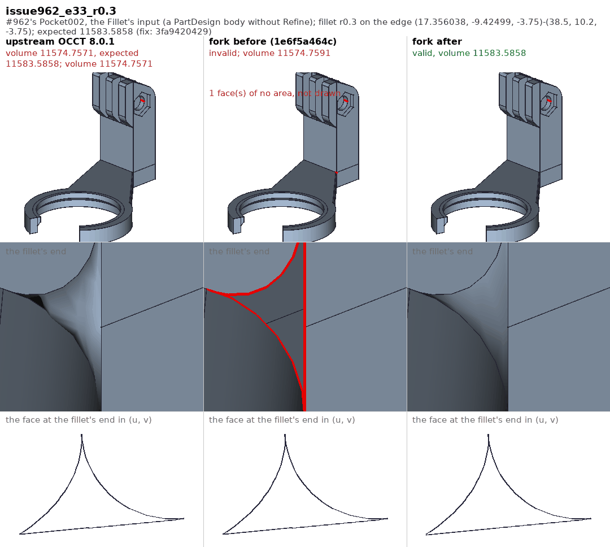

### A fillet as wide as the piece of a split wall (`98c6125b85`)

The slot and the fin of the two fixes above, their wall split 0.7 from the
outer face, at a radius within the walk's tolerance (1e-4) of 0.7: the
fillet's line on the wall runs along the split, its whole length. The walk
starts, and goes on, only at points inside both faces, and a line along
the split is on the boundary of both pieces everywhere. At 0.7 the walk
did not start: the fin's picture shows the input in both "before"
columns. Just past it, at 0.7001, it started on the wide piece, but the
line's ends fell on the split's own vertices and nothing cut the narrow
piece away: the wide piece kept the split and the fillet's line side by
side, a slit of no width, and the narrow piece stayed whole beside the
fillet. The slot's picture draws the wall red, the split's edges red, and
on the third row the block's top still holding the narrow piece's edge, a
loose end circled red. Upstream fails too, with another volume.

Now, on the far piece, a point on the split toward the piece the spine is
on counts as inside; a line along that split cuts the split away, as it
does the spine's edge; and the top corner, of three convex edges, cuts
away the narrow piece's edge on the top as the floor's corner already did.
Every radius from 0.69995 to 0.7001 gives the unsplit slot's volume, and a
chamfer of the same size, which walks the same way, comes out right with
it.

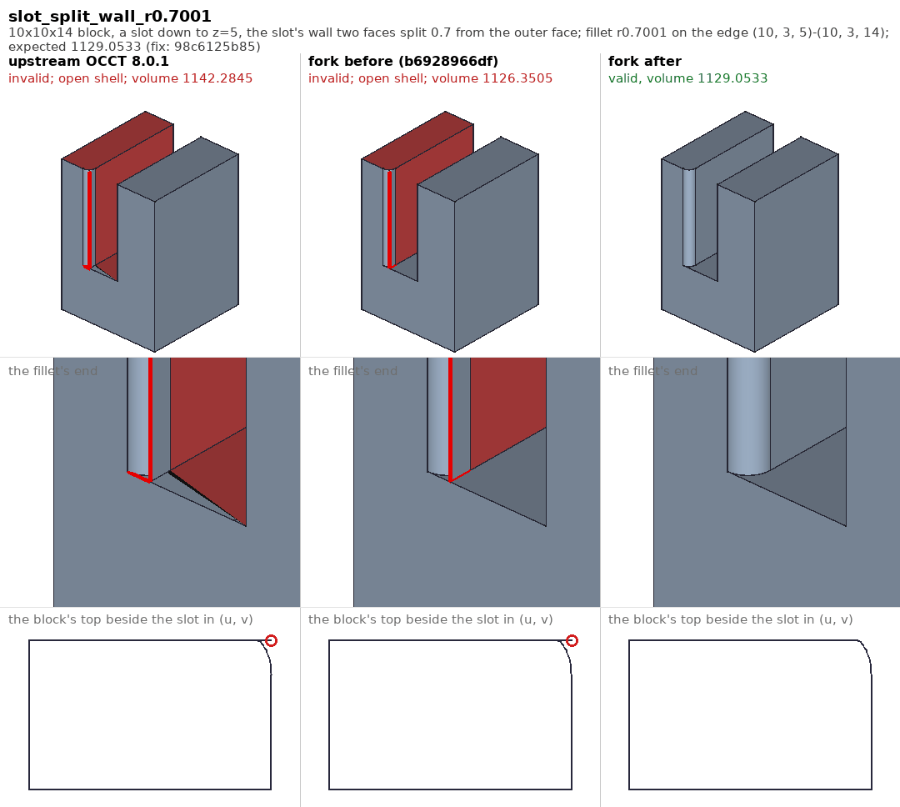

### A fillet's end under a wall that runs on past the corner (`692cae9e35`)

The small block of the plate fix above with the block's side y=27.2 left
one face, from the floor to the block's top. The fillet's line on the arm's
side stops at the arm's top; the one on the block's side runs on up the
wall. The corner stretched the arm's top out to meet it, and the arm's top
reaches under the block there: the section's arc crossed the arm top's own
edge x=38.5, and the arm top's outline crossed itself. In both "before"
columns the arm's top is drawn red, the face that fails, its shading
folded along a diagonal; zoomed on the fillet's top, it runs on as a flat
red sheet past the fillet into the block's corner. Upstream fails the same
way, with the same volume. The crossing itself is 0.375 wide at radius 2
(0.1875 r), too small to show in the third row, which draws the whole arm
top: its outline looks the same in all three columns.

Now the corner checks for that crossing first. When the arm top's other
edge runs into the corner, the line on the block's side is cut where the
arm's side ends, as a split at the arm's top would cut it, and the corner
gets the plate the split block gets: the same result to within 0.5% of
what the fillet takes -- in the zoom, the small patch where the fillet's
top meets the arm's top and the block's corner. The mirror corner, the block's edge coming down onto
the arm's top, crosses nothing -- there the stretched arm top is the
fillet's floor -- and keeps the exact plane.

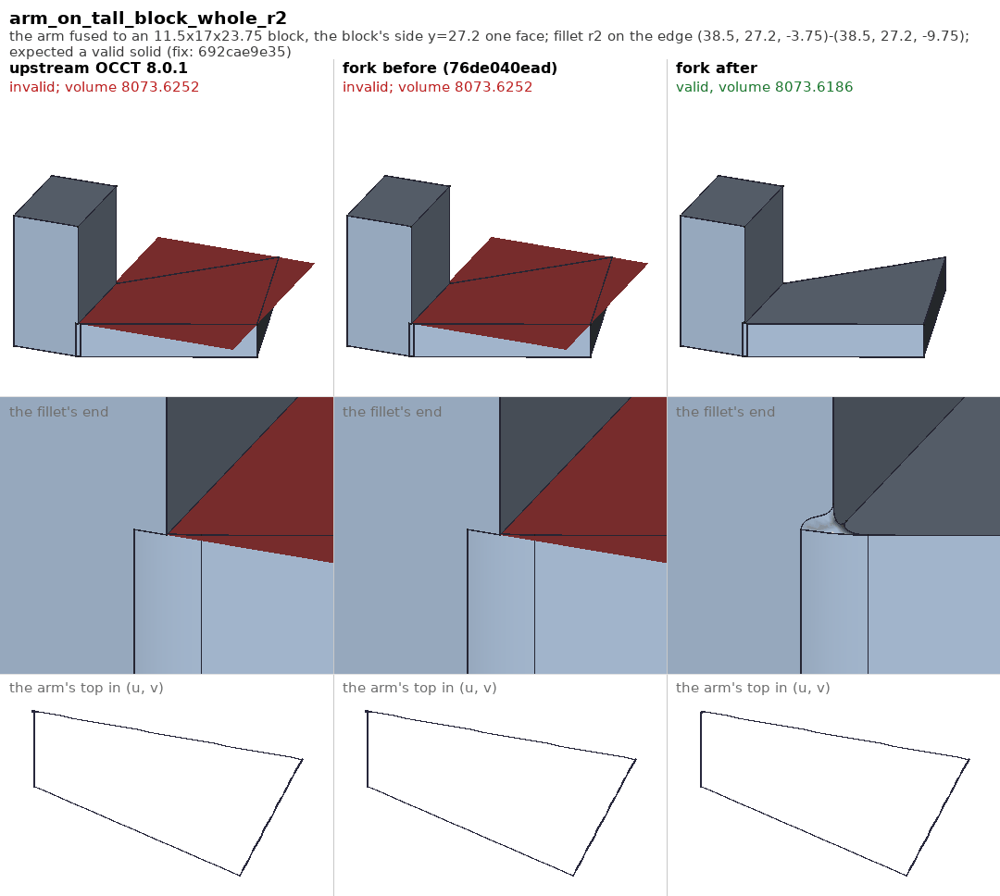

### An end point a rounding error past the line (`efbe5c99fd`, realthunder/FreeCAD#523)

The box and cylinder of the first fix, at radius 2, on the top edge across
the box's diagonal from the one ending on the seam: x=0, from the
cylinder's face at (0, 2) to (0, 10). The fillet's line on the top, x=2,
runs to the cylinder's top circle and is tangent to it at the line's very
end, the seam's vertex (2, 0, 10). The corner cuts the line with the
cylinder extended past its face, and found that point -- 6e-15 past the
line's end, where on the seam's side it fell 7e-15 inside. Thrown away, it
left the corner with nothing to cut the line with, and the fillet was
refused, upstream and in the fork alike: both "before" columns show the
input. Now a point a rounding error past an end, when none lies on the
line, is the end, and the result is the seam case's, the cap of the
cylinder running from its face's start back to the seam: in the third row,
the piece left of pi/2, down to u=0, where the cap's curve meets the
circle tangentially.

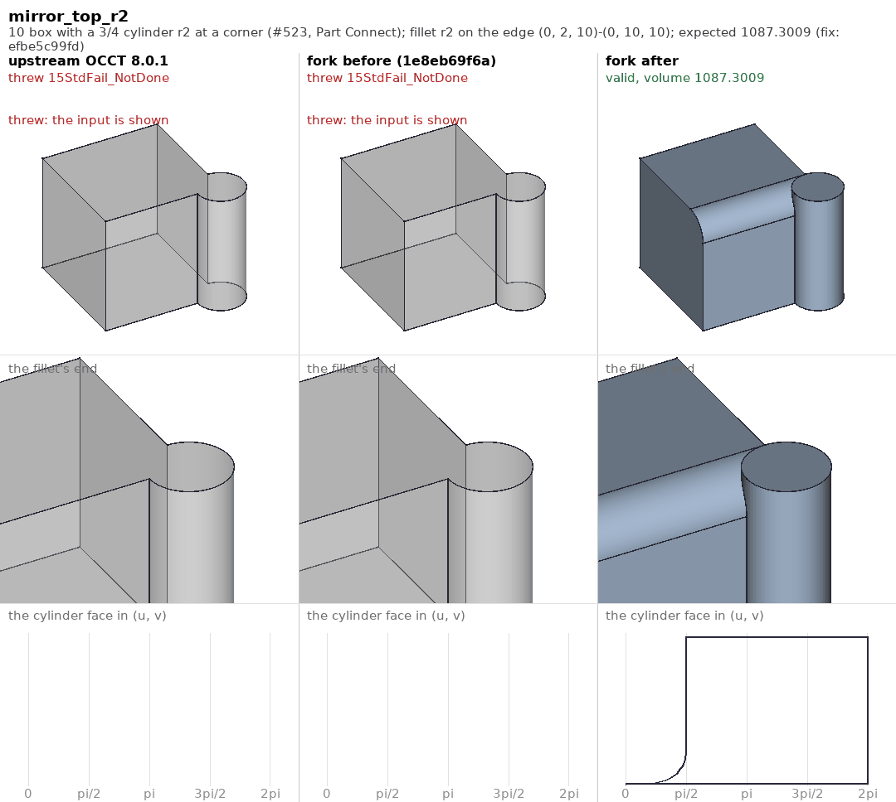

### A fillet's end on the edge where its side runs into a wall (`538ce9f99a`, realthunder/FreeCAD#876)

A post, a cylinder of radius 3, stands on a 3-thick plate whose side y=-3
runs tangent into the plate's round end under the post; the fillet is on
the plate's top edge along that side. The top pinches out between the side
and the post's base at (0,-3,3), where the edge ends, so the fillet is cut
by the post's cylinder, carried down past its face: in the zoom, the
fillet's end curving up into the post, the same in all three columns. On
the plate's side the cut ends exactly on the edge where the side turns into
the round end. The piece of that edge above it should bound the round end
and the post's wall alone; it stayed in the side face as well, whose
outline ran up to the plate's top and back down -- the spur at the top
right of the third row, before. In both "before" columns the side is drawn
red, the face that fails; upstream fails the same way. Now that piece goes
to the round end and the side stops at the fillet: the volume is the same,
the shape valid. With the post drafted 1 deg (#876's own corner) the
fillet is still refused -- next.

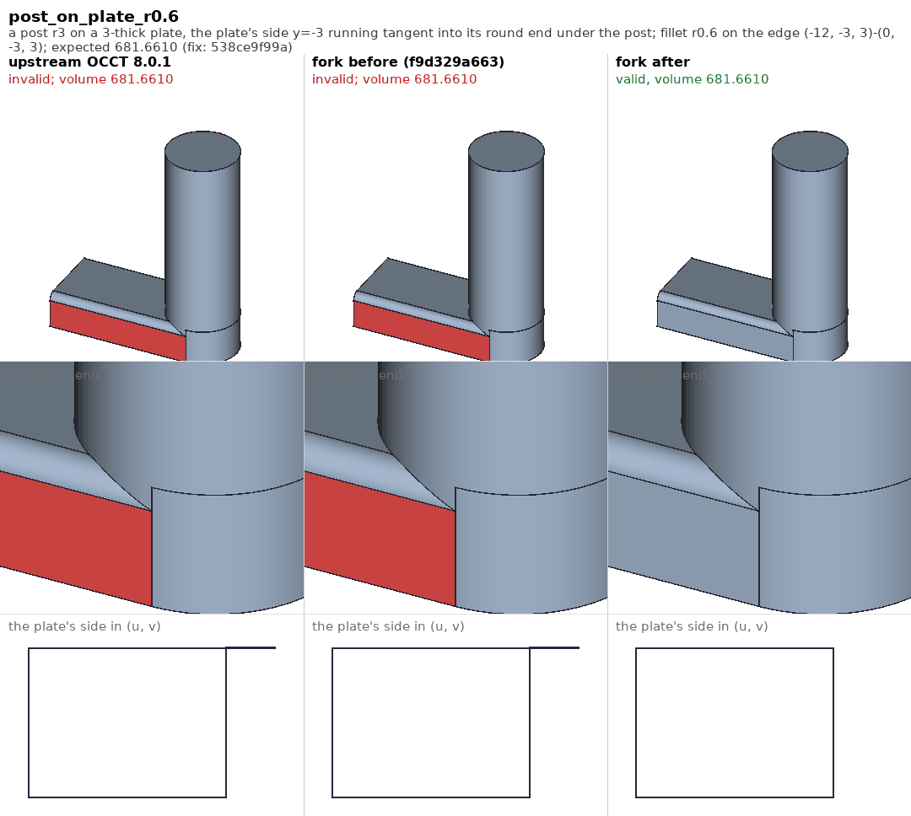

### A drafted wall at the fillet's end (`5310ff9d59`, realthunder/FreeCAD#876)

The same post drafted 1 deg, as #876's tall body is: its wall is a cone,
the round end under it still a cylinder, and the edge between them sharp.
That makes four sharp edges at the fillet's end, and an end at more than
three was a break point: the walk ran on along the post's base and the
corner went to the plate, which refused it -- "fork before" shows the
input. Upstream builds something, an open shell: in its zoom the faces at
the cut are red, and the edge round the post's base. But the plate's side
and its round end are one wall in two faces, tangent across their edge;
leave that edge out and the corner is the undrafted post's. Now the fillet
ends there against the post, cut by the cone carried on below its base: in
the zoom, the fillet's end curving up into the post as before, and in the
third row the cone's outline dipping below its base where the cut runs.
Since the side is tangent to the cone's base circle at the vertex, the side
face keeps a sliver between the cut and the round end, closing to a point
at the top -- the notch under the fillet's end in the zoom. On #876's own model two of the
drafted walls were cones trimmed at the plate's top, which kept the cut
off them; the trim is no bound now, and #876's Fillet002 (0.6) is valid,
the Pocket after it taking material away as it should.

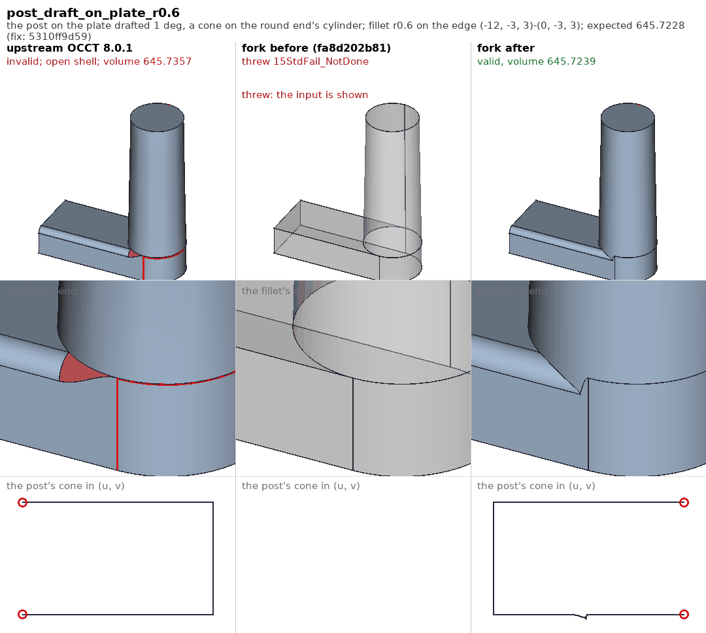

### A corner's extension on the cut's side of a seam (`c34722ef01`)

The undrafted post turned three quarters, so that its seam runs up from
the fillet's end. The cut on the post's cylinder runs round from the
post's base to the seam and ends there at u=2pi; the extension from that
end down to the vertex was put at u=0, where the edge beside it gives the
vertex its parameter. The post's outline jumped a period between the two
-- in the third row, before, the cut's end at 2pi is left open, circled
red at the bottom right -- and the face was built inside out: in both
"before" columns the post's wall is red, and the fillet takes 12 instead
of 0.87. Now the extension starts where the cut ends, the outline closes
at 2pi, and the result is the post's turned any other way. (The circles
at u=0, in all three columns, are the seam's other side: the outline draws
the seam once.)

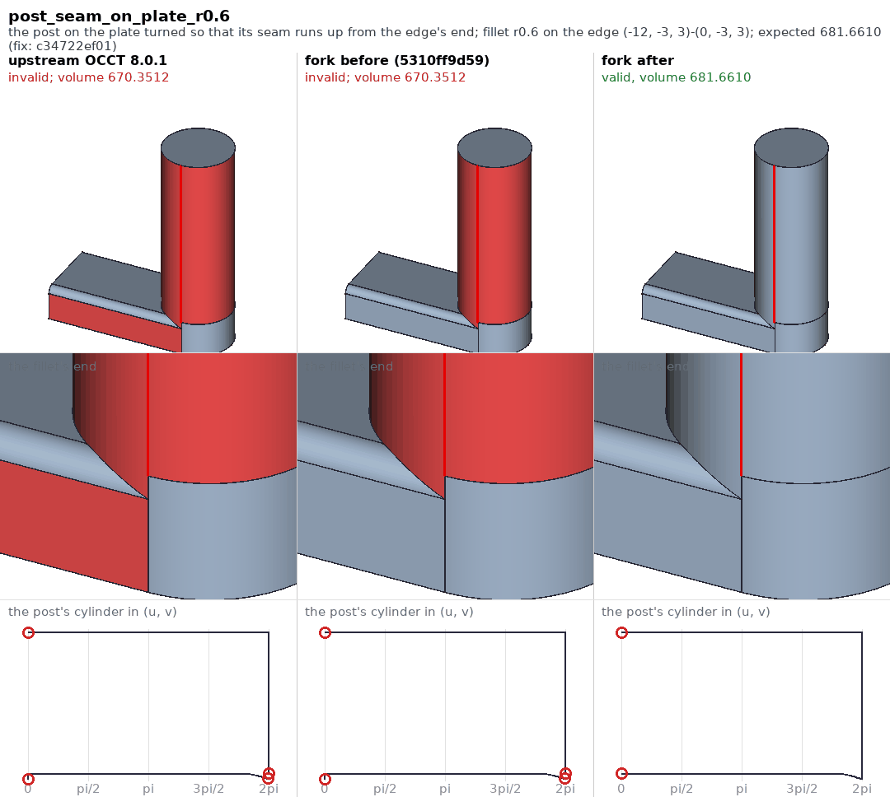

### The cut over a drafted wall's cone and plane (`2a623612a8`, realthunder/FreeCAD#876)

The tall body of #876 has its corner drafted the same way, but the corner's
cone covers only 41 deg of arc on the plate's top before the drafted
wall's plane takes over, the cone running on into the plane tangent. Made
small: the drafted post with a straight wall tangent to its cone there --
a teardrop. The fillet's line on the plate's top ends where the top does:
on the cone's base arc up to radius 0.74, on the plane's base edge past
that. The plane holds no edge of the vertex, so the corner found no edge
to carry the cut on along and gave up: both "before" columns show the
input, refused. Now the cut runs over the plane from the line's end, then
on over the cone, the two pieces meeting where the cut crosses the
cone/plane edge carried down below the plate's top -- in the zoom, the
fillet's end rising into the post across the dark plane and the light
cone, with the notch at the side as before. The third row is the plane's
outline: at its bottom left the cone/plane edge runs on a little below
the base, and the cut's piece on the plane brings it back to the base
edge -- the kink. The volume matches the corner prism outside the post
carried on below its base to 1e-5. On #876's Fillet002 this makes radius
0.8 to 2 (refused before); at 1.2 with a fix to the tolerance of the
vertex at a corner's curve end (`d45fc2c2b6`). With the post's faces
B-splines, the cut's end on the side must lie beside the cone's arc
(`8c91316949`): the B-spline cone carried on can meet the side again far
off.

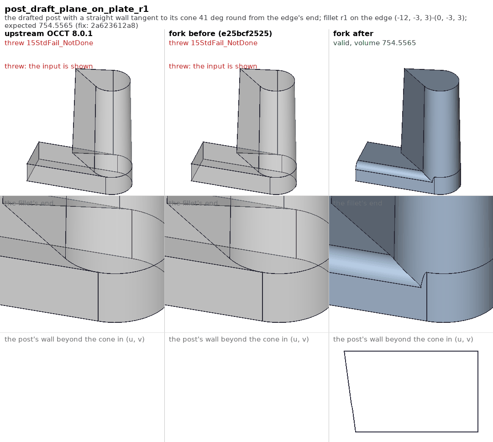

### A failed corner set back (`0ff4092766`, realthunder/FreeCAD_assembly3#894)

Where a fillet fails at a corner, the fork now computes it again with that
corner set back: the fillets there stop short of the vertex along their
edges, and the opening is closed by one patch tangent to them -- the setback
corner of the "Blend Corner" request, used here as a fallback. It tries
where the fillets meet first, then 1, 1.5 and 2 times the radius, and keeps
the first result that is valid, valid again once written and read back, has
no edge looser than the input's or a twentieth of the radius, no face of no
area, and every fillet asked for in it; otherwise the fillet fails as it
did. Nothing made before changes. Design and measurements: fcad's
`docs/CornerBlending.md`, section 9; FreeCAD's Part preference
`FilletCornerSetbackFallback` (0 turns it off).

The first Fillet input of #876, the four edges at the corner (17,16.75,3):
the fork threw (`Standard_ProgramError`, a stripe's end without a point at the
far corner, (-17,16.75,3)) and upstream refused. Now both corners are set
back where their fillets meet. In the zoom, the vertical fillet and the
one along the base stop short of the corner, and the patch closes it. Its
outline is the third row: six edges -- the ends of those two fillets (1.41
each), a curve on each of the two plane walls (1.57), and the ends of the
other two fillets (0.0175 each), which run along edges between walls a
degree apart and are all but flat: the cusp at the left. Those walls being
so nearly flat, the volume moves by thousandths. The red mark by the left hole is the
input's own: the holes' seam edges are stored once, not once each way
round.

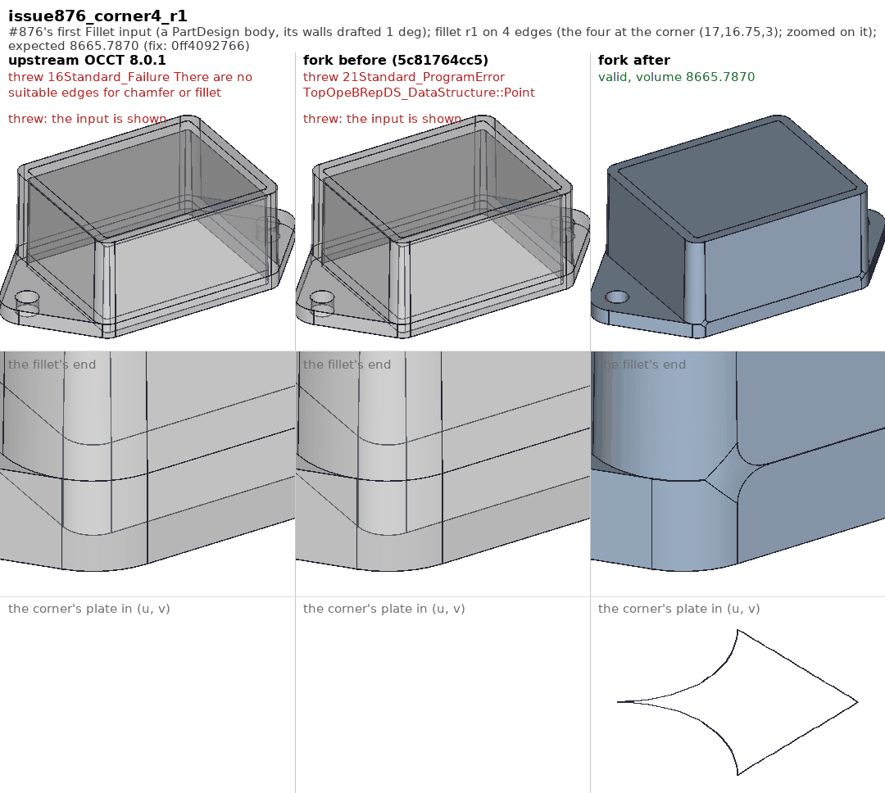

The box and cylinder of #523 past the cylinder's radius, the end refused as
a cut over two faces ("bouchon non ecrit") by the fork before and upstream
alike. At radius 2.5 the end is set back where the fillet meets the corner:
the fillet stops partway along the edge, and the patch blends on into the
cylinder's top and down the box's side. Its boundary on the side has a
small notch near the cylinder -- the hook at the bottom of the third row --
valid, but not as smooth as a fillet run on to the cylinder would be (that
fillet, the boolean's, is 1083.3063; this is 1085.6014).

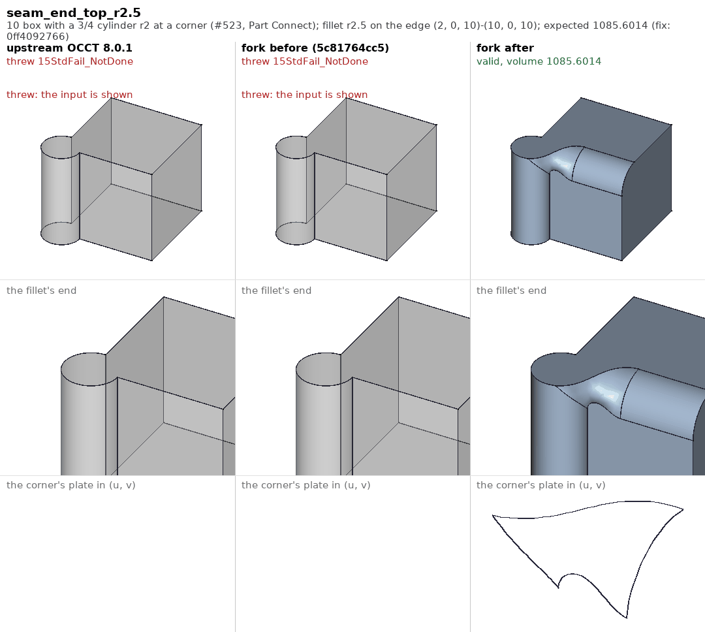

At radius 3 the nearer setbacks leave edges looser than a twentieth of the
radius, and only twice the radius passes: 6 on an edge 8 long. What is left
of the fillet is its last 2, at the far end; the rest is the patch, scooped
from the cylinder's top down the box's side. Valid, and a shape where there
was none, but more a blend than a fillet -- a user asking for this fillet
should know that is what the fallback gives here (1072.1768, against the
run-on fillet's 1078.3294).

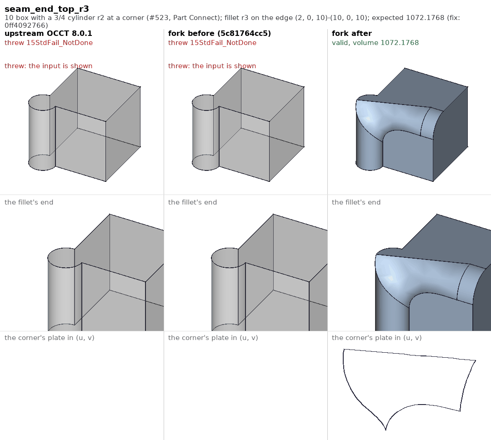

### A fillet's line over a wall kept in coplanar pieces (`9c44789bbb`, realthunder/FreeCAD#962)

The model of #962 has a rib whose flat top ends on a face sloping down. The
rib's side wall is two coplanar faces, split by a vertical edge where the slope
has come down to 31.886, 0.364 under the top. The fillet on the top's edge
along the wall: from that radius on, its line on the wall runs under the
slope's edge with the first piece, crosses the split and meets the slope on
the second piece. The walk stops at the edge's end with that side still in
the face, the corner found no face at the end for its two points, and the
end was left to the intersection at end, whose plate was a little off below
radius 0.8 (0.017 at 0.7, "valid") and invalid from it: in the "before"
columns the first piece and the slope are red, the second piece is kept
whole under the fillet, and the end is a small patch.

Now the line is carried on: it crosses one edge of its face into a piece
of the same plane, the same way up, and meets the slope on an edge of that
piece, so the end is cut as on a wall in one face, and the line is stored
in two, on each piece. In the zoom the fillet runs on past the split line
to the slope; the third row is the second piece, which now has the line's
short piece along its bottom right, from the split to the slope. The end
agrees with the same fillet on the shape refined (`removeSplitter`) to
1e-7 at every radius from 0.3 to 0.95 (a chamfer to 1e-13). The edge's
other end, at the rib's foot, is four edges whose wall line crosses the
same split onto the block's top; it is the next section.

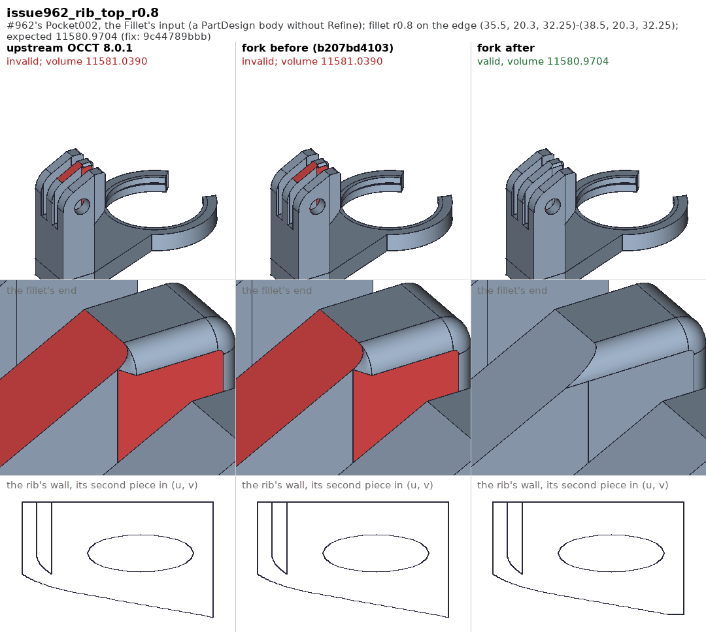

The same made small: a prism whose top slopes down past x=4, its front wall
split at x=5, filleted along the top's front edge. The volume taken is the
fillet's cross-section swept from the far end to the slope, in closed form,
and the result matches it at every radius tried, the edge either way round
and the second piece either way up on its plane (#962's is upside down,
which turns the line's transitions over).

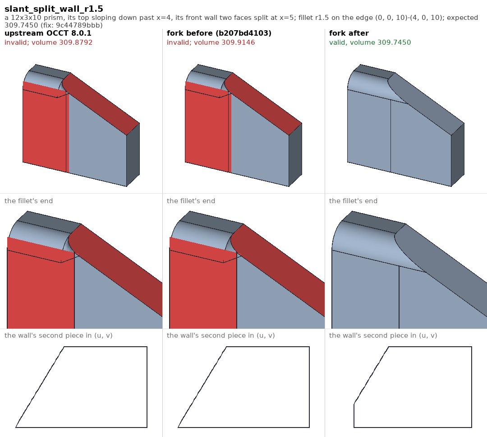

### The same line at a corner of four edges (`7a1fbeffb3`, realthunder/FreeCAD#962)

The rib's chain ends at the rib's foot: its last edge, the wall against
the 45 deg underside of the rib's overhang, comes down to the block's top,
and four edges meet there -- the fillet's, the underside's with the
block's side, the side's with the top, the top's with the wall. Such an
end is cut by the faces around the vertex, from the edge the fillet's line
on one side ends on to the edge its line on the other side ends on. Here
the wall is two coplanar faces, split just past the foot: from radius
0.493 on, the wall's line meets the block's top on the far piece's edge,
which does not reach the vertex. The corner searched the faces at the
vertex for that edge, found none, and took the end for a cap that is not
written: from 0.986 the fillet failed, and below it the end was made off
by up to 0.09 (the exact fillet's line stopped at the split, and the walk
past the end with it).

Now that edge is recognised as the one the edge of the vertex carries on
across the split's foot, and the end is cut as on a wall in one face:
over the block's side and on over its top, the edge of the vertex beside
the split -- under the fillet whole -- left out. Where the line stops in
the first piece, it is carried over the split as at the rib's top. In the
pictures the "before" columns are the input, refused; after, the fillet
runs down the underside's edge and its end lies flat in the block's top,
which grows past its old edge to meet it: the third row is that face, its
bite the end's ellipse. The end matches the refined shape to 1e-5 at every
radius from 0.3 to 3 -- through 0.9852 to 0.9868 as well, where the
split crosses the line within 1e-3 of the spine's end (since `bdaa69edc6`
on the far side of the end, and since the split no longer cuts a sliver
off the line on the near side) -- the chamfer exactly.

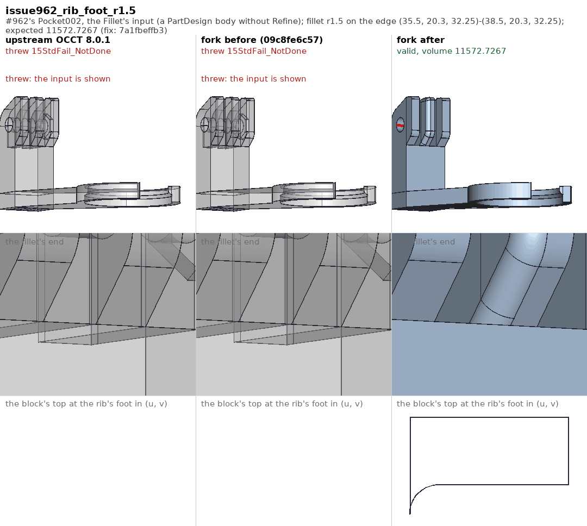

The same made small: a rib with a 45 deg underside standing on a block,
its front wall split at x=1. The fillet's cross-section swept between the
underside's end and the block's top, in closed form, is what it takes, at
every radius tried, either way round; the chamfer's likewise.

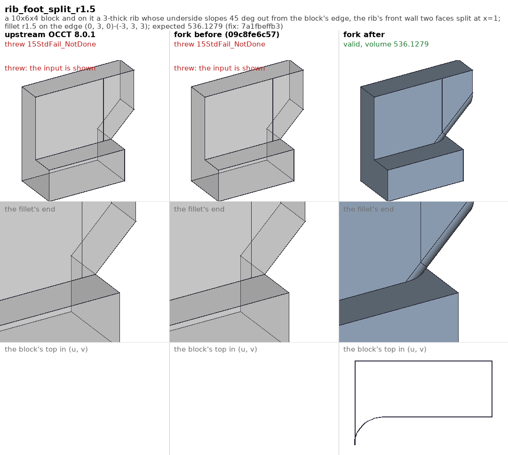

### A flag read before it was set (`09c8fe6c57`, realthunder/FreeCAD#474)

Where a fillet ends at four edges on a B-spline face, the corner extends
that face's surface to cut the fillet on it -- once, and not when the flag
it passes says the surface is extended already. The flag was never set to
zero first: what the stack held decided whether the surface was extended.
The Fillet003 input of #474, edge 51, ends so on a B-spline face, and it was
refused at every radius; it found the stack non-zero. It showed when the
change above moved other results of the same input without running any of
its own code. Now the flag starts at zero, as everywhere else. The
material the fillet takes is its cross-section times the edge's length to
0.1%.

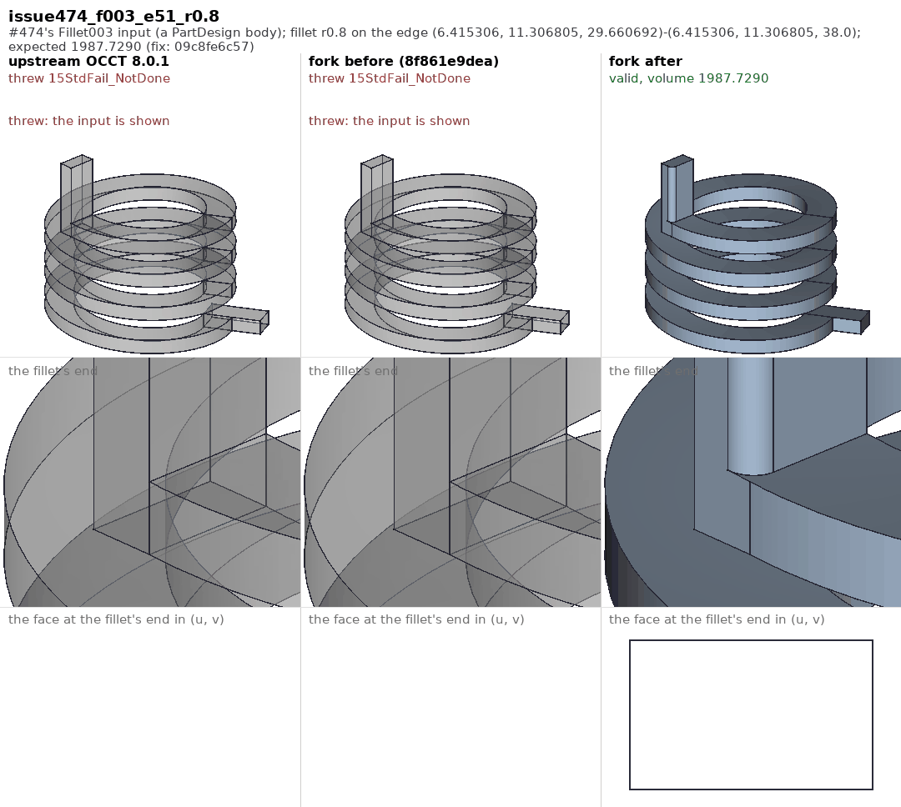

### A spine extended past a corner by the radius (`fff5d20907`)

The rib foot in miniature of the section before last, at radius 2.5. A
fillet's walk runs on past the vertex at its end, and the corner cuts it
back; the spine is extended for that by half its length. This edge is 4.24
long, and the wall's line, carried over the split to the block's top, needs
the walk past the vertex by the radius: from 2.25 on it fell short, and
the corner at the foot was refused, upstream and in the fork alike -- both
"before" columns show the input. Extending every such spine further moved
results made before, so it is a fallback: a fillet that failed, with an
end at a corner on edges short for its radius, is computed again with
those ends extended 1.5 radius, and kept only if valid with every fillet
made; nothing made before changes. In the zoom the fillet runs the whole
underside and its foot lies in the block's top past the split; the third
row is the top, the end's ellipse cut into its corner. The volume is the
closed form's, at 2.3 and 2.8 as well.

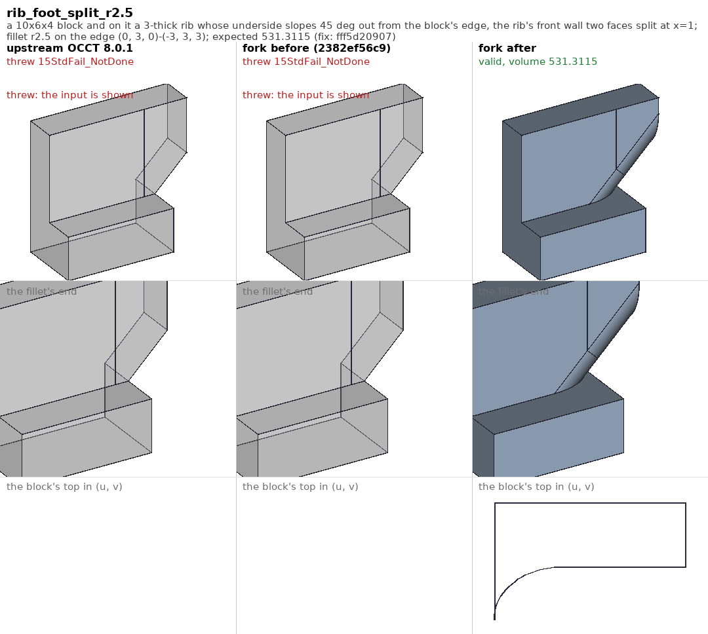

### A corner's curve kept on its face (`8704591b60`, realthunder/FreeCAD#523)

The bottom edges of the box and cylinder at radius 2, the one ending on the
seam and its mirror image. The corner's curve on the cylinder ends at the
cylinder's far vertex, tangent to the bottom circle, and leaves it at fourth
order; its approximation ran up to 1.6e-9 below the face there, a pole
1.1e-6 past the circle, and BRepCheck found the wire crossing itself (the
tops did the same; BRepCheck happened not to see it). The curve is now
refined towards that end and its poles past the circle put on it, the one
next to the end 1e-8 inside: within the hull of its poles it stays on the
face, and leaves the circle at an angle. The shape does not move -- it was
right, its wire was not: the fork's "before" column is the same shape with
the cylinder face red, and its (u, v) outline the same. Upstream's column
is the seam case's old result (1070.5458, invalid) and, across the
diagonal, a refusal. Both bottoms are valid at the tops' volume.

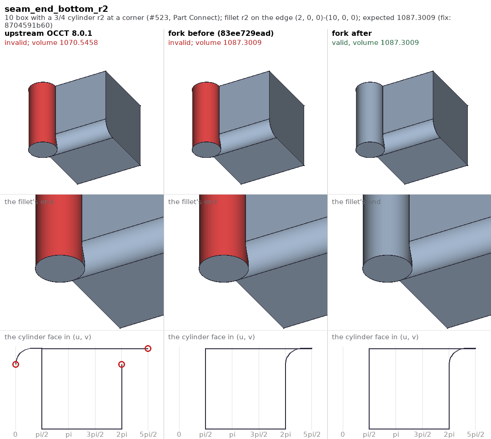
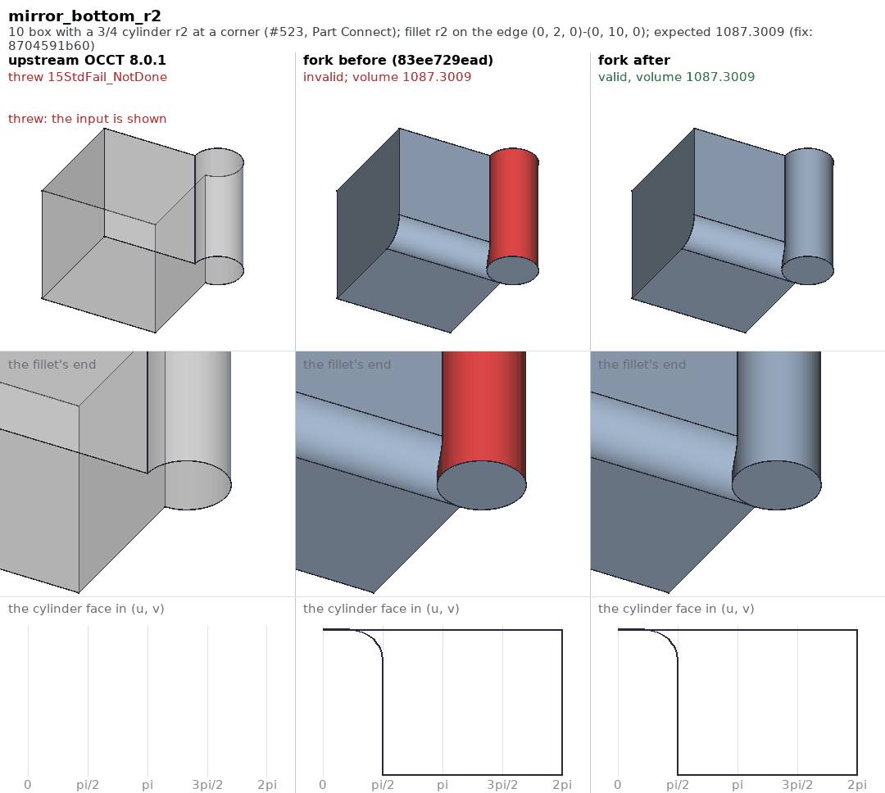

### A split a sliver inside the line's end (`b9e95d0e71`, realthunder/FreeCAD#962)

The rib's foot of "The same line at a corner of four edges", at radii just
above 0.98571, where the wall's line at the edge's end lies on the split.
The exact fillet along the underside's edge is cut where its line on the
wall meets the split, and there that is inside the edge, 4.4e-5 to 6.4e-4
short of its end: a sliver of the exact fillet, then a walk from the cut
back past the end. The underside's line leaves its face exactly at the end,
so the walk began within its tolerance of that face's edge: at 0.9862 and
0.9863 it could not take a first step (refused), and from 0.9865 to 0.9868
it reached the edge and went on past it at a fifth of the sliver's length,
a step under the walk's own idea of two points being one: it stopped at
once, and the end was made of what there was. At 0.9865, the picture's
radius, upstream refuses the fillet (its column shows the input); the
fork's before is invalid, two shells and a face of no area -- in the zoom
the wedge at the fillet's foot is red, and the block's top in the third row
is left open where the fillet's end should bite into it. Now, at the
spine's end, a line is not cut
at a split of its wall that close to where the other line's piece ends: it
runs on over the coplanar piece, as where the split is past the end, and is
carried over the split at the end. Every radius from 0.985 to 1 matches the
refined shape to 3e-6.

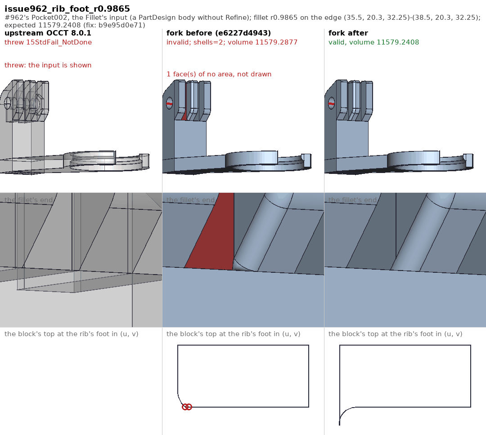

### A face that is two regions touching at a point (`40ba54dcdf`, realthunder/FreeCAD#523)

The box and cylinder at radius 2 once more, the fillet's line on the top
tangent to the cylinder's circle at its far vertex. What is left of the top
is the box's rectangle and the cylinder's whole disc, which touch at that
vertex alone; the corner put a vertex of its own there, 4e-15 from the
cylinder's, and the top was one face whose wire passed through the point
twice, once at each. BRepCheck took it; BOP's argument check called both
vertices self-intersecting -- a boolean on the result could fail on it --
and made one vertex, the wire is unorientable. The result is now touched
after the build: where a face's one wire passes a point twice at two
vertices, one of them the input's, at one point of its parameters, and each
loop from there bounds a region, the corner's vertex is replaced by the
input's and the face split into the two regions, its history -- what the
input's top became, and each face the fillet made -- carried to the pieces.
The cylinder's face holds the same two vertices a period apart in u, as at a
seam, and is only given the one vertex. The views look the same in all three
columns (upstream's cylinder is red for the old seam fault); the third row
is the top: before, one outline, the rectangle with the disc hanging from
its corner; after, the rectangle alone, the disc a face of its own. The volume does not move, and
all four r=2 results, tops and bottoms, pass BOP's check.

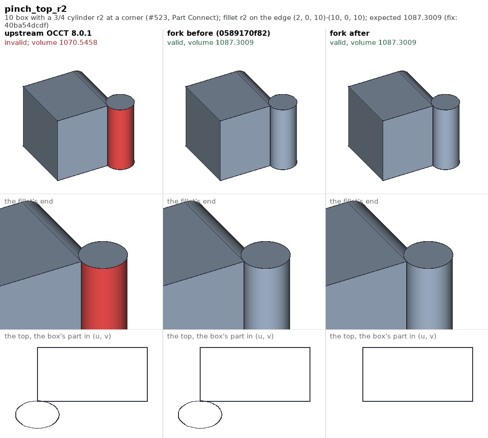

## Making the pictures

`tests/fork/fillet/pictures/make_pictures.sh` does it all, on Linux or macOS;
a few minutes, most of it building one library per column:

1. `mkold.sh` builds scratch `TKFillet` libraries (and `TKGeomAlgo` where a
   column needs it) -- upstream's files that
   differ from the fork, at `91be8c4c71`, and the fork's sources at each
   stage's "before" commit (`STAGES` in `cases.py`) -- from the build tree's
   own compile commands (`oldbuild.py`).
2. `compute.py` runs every case of `cases.py` under `FreeCADCmd`, once per
   library set and once on the fork as built, keeping each result as a
   `.brep`, the (u, v) outline of the face `UVFACE` picks, and a
   `results.json`. The libraries are loaded ahead of the installed ones with
   `LD_PRELOAD` on Linux and `DYLD_LIBRARY_PATH` on macOS -- set inside the
   run wrapper with `env`, since macOS strips `DYLD_*` from `/bin/bash`.
3. `compose.py jobs` lists the panels, `render.py` draws them in the FreeCAD
   GUI (under `xvfb-run` on Linux; on macOS on the display, run as a
   `.FCMacro`), and `compose.py` lays them out with the (u, v) row (Pillow,
   from the FreeCAD conda env).

The renderer draws with Coin, not the bgfx renderer, so the pictures look
alike on every box. (At first that was forced: on macOS every capture after
the first came back black. A closed document's maximized MDI shell stayed
up as a full-screen window over FreeCAD's main window, macOS reported the
main window occluded, and Qt stopped painting it -- so the renderer, whose
capture needs a frame drawn, never got one. Fixed in FreeCAD; the renderer
captures these panels on Metal now.) Edges are marked
red by counting their uses through the faces' wires; `isSeam()` would count
an edge like #523's leftover seam twice in a face that holds it once.
