# Fillets in the OCCT fork, before and after

FreeCAD's Fillet -- `Part::Fillet`, `PartDesign::Fillet`, `Shape.makeFillet()`
-- is OCCT's `BRepFilletAPI_MakeFillet`, the `ChFi3d` builder in `TKFillet`.
Fillets, chamfers and drafts are among FreeCAD's most reported kernel
failures; `../../occ-issues/` holds the reports with their models. This page
shows each fix the fork makes to fillets, in pictures. The case-by-case
reference and the history are `../README.md`; the suite is
`../run_tests.py`.

## Reading a picture

Each picture is one case of the suite: the shape, the edge filleted (by its
two ends), the radius, the expected volume and the fork commit that fixed it.

Three columns:

- **upstream OCCT 8.0.1** -- upstream's `TKFillet` files at the fork's base
  (`91be8c4c71`), compiled into a scratch `TKFillet` and loaded ahead of the
  installed one, the rest of the fork as it is -- but for the files of other
  toolkits a fix here changed, which are upstream's too (`GeomPlate`'s, in
  `TKGeomAlgo`).
- **fork before** -- the fork's `TKFillet` (and, for a fix outside it, that
  toolkit) at the commit just before the fix (named in the heading), the
  same way.
- **fork after** -- the fork now.

Three rows:

- the whole result;
- the result zoomed on the fillet's end, where the fault is;
- one face of the result drawn in its own (u, v) parameters, the face the
  fault is in (its label names it) -- each edge's pcurve on it, as the
  face's wire holds the edge, which is what `BRepCheck` reads. A closed wire
  is a closed outline; an end of a pcurve that meets no other pcurve's end
  is circled red. On a cylinder the gridlines are at multiples of pi/2 in u.

Under each column heading: "valid, volume V" in green, or what was wrong in
red. Faces that fail `isValid()` are drawn red; red edges are edges not
used once each way round by the faces.

## The fixes

### A seam left on a piece of a closed face (`16df68d224`, realthunder/FreeCAD#523)

The model is a 10 box with a three-quarter cylinder of radius 2 at the
corner on the z axis, joined by Part's Connect. The cylinder's seam is the
line x=2, y=0, where the cylinder meets the box's side, and the boolean kept
that line as an edge with **both** pcurves on the cylinder -- u=0 and
u=2 pi -- though the three-quarter face holds it once and runs from pi/2 to
2 pi. A fillet on the box edge along y=0, which ends at that line, comes out
"Unorientable" at every radius: the cylinder face, red in the first two
columns, does not close. Its third row shows why: the cap the fillet's end
cuts out of the cylinder was computed near u=0, a period away from the face,
four ends open. After the fix the cap continues the face past 2 pi and the
outline closes.

`ChFi3d_Builder::PerformOneCorner` read the pcurve of the edge at the
fillet's end with `BRep_Tool::CurveOnSurface`, which, for an edge with two
pcurves on the face's surface, chooses by the orientation of the edge it is
handed; it was handed the edge as the fillet data carries it, not as the
face holds it. Now an edge closed on the face but not really closed
(`BRepTools::IsReallyClosed`) is read as the face holds it.

The geometry is the same in all three columns, which is the point: nothing
in the shape looked wrong, the face's parameters were. The fixed volumes
equal those of the same fillet on the edge across the box's diagonal, which
does not end on a seam (1092.5263 at radius 1).

At radius 2, the cylinder's own radius, the cap reaches the face's far end
as well (u = 5 pi/2, which is pi/2 a period on). The top is right now; the
bottom, its mirror image, is still invalid (`seam_end_bottom_r2`, XFAIL).

### A fillet line collapsed to a point (`214d858dc3`)

Not pictured: there is no result to show. A fillet of radius 2 on the
cylinder's top or bottom arc has no line on the top face, only a point; the
corner code dereferenced the missing curve and the process died. It is
refused now (`StdFail_NotDone`); the suite's `arc_*_r2_no_crash`.

### A corner whose faces are split in coplanar pieces (`cf96757c36`, realthunder/FreeCAD#962)

A PartDesign body without Refine keeps a wall as several coplanar faces, cut
apart by the booleans that made it. #962's Fillet (radius 0.8, twelve edges)
was invalid, and five of its edges were invalid alone. Four of them are the
outer edges of slots cut down to a floor: the fillet ends on the floor, which
it has to extend into its end -- `PerformOneCorner`'s OnSame corner. The
slot's wall is two faces there, its piece at the outer face 0.692 wide (0.787
for the other pair of slots), and from that radius on the corner went wrong.

The corner is built from the face holding the fillet's common point on the
floor, the face on the other side, and the edge between the floor and that
other face, which is extended to the fillet. With the fillet wider than the
wall's narrow piece, the common point lies on the next piece, and the corner
took the narrow piece's own bottom edge as the edge to extend. In the
pictures the narrow piece survives whole, red, and the floor keeps its
bottom edge, dangling: the third row's open end. The fix extends the edge
between the floor and the far face, and removes the edges of the floor
between the vertex and the common point the way the filleted edge itself
goes. The block below is the same thing made small -- a slot whose wall is
split 0.7 from the outer face -- and it comes out as the unsplit slot does.

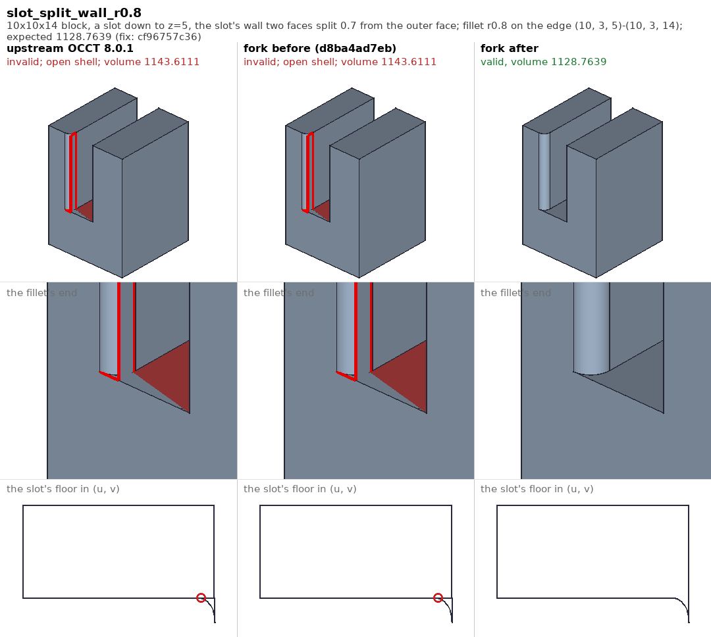
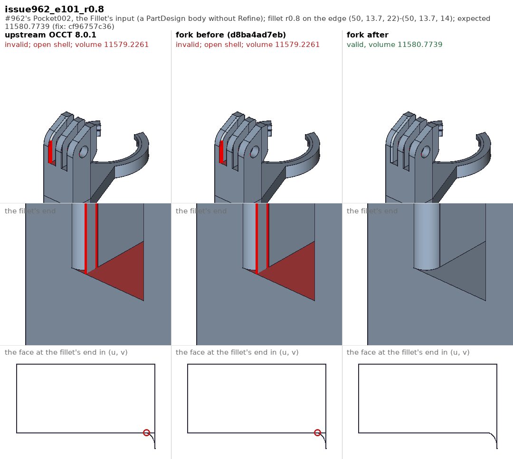

The fifth edge, 50, ends under a chamfer, and there the split is on the
other side: the wall beside the edge (y=10.2) is two faces, and the edge to
extend belongs to the other one. Its orientation in the wall was not looked
up -- it defaulted to forward -- and the wall, red, lost the fillet's line.
The third row looks the same in all three columns: the wall's outline closes
in each, and what was wrong was the direction of one of its edges, which an
outline does not show.

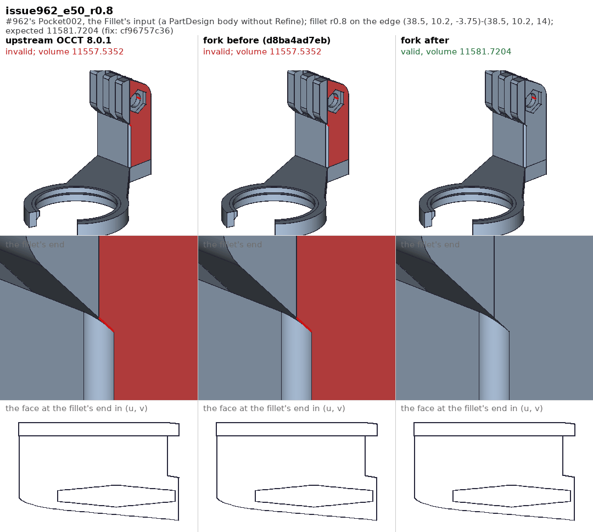

The most ordinary case of the three needs no slot: a fin padded flush with a
block's side, its vertical edge filleted down to the block. The outer face is
two faces, the fin's and the block's, split at the block's top, and the
fillet's line on the fin's face ends on that split. The corner moved that
end off the edge and gave the extension -- which runs along the split -- to
the fin's face: the fin's face, red, holds the whole split edge and no
fillet line (the third row's stray stroke). Now the end stays on the edge,
and the extension bounds the block's face. The volume was right all along;
only the faces were not.

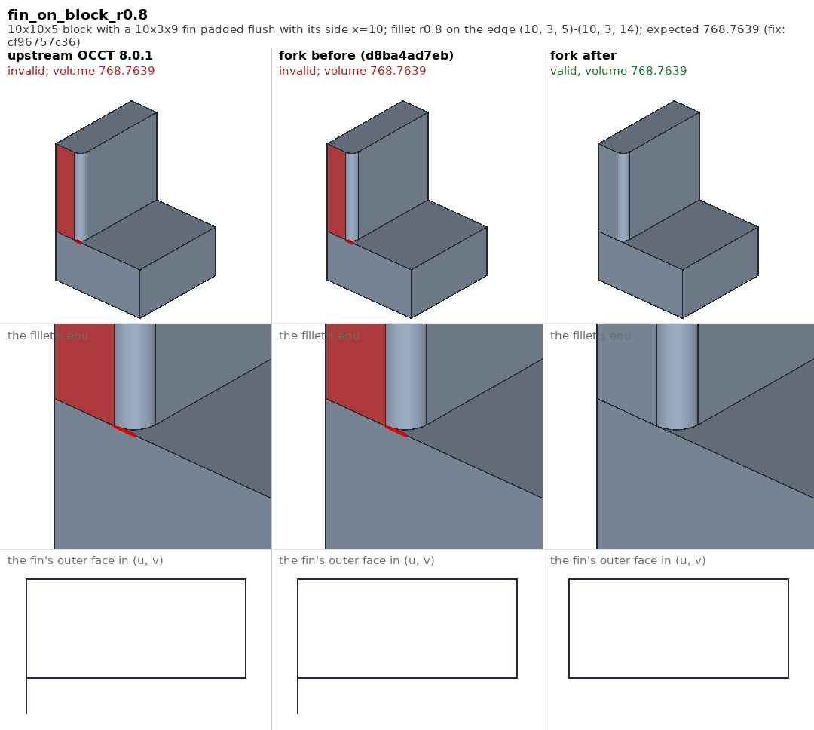

### A seam two corners cut at its two ends (`b38f0d910c`, realthunder/FreeCAD#962)

With those fixed, #962's Fillet was still invalid with all twelve edges, from
two of them: the edges at the foot of the block where the arm meets it, each
fine alone. The bottom is two faces, the arm's and the block's, split along
x=38.5. The convex fillet on one edge cuts that seam short; the concave one
on the other meets the seam's line just past its end, and the corner gave
the seam that point anyway, outside the edge -- alone the face rebuild turns
that into a longer edge, but with the other corner's cut on the same edge it
built both versions, the cut one and the longer one. In the pictures the
bottom faces are red and the arm's bottom has an extra stroke along the seam
with two loose ends. Now the piece of the seam's line past its end is a
curve of its own, and the seam is left to the other corner. It happens with
the seam running one way only, as here.

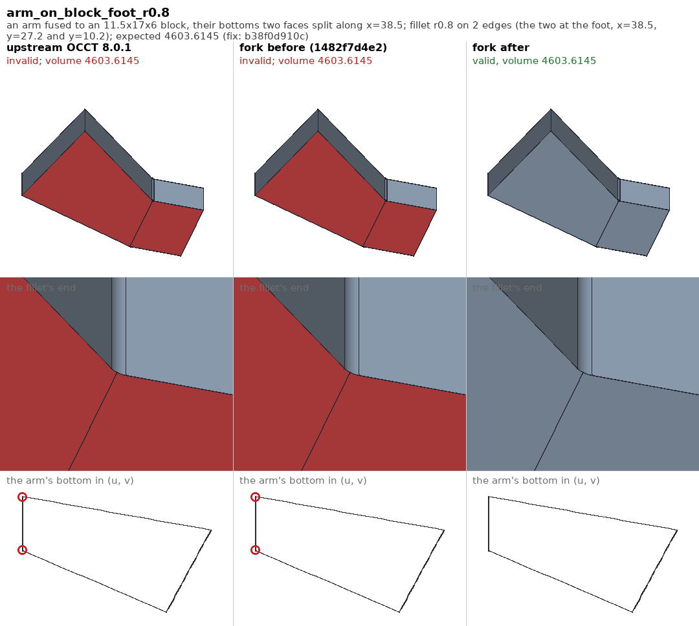
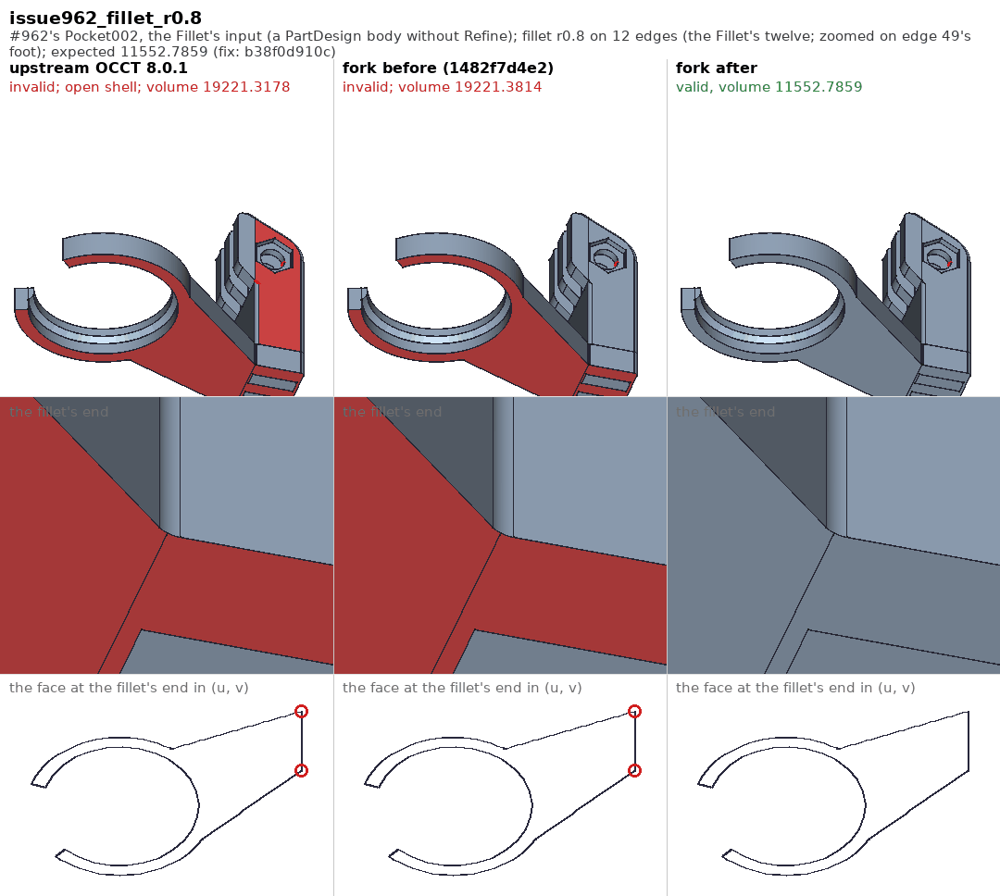

### A fillet ending on a wall kept in coplanar pieces (`2ac4fee0c6`)

The two shapes of the corner fix put together: the fin flush with the
block's side, its wall split 0.7 from the outer face as the slot's. With the
fillet wider than the wall's narrow piece, its line on the wall runs on the
wide piece, whose edge on the floor stops short of the vertex the fillet
ends at. The fillet stopped where the fin's face ends, and both the restart
of its walk and the corner took that edge for an obstacle, not for the end
of the wall: the walk failed, upstream and in the fork alike, and both
columns show the input. Now the edge counts as the wall's own, reaching
the vertex through the narrow piece, and the corner is the slot's: the
narrow piece goes, and the block's top closes around the fillet's end. The
volume is the unsplit fin's.

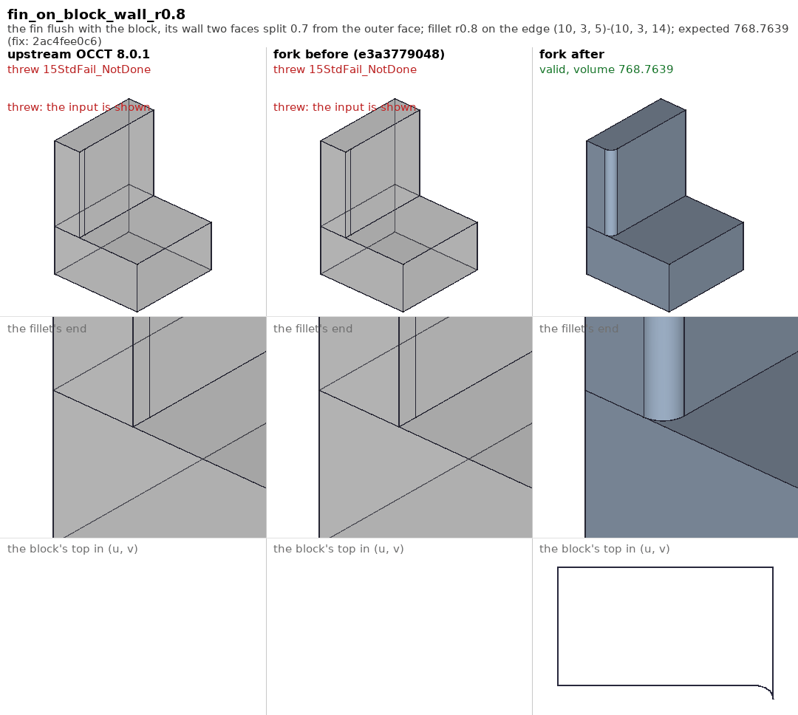

Still open: a radius equal to the narrow piece's width, 0.7, where the
fillet's line on the wall runs along the split itself (`slot_split_wall_r0.7`,
`fin_on_block_wall_r0.7`, XFAIL).

### A corner plate whose boundary curve missed its first surface (`2b9df66c48`, realthunder/FreeCAD#962)

#962's edge 36 alone, below radius 0.42. The edge is shallow -- the arm's
side meets the block's side at 21 degrees -- and at its top five faces
meet: the arm's top, the block's wall above the arm, and the block's side
going on upward as a second, coplanar face. The fillet fills that corner
with a `GeomPlate` patch. At small radii one of the patch's boundary
curves had no projection at all on the plate's first surface, and the
projection threw where the plate would have tried another surface: upstream
and the fork alike, both columns show the input. The fix is in
`GeomPlate` (`TKGeomAlgo`), so these two columns carry upstream's and the
earlier fork's `GeomPlate` as well. Now the plate falls back on a plane, and
the patch closes the fillet's end: in the zoom, the narrow fillet strip up
the edge and the small patch at its top; in the third row, the patch's
outline, closed, with a hook where two of its boundary curves meet. The
small block is the same corner made small; it failed the same way.

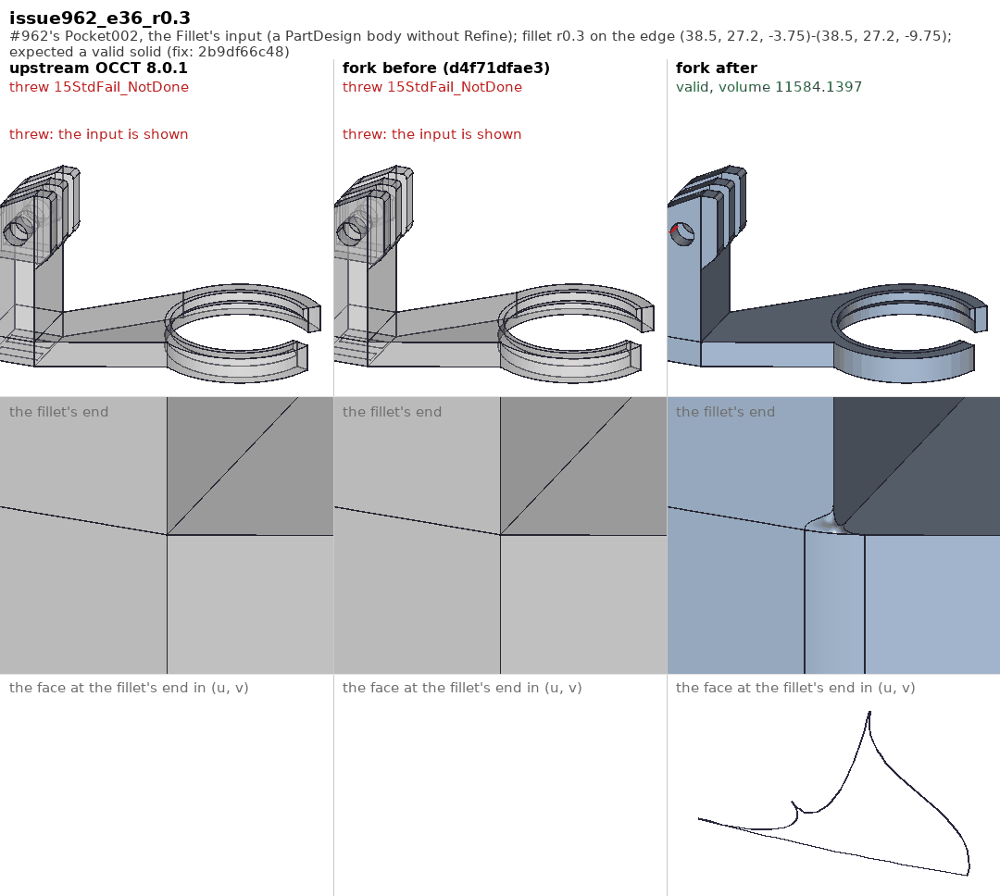
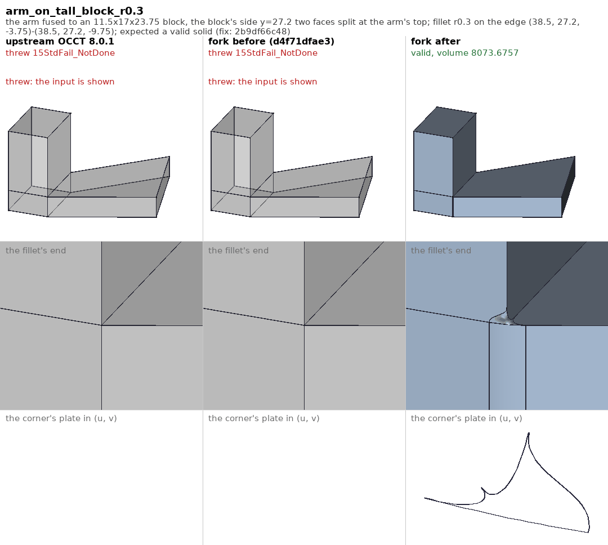

The fix lets five other fillets of the sweep get past their plate, and they
fail further on, as an invalid shape instead of an exception (see
`../README.md`). Also open: the same corner with the block's side one face
(`arm_on_tall_block_whole_r0.5`, XFAIL), invalid at every radius, before
the fix as after.

### A corner plate folded to stay tangent (`fb9200b0fd`, realthunder/FreeCAD#962)

#962's edge 56 alone gave a valid solid whose volume nobody could agree
on: 5.04 taken by GProp's default integration, 2.0 by its adaptive one,
3.5 by a mesh, where its mirror image, edge 50, takes 2.4 by all three.
Its foot is the five-face corner of the previous fix, filled by a
`GeomPlate` patch held tangent to the stripe. To stay tangent where the
stripe meets the faces at a sharp angle, the plate folded -- the lump at
the fillet's foot in the first two zooms -- missing its own boundary by
0.09 on a fillet of 0.8; its approximation then strayed 0.48, and the
corner kept edges of tolerance up to 1.18. Its control points reach so far
out that the face's bounding box is 158 across, on a corner of 0.8. Such
plates are common: of the 495 the every-edge sweep builds, 87 miss their
boundary by more than 0.1. A plate missing it by more than 1e-2 is now
built again on positions alone and taken if it fits better: the foot
flares into the corner cleanly. The third row looks much the same in all
three columns -- the old outline's loop, where one pcurve crosses itself
near its end, is a few thousandths across, too small to see here; the zoom's lump is
what shows the fold. The volume is edge 50's.

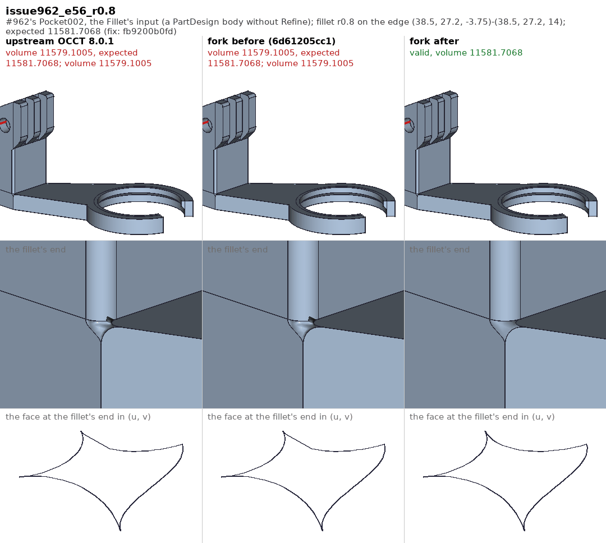

#474's Fillet003 input is one of the 17 results the change turns valid:
edge 6's corner plate missed by 1.8 at radius 2, its fillet was invalid at
every radius, with a face of no area and edge tolerances up to 36. In the
third row the old plate's outline is a sliver -- its boundary curves lie
almost on one line of a surface whose bounding box is 28 across, for a
corner of 0.8.

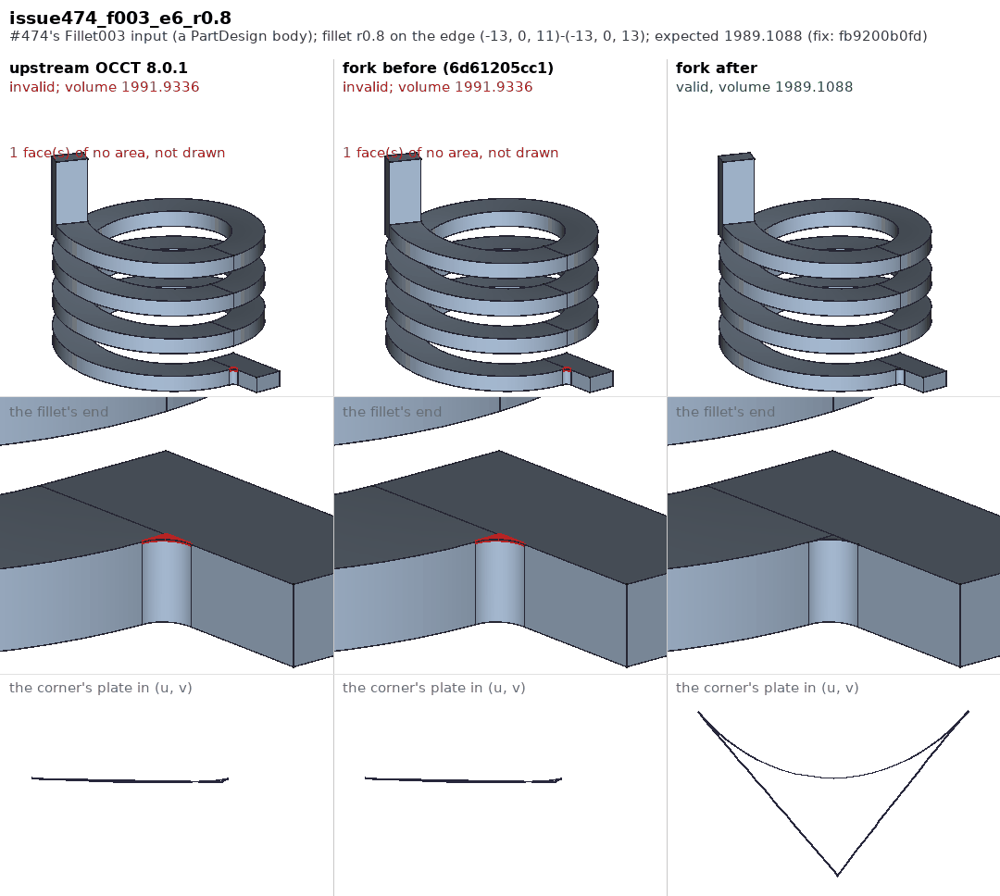

Edge 50's and #962's whole-Fillet pictures above changed with it: their
"fork after" corners are the rebuilt plates now (tolerances 0.009 where they
were 0.195). One result goes the other way -- #962's edge 33 at radius 0.3,
whose corner was folded either way and is now rejected by `BRepCheck`
(see `../README.md`).

## Making the pictures

`tests/fillet/pictures/make_pictures.sh` does it all, on Linux or macOS;
a few minutes, most of it building one library per column:

1. `mkold.sh` builds scratch `TKFillet` libraries (and `TKGeomAlgo` where a
   column needs it) -- upstream's files that
   differ from the fork, at `91be8c4c71`, and the fork's sources at each
   stage's "before" commit (`STAGES` in `cases.py`) -- from the build tree's
   own compile commands (`oldbuild.py`).
2. `compute.py` runs every case of `cases.py` under `FreeCADCmd`, once per
   library set and once on the fork as built, keeping each result as a
   `.brep`, the (u, v) outline of the face `UVFACE` picks, and a
   `results.json`. The libraries are loaded ahead of the installed ones with
   `LD_PRELOAD` on Linux and `DYLD_LIBRARY_PATH` on macOS -- set inside the
   run wrapper with `env`, since macOS strips `DYLD_*` from `/bin/bash`.
3. `compose.py jobs` lists the panels, `render.py` draws them in the FreeCAD
   GUI (under `xvfb-run` on Linux; on macOS on the display, run as a
   `.FCMacro`), and `compose.py` lays them out with the (u, v) row (Pillow,
   from the FreeCAD conda env).

The renderer draws with Coin, not the bgfx renderer, so the pictures look
alike on every box. (At first that was forced: on macOS every capture after
the first came back black. A closed document's maximized MDI shell stayed
up as a full-screen window over FreeCAD's main window, macOS reported the
main window occluded, and Qt stopped painting it -- so the renderer, whose
capture needs a frame drawn, never got one. Fixed in FreeCAD; the renderer
captures these panels on Metal now.) Edges are marked
red by counting their uses through the faces' wires; `isSeam()` would count
an edge like #523's leftover seam twice in a face that holds it once.
