# Thickness in the OCCT fork, before and after

FreeCAD's Thickness -- `Part::Thickness`, `PartDesign::Thickness`,
`Shape.makeThickness()` -- hollows a solid by removing faces and giving the
rest a skin. Underneath it is OCCT's `BRepOffsetAPI_MakeThickSolid`, and the
fork (this repository, branch `LinkVibe-801`) carries a chain of changes to
it so that a *concave* face can be removed, which upstream does not support
(realthunder/OCCT#1-#4). From 2026-09-30 to 2026-10-01 that chain was
measured against upstream for the first time and the thickness failures were
chased down, one cause at a time. This page shows what each fix did, in
pictures, and each section below is one fix: what was wrong, why, and the
volume that is right. "Sec N" means a section of this page; the numbers are
this page's own, oldest first.

Sections 1 to 18 were first written in FreeCAD's docs/TransactionLog.md, as
its sections 27.88 to 27.96 and 27.100 to 27.108 in that order (sec 7 is its
27.94), where the longer build log -- what was tried, the gates -- still is.
Commit messages of that time give those numbers. From sec 19 on this page is
the only write-up.

Where things are:

- The fork's suite: `tests/thickness/run_tests.py` (`FreeCADCmd
  tests/thickness/run_tests.py`; PASS 277, XFAIL 8) and its `README.md`, the
  case-by-case reference.
- The pictures: `pictures/<case>.png` beside this page, one per case of the
  suite that a fix turned from failing to passing.
- The tools that made them: `tests/thickness/pictures/` (`make_pictures.sh`,
  see "Making the pictures" below).
- FreeCAD's own cases: `parttests.regression_tests` in FreeCAD's `src/Mod/Part`, one
  test per step (`test_thickness_*`).

## Reading a picture

Each picture is one case: a solid, the face removed (`FaceN`, 1-based as in
`shape.Faces`), the direction (`+1` outward, `-1` inward, thickness 1), the
join (Arc or Intersection) and whether intersection mode is on; the expected
volume, or "a valid solid" where no reference exists; and the section of
this page that fixed it.

Four columns:

- **the shape given** -- the input, the removed face or faces in magenta.
- **upstream OCCT 8.0.1** -- upstream's eleven files of the fix chain at the
  fork's base (`91be8c4c71`), compiled into scratch `TKBool`/`TKOffset`
  libraries and preloaded, the rest of the fork as it is.
- **fork before** -- the fork's `TKBool`/`TKOffset` sources at the commit just
  before the fix (named in the heading), the same way.
- **fork after** -- the fork now.

Two rows: the shape or the result seen from the removed face's side, and
the same cut open -- the half towards the camera cut away by a plane through
the removed face's centre, the cut faces orange, so the walls show their
thickness.

Under each column heading: "valid, volume V" in green, or what was wrong in
red. "Unhollowed" is a result whose volume is the input's: the opening was
never cut, though the solid may be valid. "Inside out" is a negative volume;
such a solid is drawn black (its back faces), and its cut is done by a clip
plane with no caps, as is any cut the boolean refuses ("clipped"). Where the
thickness threw, the input is drawn greyed. Red edges are edges of the result
not used exactly once each way round by its faces (free, doubled, or turned);
red faces fail `isValid()`; faces of no area are left out, and the picture
says how many.

Upstream's column is one run of many: upstream visits offsets in hash order
and its wrong results vary from run to run (sec 1). Of the first 46, two came
out different on a second run (`tshape_bar_top_out`, `filletbox_end_out`),
wrong both times. The fork's columns are the same every run.

A result can be right only when it is a valid solid with one closed shell and
the expected volume -- or, where no cavity can reach the removed face (sec
10), two closed shells, the skin and a void; the volumes are upstream's
where upstream is right, and otherwise worked out by hand (each section
has its derivation, or names the hand-value script).

## How it stood, and how it stands

The sweep behind all of this (sec 2): 712 thickness runs
-- 16 solids, every face, +/-1, intersection off and on, the Arc and the
Intersection join -- against both builds. A run counts as right only as
above, with the volume plausible for a skin where no reference exists.

| After | Fork worse than upstream | Fork better | Fork right, Arc join (int. off / on) | Fork right, Intersection join (off / on) | Upstream right (four modes) |
|---|---|---|---|---|---|
| start (sec 2) | 144 | 51 | | | |
| sec 2 | 26 | 53 | | | |
| sec 3 | 9 | 59 | 123 / - | | 101 (Arc, off) |
| sec 4 | 0 | 78 | 135 / 135 | 129 / 113 | 106 / 107 / 110 / 111 |
| sec 5 | 0 | 110 | 135 / 135 | 137 / 137 | 106 / 107 / 110 / 111 |
| sec 6 | 0 | 122 | 141 / 141 | 137 / 137 | 106 / 107 / 110 / 111 |
| sec 8 | 0 | 138 | 149 / 149 | 137 / 137 | 106 / 107 / 110 / 111 |
| sec 9 | 0 | 162 | 149 / 149 | 149 / 149 | 106 / 107 / 110 / 111 |
| sec 10 | 0 | 164 | 150 / 150 | 150 / 150 | 106 / 108 / 110 / 112 |
| sec 11 | 0 | 164 | 150 / 150 | 150 / 150 | 106 / 108 / 110 / 112 |
| sec 12 | 0 | 164 | 150 / 150 | 150 / 150 | 106 / 108 / 110 / 112 |
| sec 13 | 0 | 164 | 150 / 150 | 150 / 150 | 106 / 108 / 110 / 112 |
| sec 14 | 0 | 164 | 150 / 150 | 150 / 150 | 106 / 108 / 110 / 112 |
| sec 15 | 0 | 164 | 150 / 150 | 150 / 150 | 106 / 108 / 110 / 112 |
| sec 16 | 0 | 164 | 150 / 150 | 150 / 150 | 106 / 108 / 110 / 112 |
| sec 17 | 0 | 164 | 150 / 150 | 150 / 150 | 106 / 108 / 110 / 112 |
| sec 18 | 0 | 164 | 150 / 150 | 150 / 150 | 106 / 108 / 110 / 112 |
| sec 19, 22 solids | 0 | 264 | 192 / 192 | 192 / 192 | 123 / 125 / 127 / 129 |
| sec 20, 24 solids | 0 | 306 | 204 / 204 | 204 / 204 | 123 / 125 / 130 / 132 |

The "right" counts are of the 150 runs a mode that are in scope; sec 3
set the scope (a face whose removal leaves the shell in pieces is out) and
sec 4 rebuilt the pocketed box (walls 2.5, not twice the thickness), so
counts before sec 4 do not compare with those after it. The last row
counts the holed cone's sealed void right (sec 10), which upstream's
intersection mode gives -- by that rule the fork was worse than upstream in
those two runs before it. Sec 19 added six solids with a sphere at a
pole to the sweep, 42 runs a mode, all in scope: its row counts 192 a mode.
Sec 20 added half a ball and a third of one, from pole to pole, 12 runs
a mode: 204. From that section on the sweep is also run with every solid
under a location and with its geometry turned in space (`SWEEP_PLACE`): the
same 928 volumes, all right.

Of the 134 pictured cases, 36 are ones upstream gets right and the fork had
broken -- the chain's casualties (sec 2, 3, part of 4, the holed
cone's top with intersection on, sec 10, a short box's and a box's bottom
alone, sec 11 and 12, a pocket's open shell, sec 13, the
input left inside out, sec 14, the faces closed at a pole, sec
16, half of a cap turned in space, its sphere removed, sec 20, and
a dome with its rim in two arcs, sec 21).
The other 98 fail upstream too: the fork
now does better than upstream there.

Nothing in the suite fails. Half a ball cut through both its poles, which
sec 19 left open, is answered in sec 20, and as a refine or a cut
leaves it, or with its sphere in two faces, in sec 21, which marks
eight cases known broken: ball wedges on more than half a turn with the
sphere removed, and a dome's half flat with the Intersection join. Every run of the sweep in scope is right. Out of scope, sec 11 answers the faces left in pieces where each
piece is a plain plate or disc, with either join (sec 12), and sec 13
the pieces that are pockets and bosses: every one checks by hand. The one
refusal left in the sweep is the torus's face, and it is right: with its one
face removed no face stays (sec 15, which refuses the sphere's too).

The sweep's first 16 solids have no face closed at a pole -- no dome, no
cone with its apex -- which is how sec 16's fault, there since the chain
was ported, went unseen: the sweep's lines are the same before and after it.
Sec 19 added the pole solids.

## The fixes

### Sec 1: the same result every run

Not pictured: no single picture shows it. With intersection on and the Arc
join, `BuildOffsetByArc` visited its offsets in hash order -- a shape's hash
is its TShape's address -- and the result depended on the order: up to four
different results in eight runs of one input. The offsets are now taken in
the shape's topological order. The suite's `arc_inter_*_same_every_run` cases
guard it.

### Sec 2: the chain's own regressions

Upstream passes every case here; the fork, before, broke all of them.

*A closed edge found twice* (`BRepAlgo_Loop::FindLoop`). On a periodic face
the seam wire replaced the closed-edge wires found before it, but the search
found the other closed edge again afterwards and kept it as a wire of its
own: the inner wall had wires [1, 3, 1] and the floor went missing -- the
open shell, seen as the black disc where the floor should be.

*One seam wire per face* (`FindLoop`). A removed cylinder leaves a wall at
each end, each closed by its own piece of the seam; the loop allowed one seam
wire per face, so the other wall was built from two bare circles -- the face
drawn red, which fails `isValid()`.

*A const edge losing its orientation* (`BRepAlgo_Loop::Perform`). The
concave-face pass replaced the const edges with FORWARD copies, and a seam
wire closed on two circles running the same way (inward); outward, the
re-found closed edge of the first cause.

*The offset of an ellipse stretched past its ends*
(`BRepOffset_Inter3d.cxx`, `ExtentEdge`). The offset of an ellipse is a
closed B-spline that is not periodic, and the context extension stretched it
100 lengths past its ends, evaluated there at 1e34: the bottom came back
unhollowed, the top as two shells with a face of no area (outward, of
negative volume). A closed edge on a
curve that is not periodic is no longer extended.

Not pictured: a crash in `BuildSplitsOfTrimmedFaces` (upstream code, reached
only with the fork's edges), now guarded; the suite's
`pocket_inter_join_no_crash`.

### Sec 3: past concave corners, and a concave face removed

*The corner piece of an arc face* (`BRepAlgo_Loop`). Outward with the Arc
join past a concave corner, the arc face along one edge is cut by the arc of
the next; the fork's loop keeps every piece of a cut edge (it needs them for
a concave removed face), and the piece beyond the cut, closed by the arc's
own end, came out as a face of its own -- the red sliver at the corner. A
wire through a piece beyond the edge's own span now loses to one that stays
inside. Upstream is right on the L-box and the T; on the pocket box it
returns the input, invalid.

*A neighbour skipped before its edge was renewed*
(`BRepOffset_MakeLoops::BuildFaces`) and *a stretched edge lying on another*
(`FindLoop`). The T's bar top beside the post -- a concave face -- removed,
outward: a corner sphere kept an old edge, and a piece of the removed face's
stretched edge lay on an arc face's tangent line. Upstream returns it inside
out, with two shells; the fork threw.

### Sec 4: inward past a concave top, and intersection mode

*Where the stretched removed face crosses an edge* (`BRepAlgo_Loop::Perform`).
The T's bar top removed, inward: the stretched removed face crossed the far
end wall's inner edge above the bar's inner top, and that crossing was taken
for the edge's own end; the corner above the bar's inner arc came out as a
face of its own and the build failed. Upstream returns the input unhollowed.

*An edge two faces share, trimmed twice* (`BRepOffset_MakeOffset.cxx`,
`TrimEdges`). The guard meant to trim each new edge once, an indexed map's
`Add()`, is never 0; with intersection on and the Intersection join the
second pass cut a section short, and the fork threw where upstream is right.

*A wire running once round a periodic face* (`FindLoop`). A cone with a
through hole, its bottom removed, inward, intersection on: a circle beyond
the seam's span came out as a face of no area, a second shell (the circle
drawn above the hole in the cut). Upstream is right.

### Sec 5: the Intersection join -- inside out, a blind floor, concave faces

Upstream fails every case here.

*A thick solid inside out* (`MakeThickSolid`). The quilt orients a shell by
the faces it meets first, so which way the result faced depended on the order
the shells met: valid solids of negative volume, drawn black. The solid is
now oriented by classification (`BRepLib::OrientClosedSolid`).

*A blind floor's section the wrong way round* (`ContextIntByInt`). A blind
hole's floor meets the wall at a concave edge, and the section on the wall's
offset came out reversed: a band closed on two circles running the same way.

*Concave removed faces with intersection on* (`MakeOffsetShape`). The splits
of the offset faces do not cut a neighbour's section where the rim needs it;
a shape whose removed face meets a neighbour at a concave edge is now built
as with intersection off, which gets all of these right.

### Sec 6: a removed face tangent to its neighbours

A box with its vertical edges filleted, an end or a side face removed. The
fillets' offsets run parallel to the removed face: inward they never meet it
(unhollowed), outward they meet it far round the cylinder -- a lip in the
opening (the side face: a valid solid, but 354.34 where 388.82 is right) or a
failure. A tube round the tangent edge now closes the gap, turning into the
removed face, with an eighth of a sphere at each corner outward. Upstream
fails all four.

### Sec 7: the loop's minimal wires by angle

Not pictured: FreeCAD's WireJoiner angle walk ported into `BRepAlgo_Loop`.
It changed no result (the walk and the old search were checked against each
other on every face of the suite and the sweep); it is what sec 8 uses on
a curved face.

### Sec 8: a fillet removed

The same box with a fillet removed -- a curved face tangent to the planes
beside it. Outward it threw; inward it came back valid at 647.56, more than
the input (459.40). The tubes
and corners are built on the fillet's cylinder; the loop on that periodic
surface, whose edges all lie within one quarter turn, walks the angles as on
a plane; and a piece of the floor's offset left hanging on the shell is
dropped. Upstream fails both. The cut is in plan, to show the opening.

### Sec 9: the Intersection join at a tangent edge

The Intersection join builds no tubes: the neighbour's offset ran round its
cylinder into a lip (outward) or never met the removed face (inward,
unhollowed; a fillet threw). The gap is now closed by the tube's sharp
counterpart, the user's choice of a square corner: a strip of the
neighbour's tangent plane a thickness into the removed face, offset with it,
and a wall square to the removed face at its far edge, cubes at the corners.
Upstream fails all eight.

### Sec 10: a cavity sealed below the removed face

A cone with a through hole, its top removed, inward: the wall is 1.4 thick
at the top, thinner than twice the thickness, and the cone's and the hole's
inner offsets cross at z=6.485. No cavity reaches the removed face. The
material is every point within the thickness of a face that stays, so the
cavity -- farther than that from all of them -- is closed, and the top stays
as skin over it: the user's choice of answer, two shells, the input's skin
and a void of 112.92. The fork gave a "valid" solid larger than its input
with intersection off (a shell crossing itself) and invalid ones with it on.

Three causes. With intersection on, the loop on the cone's periodic offset
let the band from the top circle down to the crossing, found first, take
the crossing circle from the band below it -- the cavity -- which was never
built: a band beyond the seam's span now gives way to one on it, and the
band is made straight from the seam's two pcurves (`ShapeFix_Wire` turned
the seam's pcurves round for one band and left the next running the wrong
way). With every offset face then in a closed shell, the thick solid is the
skin, the removed face kept, with those shells as voids. With intersection
off the two offsets were never intersected -- they are not neighbours; walls
beside a removed face too thin for it are now built with intersection on.
That also fixed the cone's bottom removed with intersection off, whose
cavity ran on past the crossing, "valid" and 0.761 too much (upstream says
invalid). Upstream's intersection mode gives the sealed void; its default
mode is invalid.

### Sec 11: faces left in pieces, and down to one face of a short shape

A cylinder with its side removed keeps its two caps, and nothing joins them:
the faces that stay fall apart into pieces sharing no edge. OCCT refuses
that before it starts (`BRepOffset_NotConnectedShell`), upstream too -- the
suite had it as `cyl_side_out/in`, XFAIL, put down to the seam, which has
nothing to do with it. Each piece is now a thick solid of its own, the shape
with the other pieces removed as well, and the result is their union: a
compound of solids (the user's choice), fused where they overlap, and one
solid where one is left. A cylinder 1.5 high, inward by 1, gives two discs
that overlap, and their union is the whole cylinder. A piece that does not
come out as one valid closed shell refuses the whole as before: a pocket's
walls and floor, the outside of the shape removed around them, are built
wrong still, and their union would pass for an answer.

The short cylinder showed a second fault, in the loop. Keep only the bottom
of a box 1.5 high, inward by 1: each removed side is split where the
bottom's offset crosses it, and the loop kept the piece of the side's edge
nearer one of its ends -- above the offset, since the band below it is the
longer one. It now keeps the piece that runs from the end on an edge of a
face that stays. The fork had given the box with the plate's complement as
a void (sec 10's sealed cavity took that shell for one), and before that
an empty shell; upstream is right.

### Sec 12: the Intersection join with one face left

A cylinder down to its top, a box down to its bottom, with the Intersection
join: the fork threw (`BRepAlgo_Image::Bind`) where upstream answers. Its
face list for the intersections carries the removed faces, and with one face
left the removed faces' enlarged copies had been split; binding the splits
as offsets met the image a removed face already has. A removed face now goes
the way it goes when not split. Underneath was a second fault: the removed
side's seam reached the side's loop once, not once each way -- the
intersection took the side's edges from a map, which holds a seam once --
and the loop, with no band to build, kept the whole side: the cap outward
came out as the cylinder. The seam is recorded both ways now. Upstream's cap
outward is inside out. The cylinder's side, in pieces (sec 11), is
answered with this join too.

### Sec 13: pockets left in pieces

A box with a blind hole, its top removed: the hole's wall and floor are a
piece of their own beside the outside's (sec 11), and the fork built it
wrong, so the whole was refused. Upstream refuses it as well.

Two causes. A piece was the shape with the other pieces removed as well, and
the removed faces that do not touch it came back as a shell of their own
(upstream does the same); a piece is now an open shell, its faces and the
removed faces beside them. And on that open shell the fork was wrong where
upstream is right: an edge of a removed face that no other face shares -- the
top's square rim here -- was stretched and put in the top's loop, the loop
closed it round the hole's rim and the offset rim, and the wires nested a
step off, so the ring between the two rims was never built. Free edges stay
out of the loop now; upstream drops them only because they happen not to
chain. Every pocket and boss of the sweep is answered, in every mode, and
each was worked out by hand: here, outward, the outside with arcs (300 +
15 pi + 2 pi / 3) and the hole's pot (10 pi); inward the pot sits on the
floor's plate and they fuse. A square pocket's piece inward floats in the
cavity, apart from the walls.

The free rim alone: the hole's wall and floor and the top beside them as an
open shell, the top removed. Upstream is right; the fork gave the pot
without its ring outward and the hole itself inward.

### Sec 14: the input left as it was

The result was right; the input was not. A PartDesign Pad of an arc whose
parameters run past 2 pi, under a Thickness removing the arc's face and the
caps, came back inside out on a box that does not freeze shape values
(FreeCAD's copy-on-write protects a frozen one): the thickness had edited
its input. The loop's pruning builds a test face of each wire on the face's
own surface from the loop's own edges, some of them the input's, and ran
ShapeFix on it when it was invalid; ShapeFix shifted a shared edge's pcurve
by a period, on that surface -- the input face's own pcurve. It works on a
copy now. Here a ring sector straddling angle 0, padded 27, its outer arc's
face and caps removed; the panels show the input after the call. Upstream
throws, and leaves the input alone. The suite now runs unfrozen and checks
every input.

### Sec 15: every face removed

A sphere has one face. Remove it and no face stays to be thickened: there is
no answer, and the fork -- like upstream -- gave one, the sphere itself,
"valid" and unhollowed. A box with all six faces removed came back the same
way. The torus, one face too, was refused already. A thickness with every
face removed is refused now (the user's choice); the panels show the input
where it is.

### Sec 16: a face closed at a pole

A dome -- half a sphere -- with its flat face removed leaves one face, the
sphere, bounded by its seam, the pole and the equator. On a periodic face
the loop builds a seam wire from a closed edge, a piece of the seam, and the
closed edge at the seam's far end; but it keeps degenerated edges, the
pole's, out of its vertex map (they would come out as one-edge wires of
their own), so at the pole it found no closed edge and built no seam wire.
The equator was left as a wire on its own, which bounds nothing: the offset
sphere came back a face of no area, the result invalid, 216.55 outward and
231.51 inward by 0.5. It had been so since the chain was ported; upstream is
right. The band is now closed by the pole's degenerated edge where the seam
ends at one. A cap, a bowl, a sphere cut above its equator and a cone with
its apex went the same way and come right with it. The rim is closed in the
removed face's plane, so each volume is a difference of sphere caps, pi h^2
(3R - h) / 3: the dome (2/3) pi (5.5^3 - 5^3) = 86.6556 outward and (2/3) pi
(5^3 - 4.5^3) = 70.9476 inward; the cap above latitude 30, inward, 81.8123 -
48.1711 = 33.6412; the sphere below it, outward, 569.6755 - 441.7865 =
127.8890.

The cone (radius 4, height 6, sin a = 4 / sqrt(52)), outward with the Arc
join: the cone a thickness out is the same cone with its apex 0.5 / sin a
lower, cut where the ball of 0.5 round the apex is tangent to it, 0.5 sin a
below the apex -- the ball's slice 0.0663 and the cone above it 152.8742,
less the cone's 100.5310: 52.4095. Sharp, with the Intersection join,
52.4563.

The fix is in `BRepAlgo_Loop::FindLoop` (`e626b499d9`): the edges tried at
the seam's far end are the vertex's own and the degenerated edges on it
(`MakeSeamBand` fits a degenerated edge by its pcurve like any closed edge),
and the put-back of degenerated edges skips one already in a wire. issue4's
sphere caps, a quarter turn, have no closed edge to start a seam wire from:
their wires come from the vertex walk, and the pole is put back.

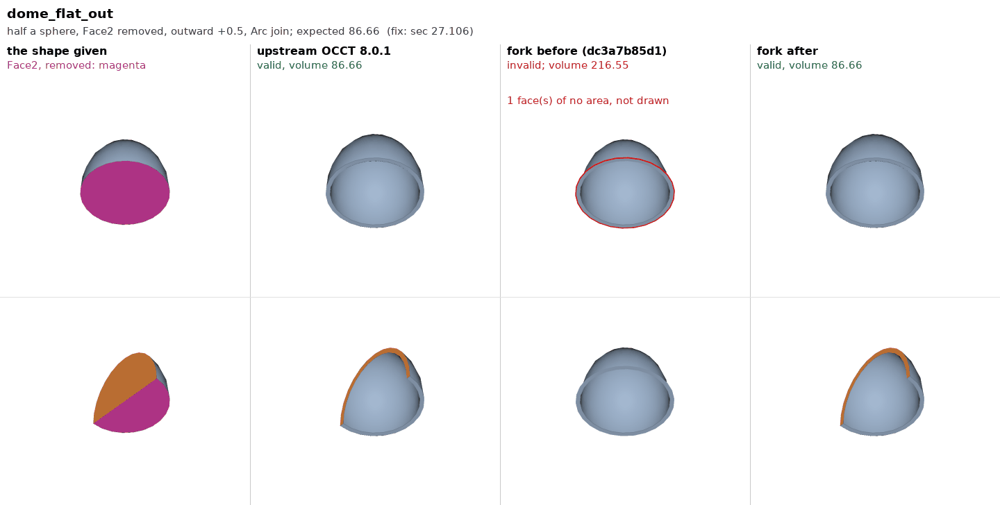
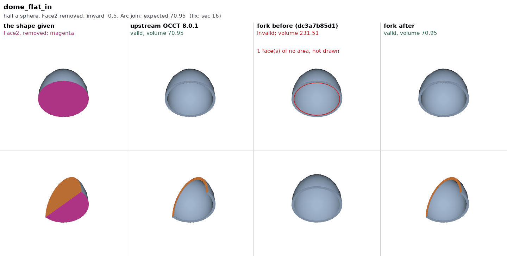
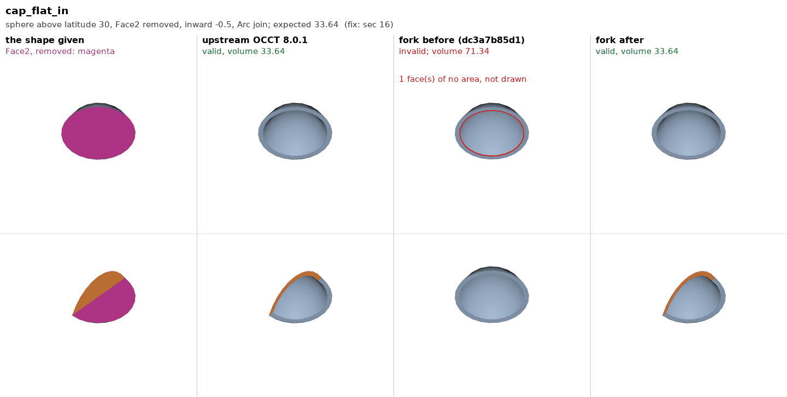
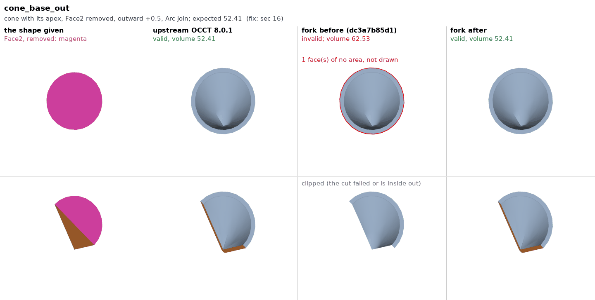

Found beside it, wrong upstream too, and taken up in sec 17: a cone with
its apex inward, and half a dome.

### Sec 17: a cone with its apex, half a dome, and the input never back

**The cone.** The offset of a cone with its apex is a cone with its apex
somewhere else, and `BRepOffset_Offset` trims the offset face again there:
the edges ending at the apex get a new pcurve, with its range set on the
face only. The 3d line computed for such an edge afterwards had no range at
all, -2e100 to 2e100, and three faults came of it, each upstream's too.
Inward with the Arc join, an intersection on the edge took a parameter of
2e100 and `BRep_Builder` refused it (apex down), or the face could not be
stretched to the removed base (`ExtentFace`, apex up). With the Intersection
join and the apex down, the face's bounds were infinite, the enlarged cone
kept the wrong side of its apex -- the nappe running away from the base --
never met the base's plane, and the cone came back unhollowed, 100.5310. The
iso runs with its pcurve, so the pcurve's range is the curve's
(`aca7df93b0`). Inward the skin is the cone less the same cone with its apex
0.5 / sin a = 0.9014 higher, 100.5310 - 61.6882 = 38.8428, with either join;
outward and sharp, 52.4563.

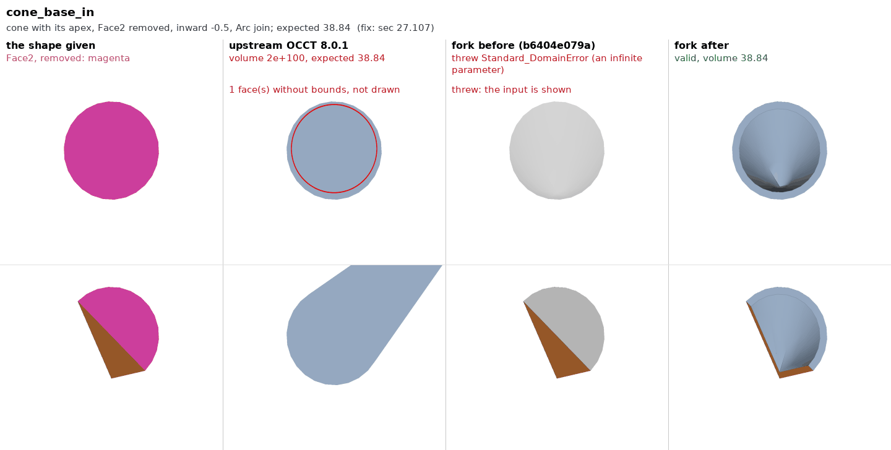
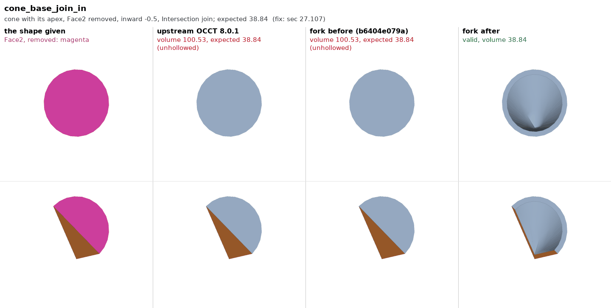

**Half a dome.** `Part.makeSphere(5, V(), V(0, 0, 1), 0, 90, 180)`: a
quarter ball. Its sphere is bounded by two meridians meeting at the pole and
half the equator; its flat side is two coplanar quarter discs, Face3 and
Face4, meeting on the axis; Face2 is the bottom. No seam, a pole, and a
tangent neighbour: six things went wrong (`d964dc081b`).

*The bottom removed, outward.* A pole's degenerated edge has one face, so
the pole counts as a vertex on a free border, and such a vertex has an image
for each tube ending at it -- here the tubes of both meridians. `ToContext`
rebinds an image it has stretched by removing it and binding the new one;
with a second image still there, `BRepAlgo_Image::Bind` threw. The new image
is added instead. With the Intersection join the loop dereferenced the
vertices of an edge that has none; it passes over it. The skin is the sphere
a thickness out, cut by the bottom's plane and by the flat side's plane a
thickness out, the edge between them rounded: 66.1779 outward (67.0206
sharp), and inward 130.8997 less the half cap of radius 4.5 above y = 0.5,
51.3127, with either join.

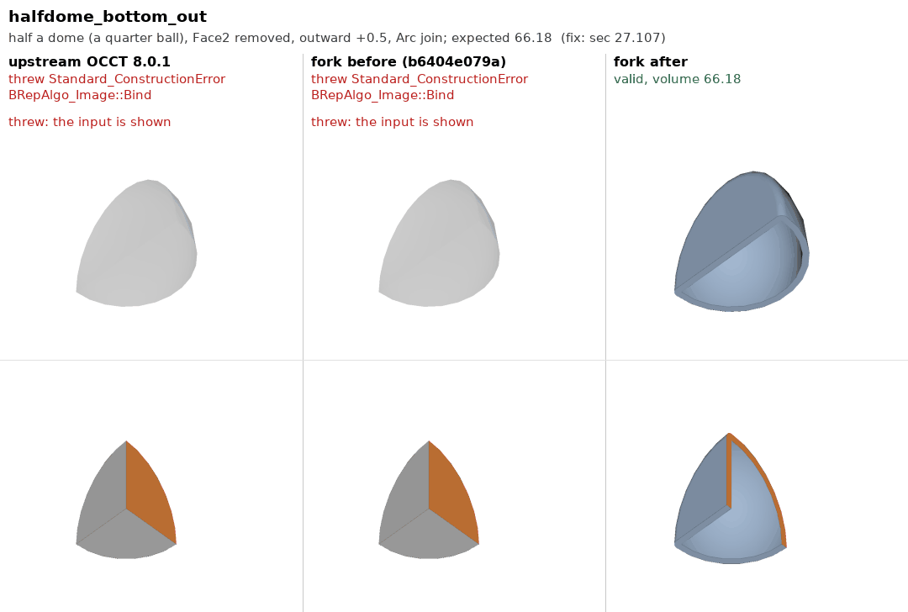

*A side removed.* The other side is its tangent neighbour, and the Arc join
closes the gap with a tube round the axis (sec 6) whose edge on the
removed face, the line x = 0.5, runs through the face's own outline: it
crosses the meridian at z = 4.975. Four things. The loop on the removed face
finds where edges meet by projecting each edge's vertices on the others, and
a crossing inside both edges has no vertex; on a planar face such a crossing
now gets one. The tube was built before that loop cut its edge and kept the
edge whole where the rim took the pieces -- a free edge; a face built before
a later loop cut one of its edges now takes the pieces too
(`MakeFaces`). The pole's degenerated edge, kept out of the loop's vertex
map, was dropped where the wire reached the pole on a vertex of its own; it
takes that vertex. And inward, the offset sphere -- trimmed short of its
pole, its own edges running on past the cut -- came with three wires where
it has one: on a periodic face the search keeps every closed wire, and it
found the wire round what was cut away (run the other way) and one of no
area along the pieces beyond. A wire bounding nothing now loses to one
sharing an open edge with it that bounds something.

Outward: the quarter shell of the sphere 43.3278, the bottom's slab 19.6350
and the neighbour's 9.8175, a quarter torus on half the equator 3.2151 and
on the neighbour's meridian 1.6075, a quarter tube on the neighbour's bottom
edge 0.9817 and the tangent tube on the axis 0.9817, and three ball eighths
of 0.0654 -- at the neighbour's corner and at the tube's two ends: 79.7628.
Inward: 130.8997 less the half cap above z = 0.5 (79.5870), without the
neighbour's slab in it (6.7991) and the quarter tube round the axis
(0.7827): 58.8944.

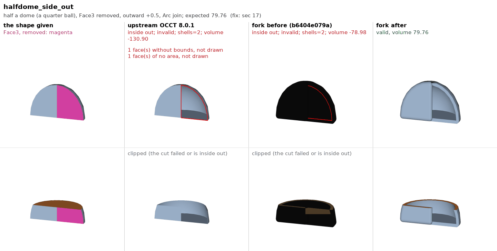
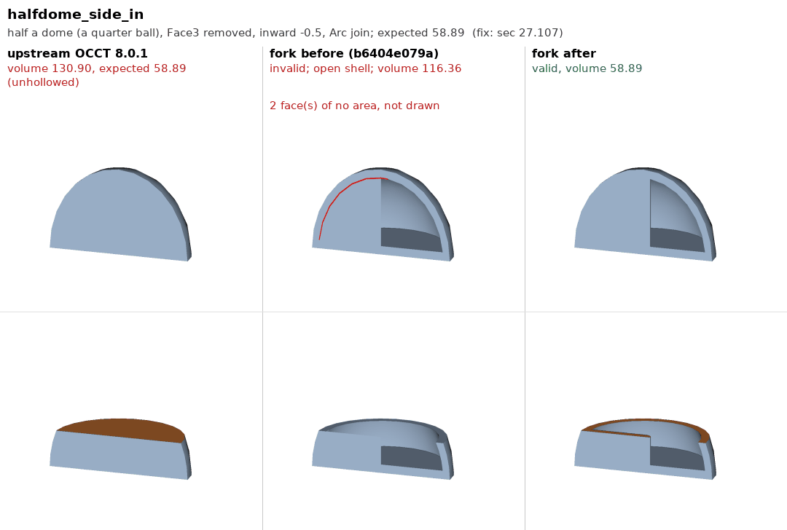

**The input never back** (`92568cb0da`). Where an offset never meets a
removed face, the face is rebuilt whole and the result is the input,
unhollowed and "valid" -- the cone above, and what the first of these
changes turned the half dome's Intersection-join throws into. It is the one
result that is never right, and `MakeThickSolid` now refuses it: a result of
the shape's own volume inward, or outward of its volume with every removed
face whole again (a skin can weigh what its shape does: a box 10 x 8 x 6 by
1 has a skin of 480 too).

**A box fused of two, not refined** -- every face across the joint in two
coplanar pieces, one piece of the top removed -- is the plain form of the
half dome's side. With the Arc join the fork was right already (upstream
throws or returns the box): 417.3038 outward, the rounded skin 455.5869
less the slab over the removed piece, three quarter tubes and two ball
eighths, plus the tangent tube and its two eighths; 274.7124 inward, 480 -
192 - 6 (3 - pi / 4). With the Intersection join the closure of sec 9
did not apply, because the faces at the joint's ends are split too, and the
box came back, 480. The closure now takes the piece beside the removed
face; the wall it needs is not built yet, and the call is refused.

**Still wrong** after this section, and marked so in the suite (XFAIL)
until the next one: the half dome's other side inward (an invalid result);
the half dome with the Intersection join, bottom outward (67.0206) and a
side either way; the split box with the Intersection join (440 and 276).
All refused or invalid; none the input.

### Sec 18: coplanar pieces, a wall on a sphere, a sphere round its pole

The five cases sec 17 left, in four groups. Upstream fails every one --
the input back, an invalid solid, or a refusal.

**The mirror image** (`ed836d0120`, `BRepAlgo_Loop::Perform`). Half a dome,
its second side face removed, inward: the offset sphere came back with the
wire round what the neighbour's offset had cut away. The removed side's
meridian is stretched over the pole and down the far side of the sphere,
and of the three closed wires the search finds on the sphere -- the face,
what was cut away, and the two together -- two run through the piece past
the pole. Sec 17 told them apart by area, and a wire whose pcurve runs
past the pole, out of the sphere's parameters, has no area to speak of:
negative for one side (right, by luck), positive for its mirror image. A
stretched edge carries its own ends as INTERNAL vertices; on a face that is
not a plane they are its span, and a piece beyond them is outside -- a wire
through it loses to one sharing an open edge with it that stays inside (the
rule of sec 3). 58.8944, as the first side.

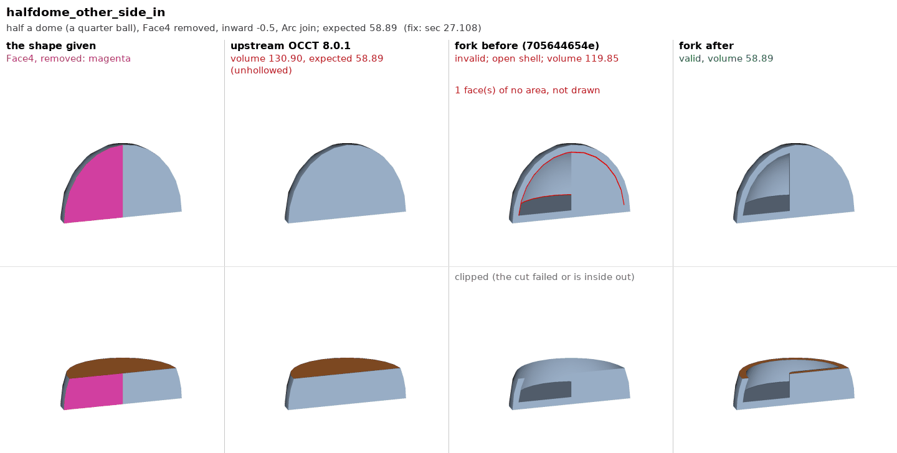

**Faces in coplanar pieces, the Intersection join** (`c13b1e5540`). The box
fused of two, every face across the joint in two coplanar pieces. Four
faults, three of them in `BRepOffset_Inter3d::ConnexIntByInt`, where faces
that meet at a vertex alone are intersected there:

*The wall intersected twice.* The end of the removed piece's tangent edge
also lists the edges of its closure on the face at that end (for
`BRepOffset_Inter2d`), which do not reach it. Taken for edges that do, the
wall and that face were intersected at the vertex as well as through their
own edge: one section, two edges, and every wire of the wall came twice --
the wall was never built and stayed an unbounded plane. An edge that does
not hold the vertex brings no face to it. This alone answers a box whose
top only is split.

*Each piece intersected with the far piece of its neighbour.* At a vertex
of the joint two coplanar pieces meet the two pieces of their neighbour,
and each piece was intersected with the far piece too: two edges on one
line, one running on past the joint, and no piece of a split face was
built. Nothing to do with removed faces -- an end face removed failed the
same way, and upstream gives the box back. A face that only carries on, in
its own plane, one the other meets along an edge at the vertex is not
intersected again.

*The side beside the removed piece.* The closure runs a thickness into the
removed piece, so the side beside it meets the other piece of the top
between the wall and the joint -- on the line where the side beyond the
joint meets that piece. Intersected anew at the wall's far vertex, the line
had two edges, one never trimmed. The side takes the edge that is there:
one edge, three faces.

*Its pieces purged* (`BRepOffset_MakeLoops::Build`,
`BRepAlgo_Loop::KeepPieces`). Such an edge is cut in the first face built,
for all three, and the pieces that face had no use for were purged before
the others came for them. Pieces of an edge more than two faces share stay.

With intersection on, a planar shape whose removed face is tangent to a
neighbour is built as with intersection off, as one with a concave removed
face is (sec 5): the splits know nothing of the closure.

The sharp skin weighs 480 either way (12 x 10 x 8 less the box, or the box
less 8 x 6 x 4). Outward, less the slab over the removed piece short of the
wall: a top piece 4 x 10 x 1 (440) or 6 x 10 x 1 (420), a side piece
4 x 8 x 1 (448), an end 8 x 10 x 1 (400). Inward, less the cavity 192 and
the shaft up to the wall: 2 x 6 x 1 (276), 4 x 6 x 1 (264), 2 x 4 x 1
(280), and for an end the cavity run out to the face, 216 (264). All ten
faces, both ways, both joins, intersection off and on -- 80 runs -- check.

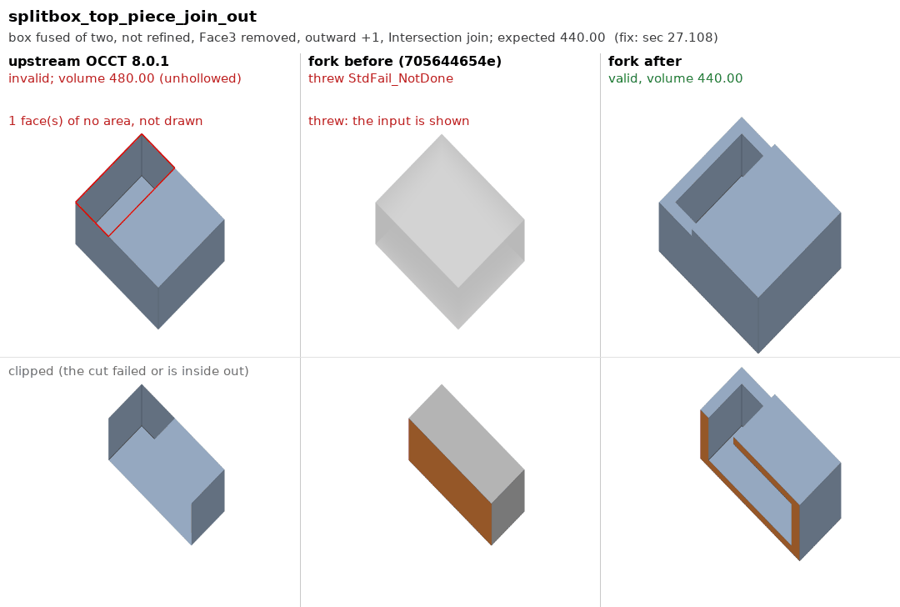
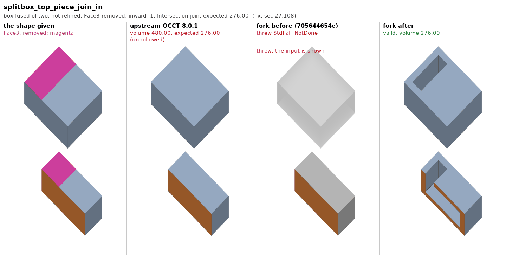
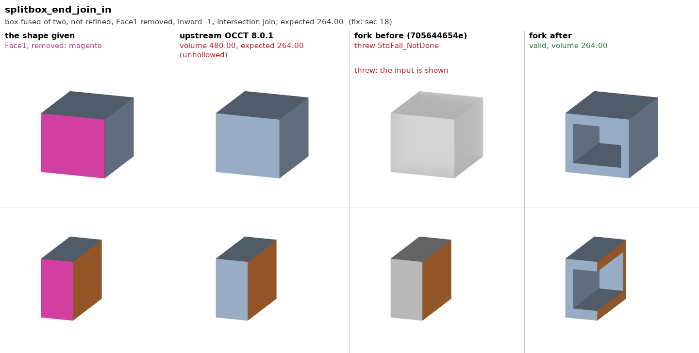

**The wall on a sphere** (`73947cfab4`). Half a dome's side, the
Intersection join, inward. The wall closing the tangent edge -- the axis --
ends on the face at the edge's end, here the sphere, at its pole. Its end
edge is a line square to the kept face and lies on the end face only where
that is a plane; on the sphere it has no pcurve, was neither convex nor
concave, and the wall was never intersected with the sphere
(`BRepOffset_Analyse::TreatTangentCaps`: on a curved end face the edge is
convex or concave as the wall runs behind the face or in front of it). And
the removed side's plane cuts the enlarged offset sphere in two half
circles, of which `BRepOffset_Tool::Inter3D` kept the one beyond the pole,
on the neighbour's side: it chooses by the angle to an extremum of the
distance from the reference edge's middle, which on an edge that point has
no foot on is the farthest point. The edge clearly nearest the reference
point is taken; the angle decides between edges as near as each other. The
Arc join's 58.8944 with a square column beside the axis, 0.9954 (the
integral of sqrt(4.5^2 - x^2 - y^2) - 0.5 over a square of 0.5), where
that has the quarter tube, 0.7827: 59.1071.

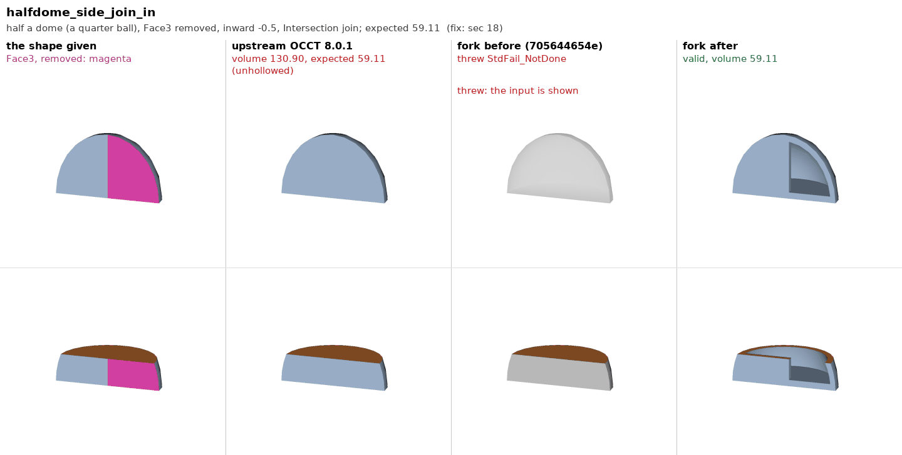

**A sphere grown round its pole** (`3860ed4511`). Outward with the
Intersection join the flat neighbours' offsets cut the offset sphere behind
its pole, and the sphere face, grown past the meridians that bound it, has
to run round the pole: in its own parameters a whole turn of U with a seam
up to the pole, where `EnLargeFace` grows U by a tenth of what is left of
the turn. Rather than teach the loops a seam that other edges cross, the
face is put on the same sphere with its axis turned
(`BRepOffset_Tool::EnLargeFace`): the middle of the face on the new
equator, opposite the new seam, and of the axes square to that middle the
one whose poles stay farthest from the face's outline -- a twelfth of a
turn at the least. There the region is a plain patch. The edges take new
pcurves; the old pole is an ordinary point, and its degenerated edge takes
a pcurve that stays on it, which `ExtendPCurve` does not try to prolong and
`FindLoop` leaves out of its wires. It applies to a face of a sphere that
reaches a pole on no more than half a turn.

The bottom removed: the ball of 5.5 above the bottom's plane and beside the
side's plane a thickness out, less the quarter ball, 67.0206. A side: the
bottom's plane a thickness down, the neighbour's a thickness out as far as
the wall, 81.7345. A quarter ball lying on its side (the face reaching both
poles), an eighth of a ball and a third of a dome are answered with them,
each checked against the same integrals.

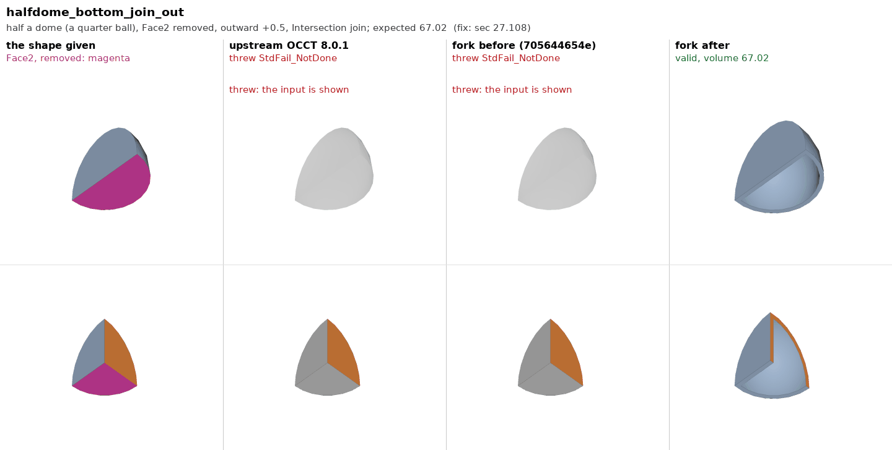
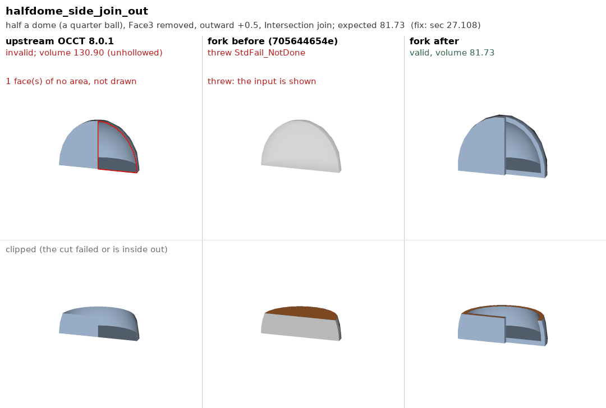
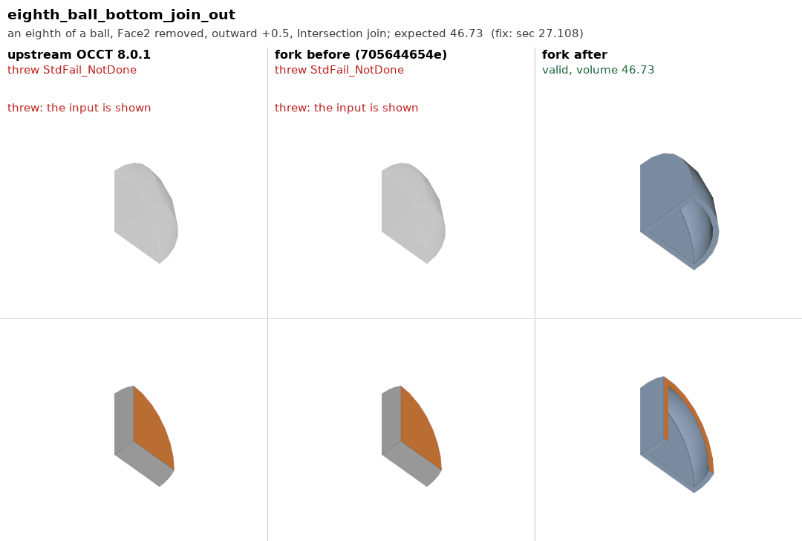

**A wall out of its band.** Half a ball cut through both its poles has no
such axis -- its outline is a whole great circle -- and its sphere cannot be
grown round the poles. Once the wall's end edge on a curved face was
intersected (above), a flat half of it removed came back as a valid solid
that was not the skin, 111.2647 for 113.0909: the sphere does not reach
where the wall must be cut, and the wall's loop closed on half a disc. A
wall stands in a band one thickness deep, between the removed face and the
kept face's offset; `MakeOffsetShape` refuses one built outside it (beyond
the kept face's offset, or, where the removed faces are planes, beyond the
removed face). Not pictured: the right outcome is a refusal.

**Found beside these, not fixed** -- shapes outside the suite and the
sweep, wrong before this section too, all with a sphere at a pole. A dome
of three quarters of a turn (`makeSphere(5, .., 0, 90, 270)`): a side
removed inward is invalid or refused with the Arc join, a side is refused
either way with the Intersection join, and the bottom removed outward with
the Intersection join comes back as the input, 196.3495, which sec
17's refusal does not catch. With the Arc join, the eighth of a ball
and the third of a dome are refused bottom removed outward, and the third
of a dome a side removed inward. Of 232 runs on fifteen shapes with a face
at a pole -- every flat face, both ways, both joins, intersection off and
on -- 28 are refused or invalid, 81 before this section (and one more, the
half ball inward with intersection on, was a valid solid of the wrong
volume); none is a wrong answer now but the three-quarter dome's. Sec
19 takes them up.

### Sec 19: more than half a turn, three tubes at a pole, the sphere itself removed

What sec 18 found beside its own cases and left: a ball of 5 cut by its
equator and by two planes through its axis -- three quarters of a dome, a
third, an eighth of a ball -- and each of them with the sphere itself
removed. Every volume here is worked by `sweep/polehand.py`, numerically,
from the rules the earlier sections settled; at this thickness it gives the
76 volumes those sections had worked one by one. Upstream answers none of
the seventeen pictured: the input back, an invalid solid, or a refusal.

**More than half a turn** (`9a23596f40`, `BRepOffset_Tool::EnLargeFace`).
Sec 18 turned a sphere's axis off a face that reaches a pole, so that
the face can grow past the pole as a plain patch; it stopped at half a turn,
and looked for the new axis only among the directions square to the middle
of the face. Three quarters of a dome kept its own axis, its offset sphere
could not grow, and the bottom removed outward with the Intersection join
came back as the input, 196.3495 -- which sec 17's refusal does not
catch, the removed face being whole in it. The axis is now any direction
that keeps both poles off the face and a twelfth of a turn from its outline,
the farthest of them; the seam is the middle of the widest stretch of the
turn the outline leaves free. 87.3133: the ball of 5.5 above the bottom's
plane, beside the two sides' planes a thickness out, less the dome.

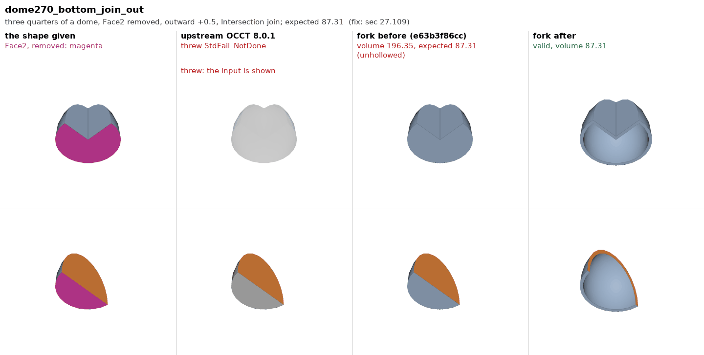

**The old pole is no edge of a turned face** (`08df835f2a`,
`BRepOffset_Inter2d::ConnexIntByInt`). On the turned sphere the pole is an
ordinary point, but its degenerated edge still stood in the outline between
the two meridians, and each of them was paired with it instead of with the
other. A removed side's border was then cut at the pole and never by the
other side's section, which lies past the pole where the edge at the axis
is concave: three quarters of a dome, a side removed inward, was refused.
The pole's edge is stepped over, unless the two meridians run on into each
other -- half a turn, where one circle is the section of both. 83.7681
inward, the wall running on a thickness past the axis; 113.7486 outward.

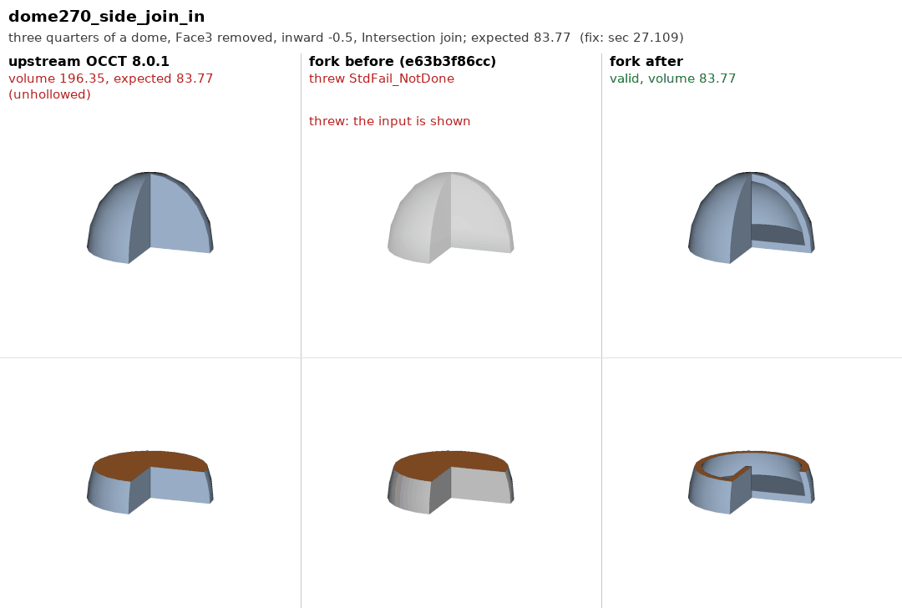
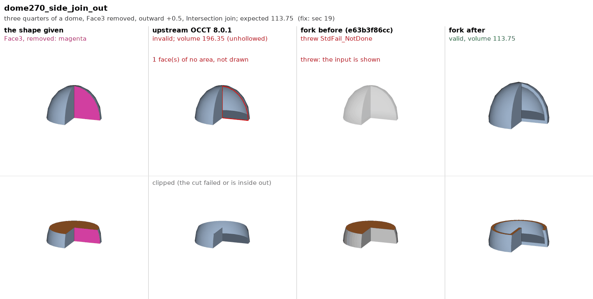

**A piece past the pole, the Arc join** (`2ecab1f566`, `BRepAlgo_Loop`).
With the Arc join the sphere is not turned, and the removed side's meridian
is stretched over the pole to where the other side's offset cuts it. The
piece beyond the pole kept the pcurve of the edge it was cut from -- the
meridian's line run on above the pole's line, off the sphere's range -- and
the pole's edge went into the wire whole, a three-quarter turn of it. The
same side inward came back invalid, or was refused for its mirror image.
The piece takes the line of the meridian opposite, coming down from the
pole, and the pole's edge is cut to run from the one meridian to the other.
With the pcurves right the search then finds two wires where it found one:
the face, and the half of it the stretched meridian cuts off by running on
down the far side. Both run through pieces beyond their edge's span; the
one through more of them loses. 83.7681, as the Intersection join.

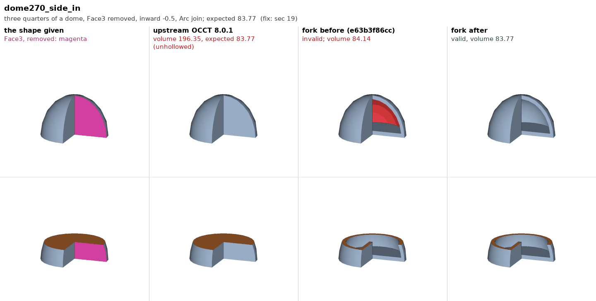

**Three tubes at a pole** (`ae43532a91`, `BuildOffsetByArc`). A vertex gets
its piece of sphere when every edge at it carries a tube. The pole's
degenerated edge was counted among the edges and carries none: an eighth of
a ball or a third of a dome, the bottom removed outward, had the tubes of
its two meridians and of its axis end on nothing, and was refused. 45.5612
and 52.4334.

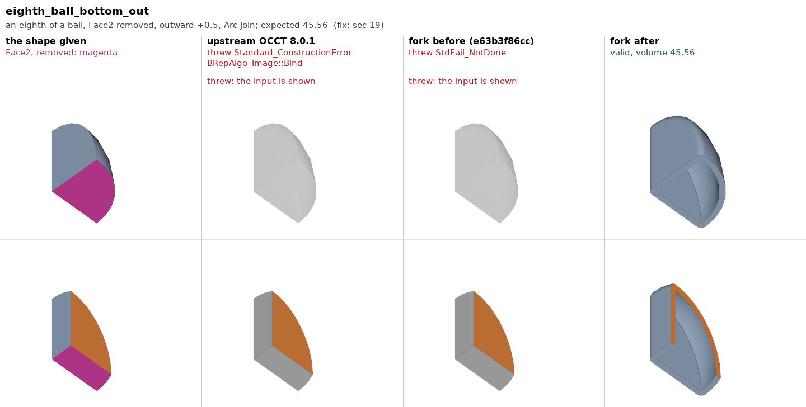
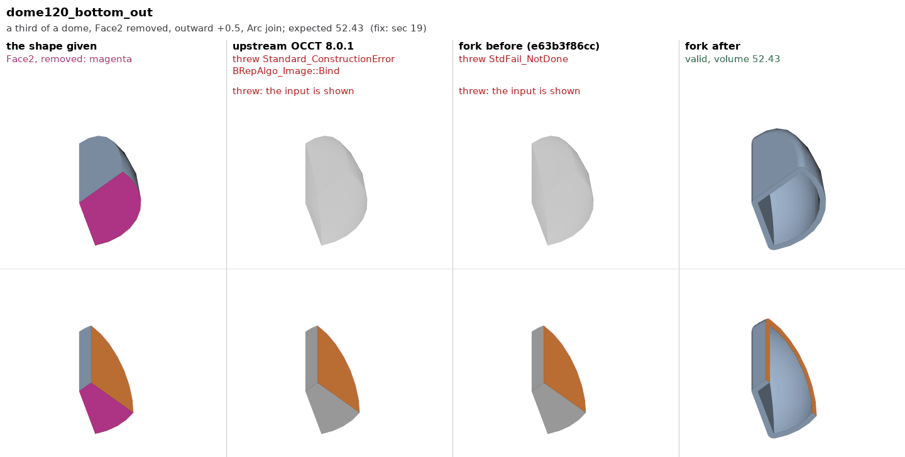

**The far crossing** (`246f2d4966`, `BRepOffset_Tool::Inter2d`). The Arc
join extends each kept face to the removed one and cuts its new edges by
their neighbours' in 2d. A line crosses a circle twice, and on a periodic
curve the parameter comes in the curve's first period, not the edge's: a
third of a dome, a side removed inward, had the other side's offset --
whose arc ends on the period's start and is cut a little past its own end
-- extended into three quarters of a disc, and was refused. 41.2951.

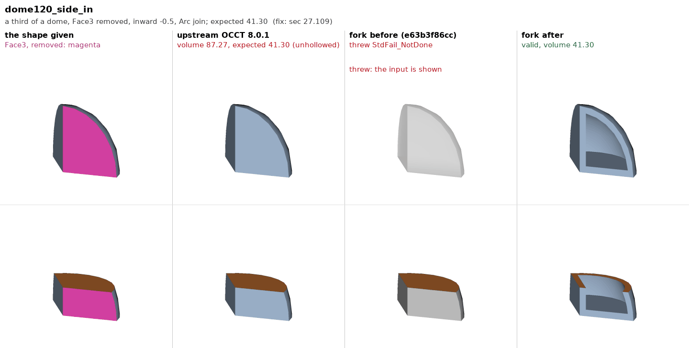

**The sphere itself removed** (`9de63f298b`, `73f8dcdaa7`). The wall of a
removed face lies on its own surface, past its outline -- on a sphere, past
the pole the outline runs to, where the face cannot grow. Outward every one
of these shapes was refused or threw, with either join. The removed face
gets what the kept faces got, a sphere with its axis turned off it, but it
is the caller's face and not the algorithm's to change: it is replaced, the
way a face made planar is (`myFacePlanfaceMap`), by a twin
(`BRepOffset_Tool::TurnedOffPole`) -- a new face with the same wires, whose
edges take a pcurve on the turned sphere beside their own. Those edges keep
their tolerance, and the pcurve has to lie within it, which the projection
does not promise (1.3e-7 for 1e-7, and the wall was invalid): it is
interpolated, through as many points as that takes. A later thickness of
the same shape finds the twin's sphere on the edges and uses it again; the
edges take those pcurves once.

Three more faults on the way, none of them the sphere's. A new edge
replaces the edge it is the image of among the descendants the loops are
built from; a vertex has edges for images too, the ends of the tubes that
meet at it, and the pole's degenerated edge, which only the removed face
holds, was given a tube's arc for a vertex. An edge with the same neighbour
at both its ends -- the meridian of a quarter ball lying on its side,
between its two poles -- takes both crossings of its neighbour's line, each
end its own: `Inter2d` gives every crossing, and a vertex moves to the one
nearest where it is. And the twin is grown, like any turned sphere,
into most of what the outline leaves free of the turn (below).

An eighth of a ball: 32.3576 with the Arc join, 33.2167 sharp, 25.7418
inward. Half a dome 41.0976 and 41.6307; the quarter ball on its side the
same, and 36.6474 inward.

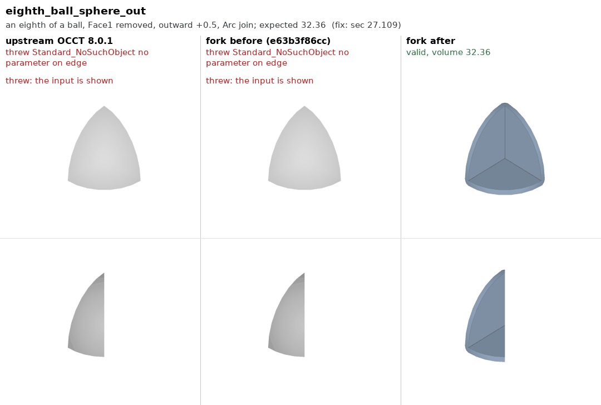
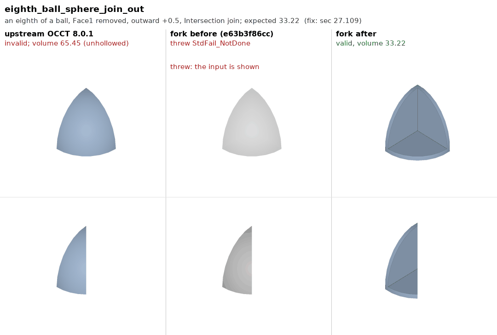
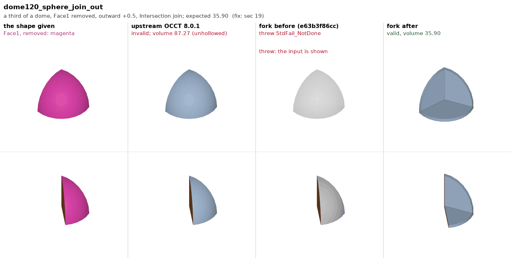
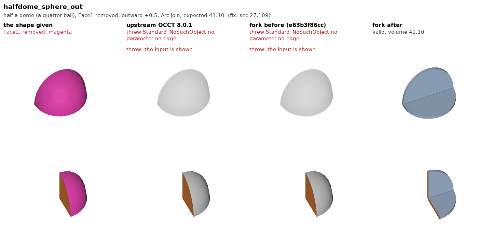
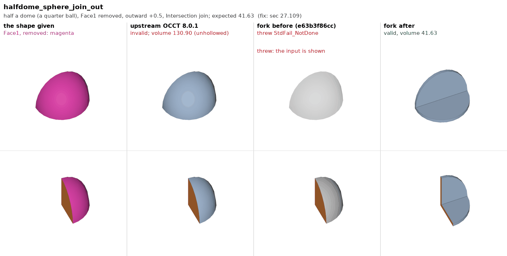
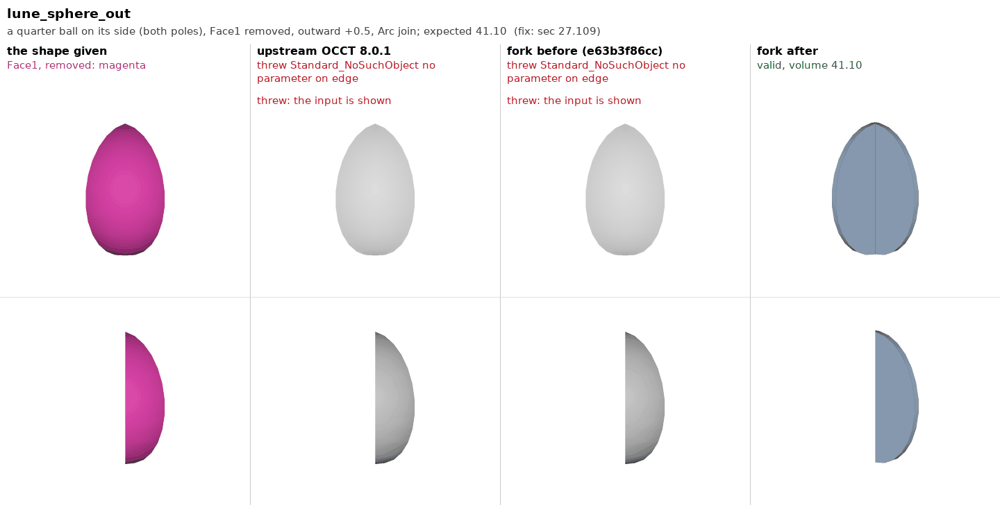
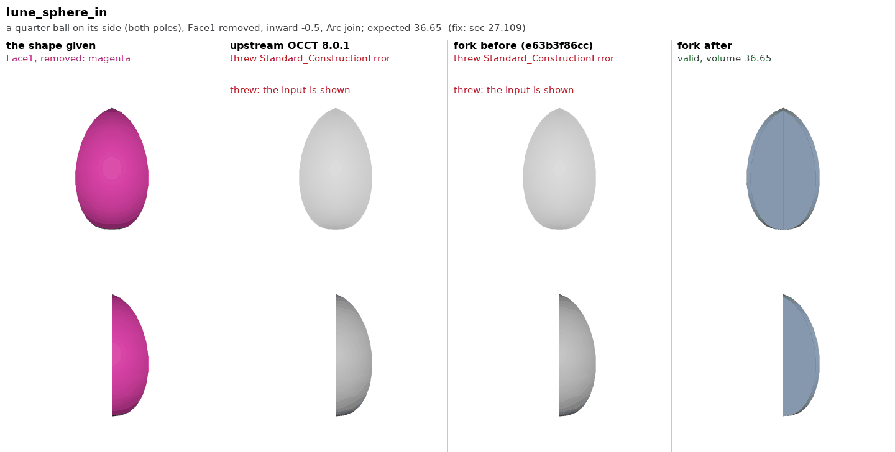
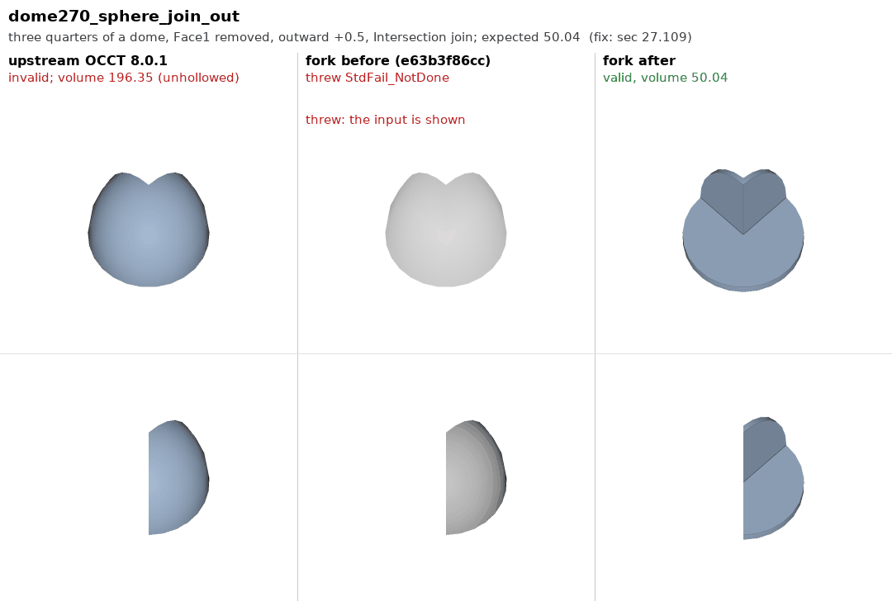

**A wrong answer at twice the thickness** (`d98bd7a7ce`). The sweep runs
at a thickness of 1, a fifth of the radius, and there three quarters of a
dome, a side removed outward with the Intersection join, was a valid solid
of 89.196 for 260.937: the skin built on the wrong side of the kept face.
A periodic face is grown by a tenth of what is left of its turn. On the
turned sphere that fell short of where the bottom's and the side's sections
meet; the side's section was cut off at the end of the grown face, and met
the bottom's at its far crossing, on the other side of the removed face.
The seam of a turned sphere lies in the middle of the free stretch, and the
face takes nine tenths of it. The same shortfall threw with the sphere
removed.

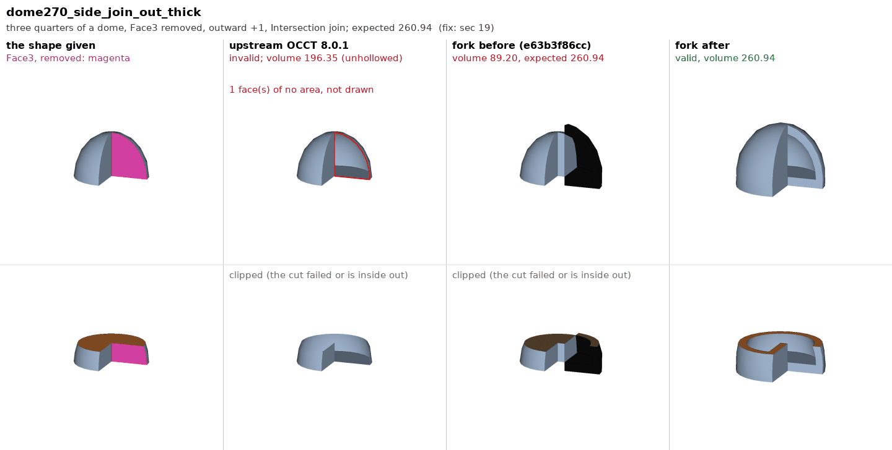
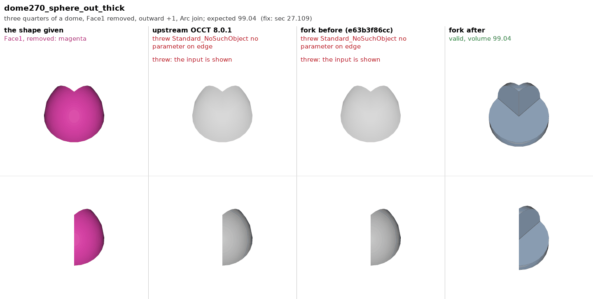

**The sweep** gained six solids with a face at a pole -- a dome, half, a
third, a quarter and three quarters of one, and the quarter ball on its
side -- 168 runs, each judged by `sweep/polehand.py`'s value: 880 runs, the
fork right on every one. Upstream is right on 68 of the 168; of the other
100, 38 are invalid, 30 refused, and 32 are valid solids of the wrong
volume.

**Left open: half a ball cut through both its poles.** Its outline is a
whole great circle, and no axis keeps both poles off the face. With a flat
half removed and the Intersection join, the offset sphere has to reach a
thickness past that circle beside the kept half, on both sides of each
pole: it holds its poles inside, and the face needs a seam. Turning the
axis onto the middle of the face makes it a dome, which the loops can
build -- but its seam and its new pole's edge are not images of any edge of
the face given, and the outline walk and the bookkeeping of a face's own
edges know only those. Tried, it turned the refusal into an invalid solid,
and was taken out. The suite marks the four cases known broken, with their
volumes: 113.0909 and 89.0272 for a flat half removed, 39.1390 for the
sphere removed outward, either join. They are refused, not wrong. Sec
20 takes it up: the face is cut in two first, and both parts are faces
the loops know.

### Sec 20: half a ball, and a shape that is placed or turned

Sec 19 left half a ball cut through both its poles. On the way to it a
second fault showed, wider than the first: the same solid gave another
result -- or none, or a wrong one -- when it carried a location, and
sometimes when its geometry was turned in space. Every volume here is one
an earlier section had settled, or `sweep/polehand.py`'s.

**A shape that is placed.** A location is what an object's placement
becomes: the shape is the shape it is where it was made. Of 228 runs on
shapes with a pole, a cylinder and a torus -- every face, both ways, both
joins -- 144 gave another result placed than plain. Four causes, three of
them upstream's code:

*A seam checked without its location* (`ea5b8c15ff`,
`BRepCheck_Edge::Tolerance`). The check compares an edge's curve with its
pcurves on their surfaces; the first pcurve's surface is taken under the
edge's location, a seam's second one without it, and the tolerance comes
out as large as the move. `UpdateTolerance` asks it for every new edge and
gives the answer to the edge and to its vertices: a cylinder moved by
(3, 4, 5), its side removed, came back with its own two vertices at a
tolerance of 7.42 -- the input edited, still valid and of the same volume
-- and the next thickness of that shape, its top removed inward, was a
valid solid of 272.73 for 89.93. Not pictured: there is nothing to see in
a tolerance. The suite's check of the input now holds the largest
tolerance in it beside its validity and volume.

*A pole not known for one* (`e600b02563`, `CheckInputData`). The poles of a
face are listed so that their normals are not tested; they were taken as
placed and compared with points of the surface as it lies before the
location. Every placed shape with a pole was refused.

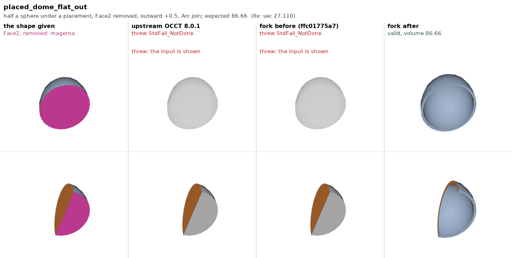

*The apex left behind* (same commit, `BRepOffset_Offset`). The apex of an
offset cone is taken on the surface and made a vertex of the offset face,
which lies under the face's location: the offset of a moved cone ran from
its base to where the apex was before the move.

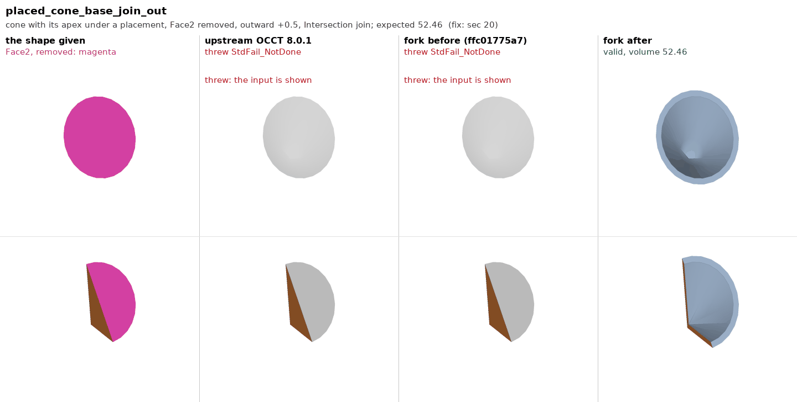

*A normal out of rounding* (same commit, `CorrectConicalFaces`). The
circle an apex becomes outward has its normal taken from its start, middle
and end. The end of a whole circle is its start; the normal was what the
rounding left of their difference -- right, by luck, for a cone as it is
made, and no vector at all for one moved by whole numbers, where `gp_Dir`
threw. The points a third and two thirds along are taken.

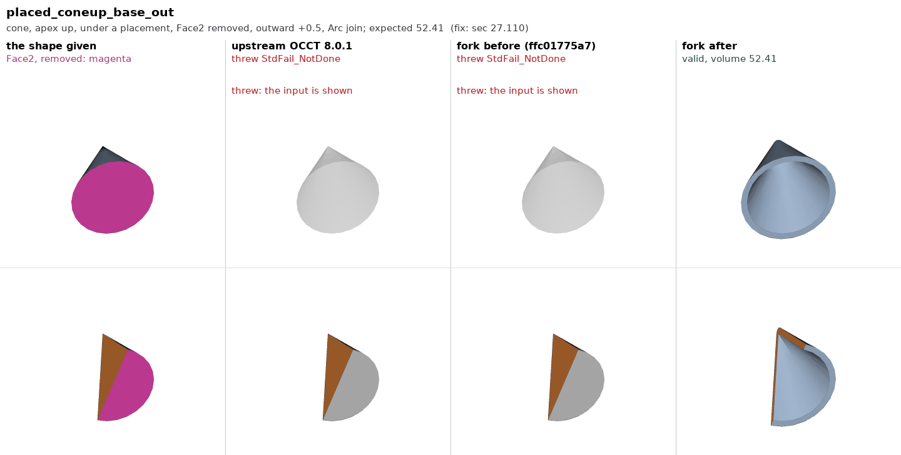

And the turned sphere of sec 18 was made only for a face without a
location; it is worked out as placed and kept as it lies before that.

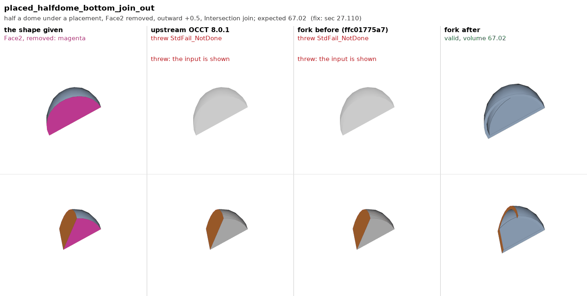

**A shape turned in space** (`f828a88a9d`, `TangentCornerArcOnCap`). With
the placed runs right, six of the sweep's still differed -- and differed as
much with the geometry itself turned, no location on it: a filleted box, a
fillet removed outward with the Arc join. At a corner of a removed face
tangent to its neighbour the sphere round the vertex meets the removed
face's surface in an arc (sec 6), which was taken from the section of
the two: the line both its ends lie on. The section comes in as many lines
as the intersection cuts it in, and where they join depends on how the
shape lies. Turned by 40 degrees about (1, 2, 3) the arc's ends lay on two
lines; no arc was found, the corner was left without its sphere, silently,
and the result was a valid solid of 459.398 for 405.903, or a refusal. The
arc is built as the tube's edge is, point by point: in each plane through
the cap's normal at the vertex, the circle round the vertex meets the cap.

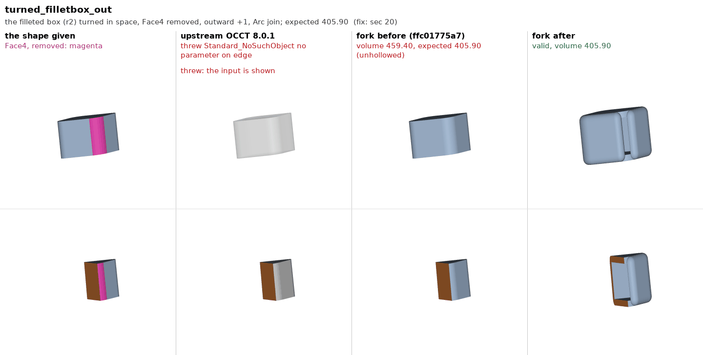

**A circle that starts where it is wanted** (`855747c9f7`,
`BRepOffset_Tool::StartSectionsFarFrom`). A section that is a whole turn of
a circle comes closed on a vertex of its own, which the intersection puts
where the circle's own axes have it. The edges that cross the circle cut it
in as many pieces as there are crossings, and the trimming -- `TrimEdge`
from the least parameter to the greatest, `ExtentFace` from the one new
vertex to the other -- loses the piece that vertex lies in. Upstream's
code, and it has always needed the vertex to fall in a piece nobody wants;
as a shape is made it mostly does, and turned in space it falls anywhere.
Half of a sphere's cap, turned by 40 degrees, its sphere removed inward:
refused with the Arc join. The same shape's bottom or a side removed with
the Intersection join was right before this section only because a shape
turned that way still carries a location (an identity, but not none), for
which its sphere was not put on a turned axis; turned like any other, it
gave a valid solid of 11.598 for 22.043, and refusals. Such an edge is made
again, on the same circle, starting at the point farthest from where the
section is wanted -- the edge being intersected, the offset face being
extended -- with its pcurves on both faces. One whose start is already in
the far half stays as it is, and so does one that runs round a face's
period, which starts on the seam, unless the face is a removed one and no
whole turn itself.

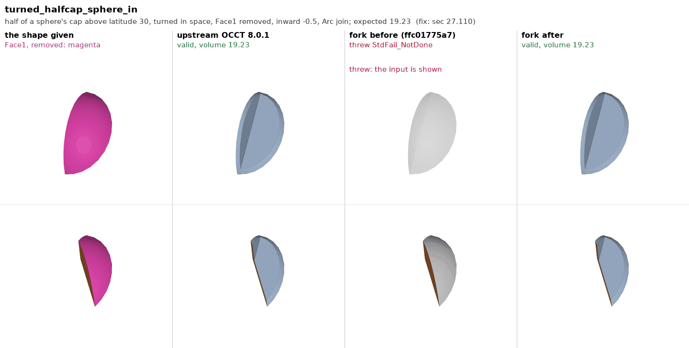

Two more of the same kind, where the answer hung on what the intersection
gave first. *Which way a section runs* (`1d4dba3c77`): sec 5 turns a
section that runs against the offset of the removed face's edge, and
compared the section's tangent at its middle with the edge's at the nearest
extremum of distance -- for a section that is most of a circle, the
farthest point, across the circle, where the two run opposite ways. They
are compared where they come nearest. With the Intersection join the same
cap came back a valid solid of 8.126 for 19.232.

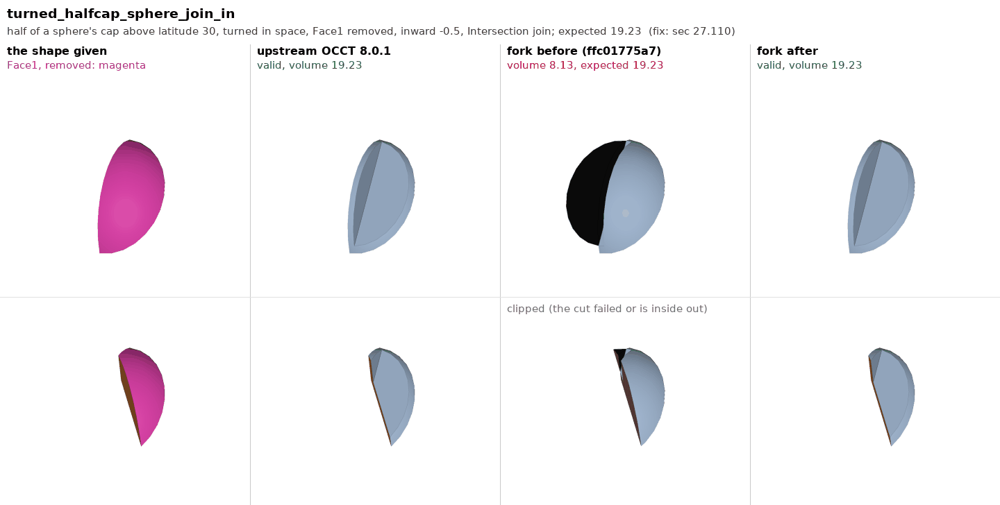

*Which of two circles* (`d9eac5779b`, `CheckIntersFF`): of the blocks a
section falls into, the one nearest the reference edge's middle is kept,
and of two as near as each other the first found. A cylinder cuts the
sphere round its end in two circles, one each side of the edge they share:
a dome on a cylinder, the cylinder removed outward with the Intersection
join, took the circle below the dome's edge once turned -- a compound of
151.12 for 100.73 (a disc of 39.2699 and the dome's skin inside the
cylinder's surface, 61.4616). The tie goes to the block nearest the face
that stays.

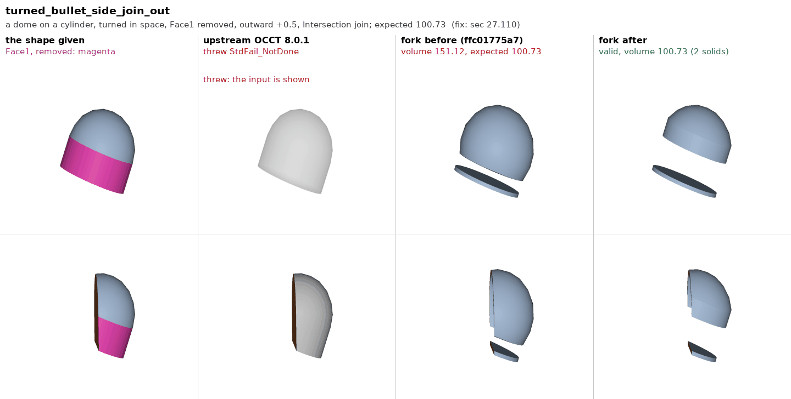

Of 228 runs on nineteen shapes -- fifteen with a pole, a dome on a
cylinder, a box, a cylinder, a torus; every face, both ways, both joins --
none gives another result placed or turned than as made.

**Half a ball, cut in two first** (`f70247dc14`,
`MakeThickSolidOfSplit`). Its sphere's outline is a whole great circle. No
axis keeps both poles off the face, so it cannot be put on a sphere with
its axis turned; grown past the outline it holds its poles inside, and
needs a seam no edge of the shape stands for (sec 19 tried one, and
took it out). Any two parts of it are faces the loops know, and their
common edge is an edge. The face is cut before anything else, by a general
fuse of the solid with the cutting edge, which leaves the solid given as it
is; the thick solid is made of the cut solid, and its images come back
under the faces and edges given -- a face's are those of both its parts.
Which way it is cut depends on what is done with it:

- a face that stays, the Intersection join: along its equator, into two
  domes, each reaching one pole and turned off it (sec 18);
- a removed face, outward: along a meridian, into lunes of a quarter turn
  at the most, each with a twin (sec 19).

The other way round fails for each (below). With the Arc join a face that
stays is not grown, and inward a removed face's wall lies within its
outline: there the face stays whole, and the result is as it was.

A flat half removed with the Intersection join: the ball of 5.5 above the
kept half's plane a thickness out, as far as the wall a thickness past the
axis, less the ball -- 113.0909; inward 89.0272. The sphere removed: a slab
of the ball, 39.1390 either way.

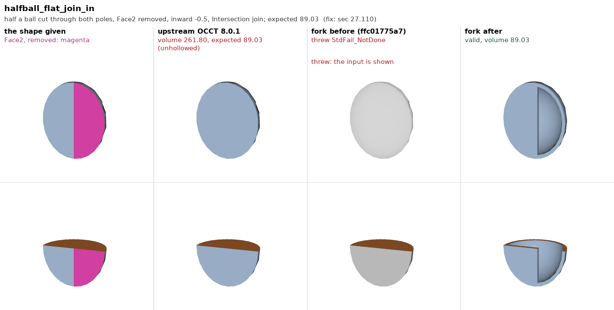
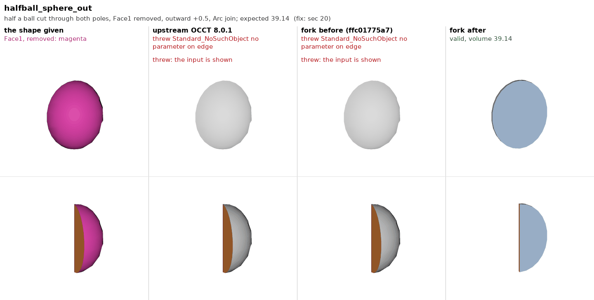
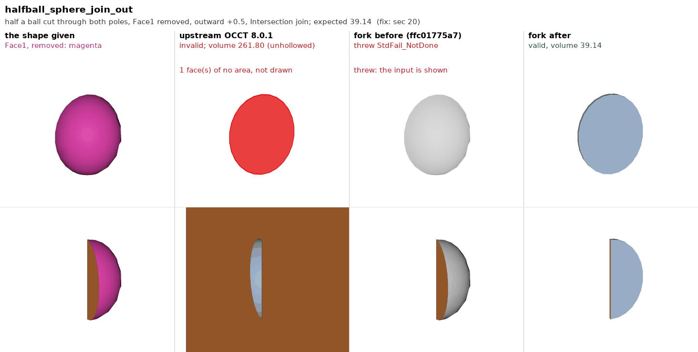

Three faults stood between the cut ball and those answers, each of them
also the fault of a half ball that comes with its sphere in two faces --
a fuse not refined:

*A pcurve that ends where the edge did* (`737eb09241`). On a turned sphere
an edge's pcurve is a B-spline, and the edge a circle; upstream's pcurves
of circles are lines and circles, with no end. A removed face's twin had
its pcurves interpolated between the edges' ends, and the edge two removed
faces share is stretched for their walls and cut past its ends, where the
pcurve was no curve: the walls came out unorientable
(`BRepCheck_InvalidRange`). And `BRepOffset_Inter2d::ExtentEdge` prolongs
a bounded pcurve by a straight segment in (u, v), where a circle's image
bends, then stretches the edge itself to most of its turn, far past the
segments: the equator between two domes came back with a pcurve 0.23 off
its curve under a tolerance to match, and the solid, valid, weighed
90.2265 for 89.0272 -- its mesh 89.026. Both pcurves are now interpolated
through the circle's points as far as the turned sphere lets the circle be
followed, ten degrees off its poles and five off its seam, and an edge on
a periodic curve keeps to the range of a bounded pcurve.

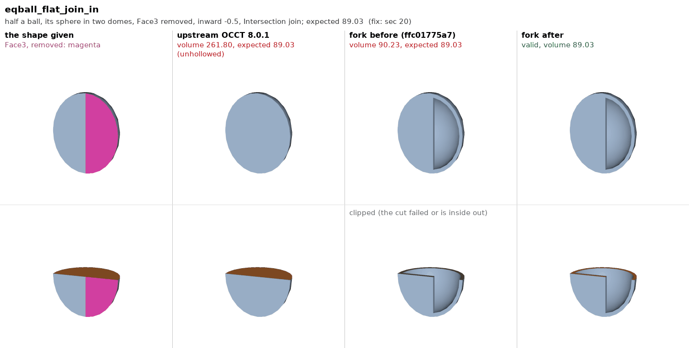
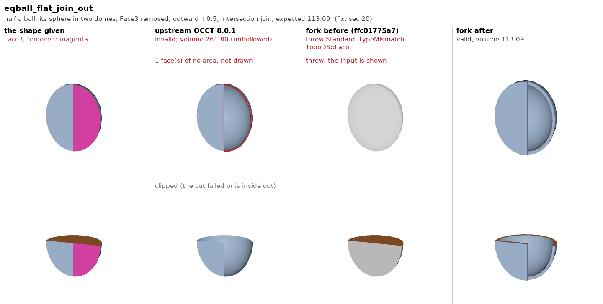

*A crossing before the start* (`5c6ec717f1`, `BRepAlgo_Loop`). The loop
finds the vertices lying on an edge by projection, which on a periodic
curve answers in the curve's first period; the parameter was raised into
the edge's range and never lowered. A meridian from 0 to pi, stretched to
run from -pi/2, lost the crossing just before its start, and the wall its
end.

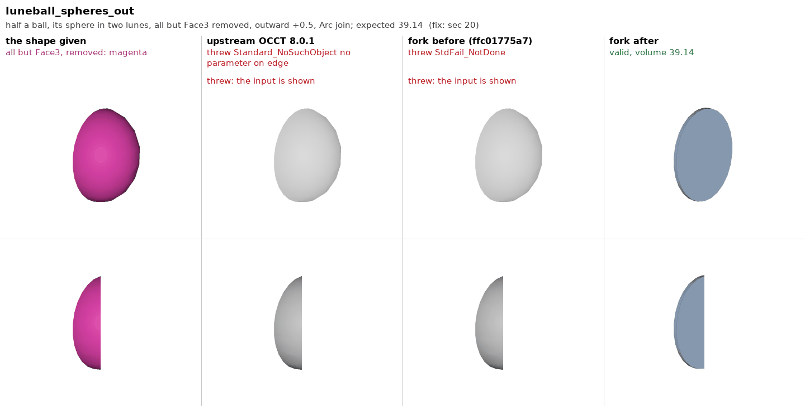

*A block without an edge* (`1147ed323c`, `BRepOffset_Tool::Inter3D`). Two
faces of one sphere meet along the edge they share and nowhere else; the
filler leaves that section's block without an edge, index -1, and it was
read as a shape: the two lunes removed inward, a segmentation fault.
Upstream's code. Not pictured: the stage's libraries crash on it.

**The sweep** gained two solids from pole to pole, a third of a ball and
half of one, 48 runs judged by `sweep/polehand.py`: 928 runs, the fork
right on every one -- plain, frozen, under a location, and turned in space
three ways (`SWEEP_PLACEMENT`). Upstream
is right on 6 of the 48; of the other 42, 22 are refused, 4 invalid, and
16 are valid solids of the wrong volume.

**Found beside these, not fixed.** All wrong before this section too.

- A ball wedge from pole to pole on more than half a turn, its sphere
  removed (`makeSphere(5, .., -90, 90, 270)` and `240`): outward it is
  refused, three lunes not being two; inward, where the face stays whole,
  the result is invalid with the Arc join and with the Intersection join a
  valid solid of 298.45 for 41.63. On 150 degrees the sphere removed
  outward with the Arc join is refused. 9 of 72 runs on six such wedges
  (90 to 270 degrees; every face, both ways, both joins); the other 63 are
  right, and every one of them with a flat side removed.
- The half ball that comes cut the other way round. In two lunes, a flat
  half removed with the Intersection join: refused outward, and inward a
  valid solid of 182.21 for 89.03. In two domes, both removed: refused
  with the Arc join, invalid outward with the Intersection join. Joining
  the faces of one sphere before cutting them would answer both.
- The half ball in two domes, both removed, fails first where the flat
  halves' offsets are rebuilt against the two domes' one sphere: the two
  new edges lie on one circle, and asked where they cross, `Inter2d`
  answers with an end of one of them. Given the old vertex's foot on the
  circle instead, the flats come out right and the walls still come back
  as the domes -- the crossing of the stretched equator with those edges
  is never looked for. That is as far as it was taken.

### Sec 21: a rim in two arcs, and the half ball with one disc

Sec 20 cut the half ball's sphere in two because no seam could be given
it. Looking for a way to give it one, a plainer shape turned out broken, and
the fork alone to blame: upstream gets it right.

**A dome whose rim is in two arcs** (`2425156571`, `BRepAlgo_Loop`).
`Part.makeSphere(5, V(), V(0,1,0), 0, 90, 360)` fused with a vertex on its
rim across from the seam: half a sphere with a seam and a pole, as a
primitive has them, but its rim two edges. The loops build the band between
a seam and a rim on a rim that is one closed edge
(`if (!IsPeriodic || !V1.IsSame(V2)) continue;`); on two arcs no band was
built, the wire of the two arcs was kept, and the dome's offset came out as
a face between its rim and nothing, of no area. The flat removed with the
Arc join: an invalid solid of 240.68 for 86.6556, of 247.66 for 70.9476.
Since the chain was ported -- the first stage's library gives the same.

A wire that runs once round the face's period with no seam in it bounds
nothing. Where the search leaves one, of more than one edge and on a face
that has a seam, the face is walked again in (u, v) (`FindLoopsInUV`): a
vertex on the seam is two nodes a period apart, the seam two edges, one for
each of its pcurves, and the pole's degenerated edge walks with the rest.
Three things it has to put right on the way. A piece of a section that ran
on past the seam has its pcurve a period over, and is moved back. A piece
cut from a seam that was stretched has its two pcurves the other way round
from a primitive's seam -- the forward one at u = 0 -- and they change
places. And a wire with a piece mirrored past a pole (sec 19) steps
half a turn there: it is no wire round the period, and a face without a
seam is none of this walk's business. Without those two limits a cone with
a through hole and three quarters of a dome, right before, came back wrong.

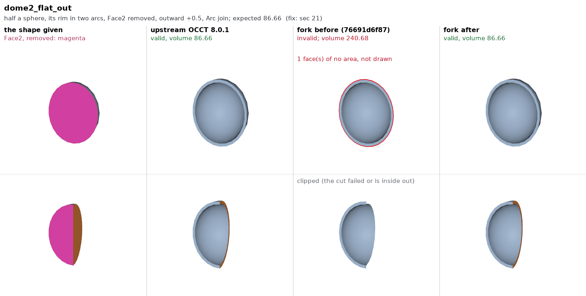

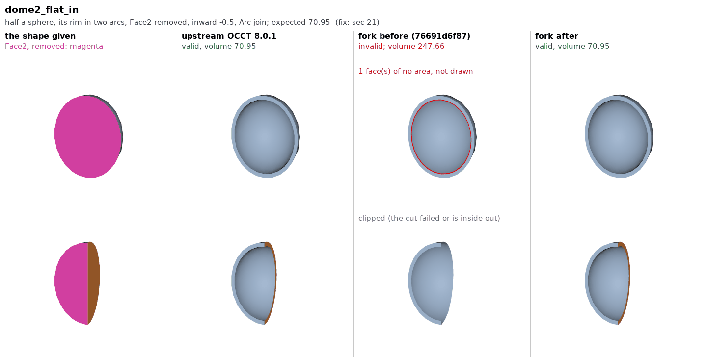

**The search had no end** (`378f5f83cd`, `BRepAlgo_Loop`). `FindAllLoops`
tries every path through the edges at every vertex. On the half ball's two
domes with the disc removed inward, Intersection join, it ran for minutes
with nothing to show. It has a million steps to spend; a search that spends
them all has no answer, and the thickness is refused where it hung.

**Two arcs replaced by one** (`56cc10d861`, `BRepOffset_Tool::ExtentFace`).
With the dome's sphere removed and the Arc join, the flat's offset has its
rim replaced by the section of its plane with the sphere: a whole circle,
trimmed between the two new vertices from the lesser parameter to the
greater. Two vertices on a whole turn bound two arcs, and both arcs of the
rim took the same one: a flat of no area, and an invalid solid for 39.1390.
The arc taken is the one whose middle is nearest the middle of the edge it
replaces.

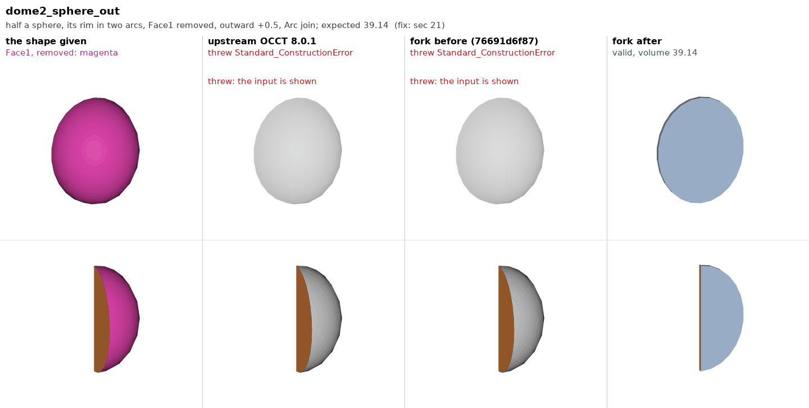

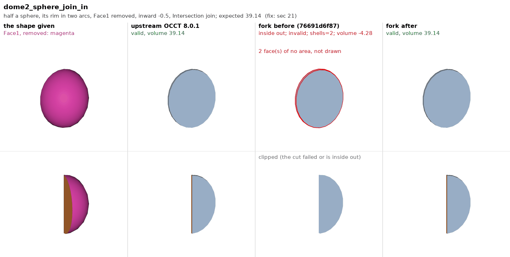

**A circle cut at the point it starts on** (`9f202c09e8`,
`BRepOffset_Tool::Inter2d`). The same dome with its flat in two halves:
each half's rim, replaced by the section circle, has to be cut by the line
between the halves. `Inter2d` looks first for an end of one curve on the
other and stops at the first it finds; a closed curve has its end wherever
it was started, the circle started on the line, and that one point was
given for both ends of the arc. Closed curves go straight to the
intersection, and every crossing comes back -- the first and the last along
the edge were kept, which on a closed curve are one point.

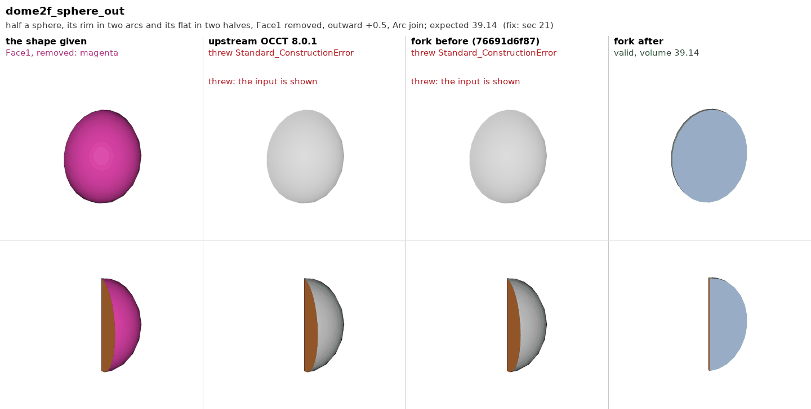

**Two new edges on one curve** (`faabdf98f7`,
`BRepOffset_Tool::ExtentFace`). What sec 20 left diagnosed: the vertex
between two new edges that lie on one circle or one line is not where they
cross, for they do not. It is put where the old vertex lies nearest the
curve. The refined half ball's sphere removed with the Arc join, refused
before, gives 39.1390 both ways.

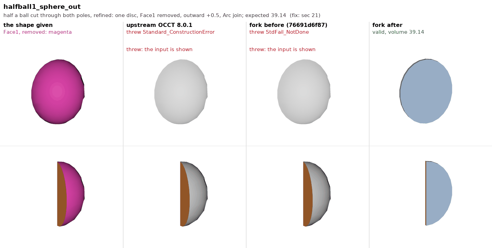

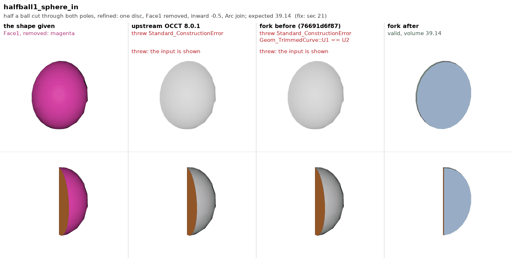

**The half ball with one disc is that dome** (`424614ea24`,
`BRepOffset_MakeOffset::MakeThickSolidOfSplit`). Half a ball as a refine or
a cut leaves it -- `makeSphere(5, .., -90, 90, 180).removeSplitter()`, or a
ball cut by a box through its poles -- has one disc for its flat and its
sphere from pole to pole on half a turn. Cut along the equator as sec
20 has it, the two domes meet the disc's plane in a rim of four arcs:
with the disc removed and the Intersection join the loops found no end
(above), the sphere removed outward with that join was refused, and inward,
left whole, it gave 39.1401 for 39.1390.

Such a face -- exactly half a turn, one face across its whole outline -- is
no longer cut. It is put on the same sphere with its axis through its own
middle (`TurnHalfSphereOntoMiddle`): a whole turn with a seam and one pole
inside, its rim the two arcs it had, which is the dome above. The arcs are
the shape's own edges and take a line on the turned sphere's equator as a
second pcurve, a cache; the seam and the pole's edge are new, and stand for
no edge of the shape, as the equator of sec 20 does not. The seam runs
from 2 pi, as a primitive's does: from 0, the piece of it stretched below
the rim has a negative parameter, and its crossing with the wall's far edge
was not found. The thick solid is made of a solid with that face in place
of the one given, by an object of its own, as in sec 20; the face is
turned whatever is done with it. 86.6556, 70.9476 and 39.1390, with either
join, plain, under a location and turned in space.

A cut hands over a compound of one solid, which this function did not look
at; it is taken for its solid.

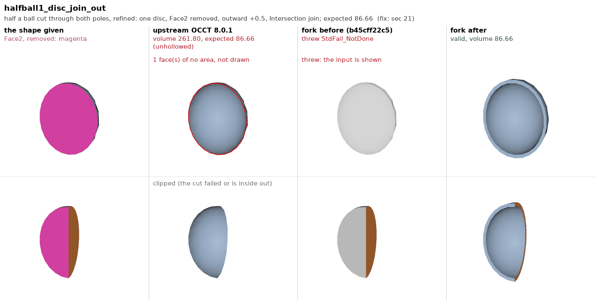

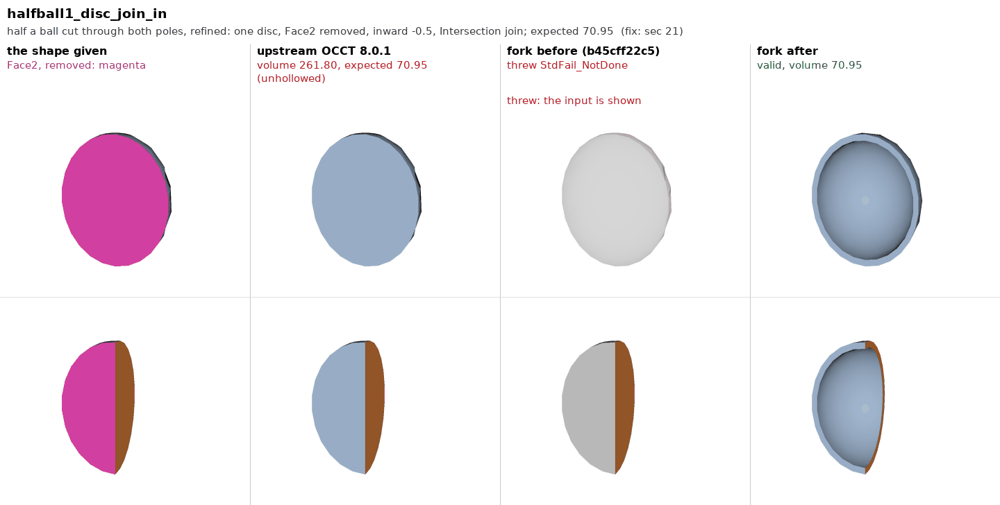

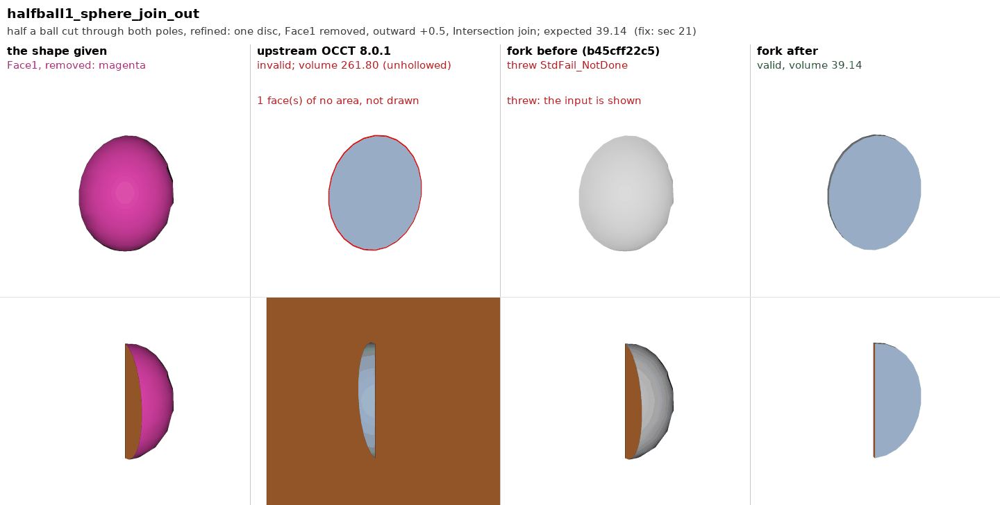

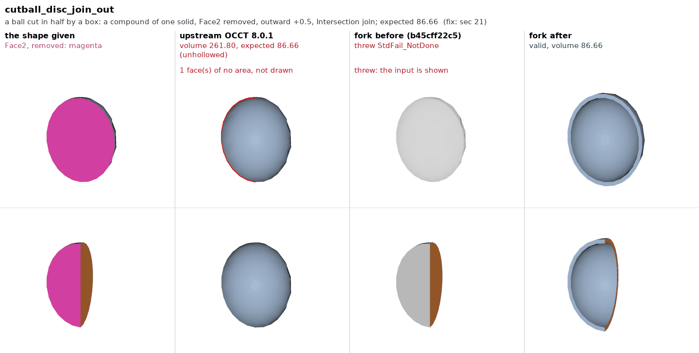

**The sphere in two faces is joined first** (`7c4a0e5eda`,
`MakeThickSolidOfSplit`). Sec 20 found that each of its two cuts fails
the other way round, and that a half ball which comes with its sphere in
two faces has the cut it came with: in two lunes, a flat half removed with
the Intersection join, refused outward and a valid solid of 182.21 for
89.03 inward; in two domes, both removed, refused or invalid. Faces of one
sphere that meet along an edge and have one thing done with them -- both
removed, or both staying with one offset -- are joined into one face
before anything else (`ShapeUpgrade_UnifySameDomain`, with every edge kept
but the joint and the pieces of the outline the joint had cut). The thick
solid is made of the joined solid by an object of its own, which cuts it,
or turns it, the way that suits what is done with it.

Where the joined solid gives no valid answer, the solid is taken as it
came: two lunes removed outward with the Intersection join, right as
given, came out unorientable once joined -- the flats of the joined solid,
which the unifying rebuilt, do not take the meridian cut as the primitive's
do. Not chased.

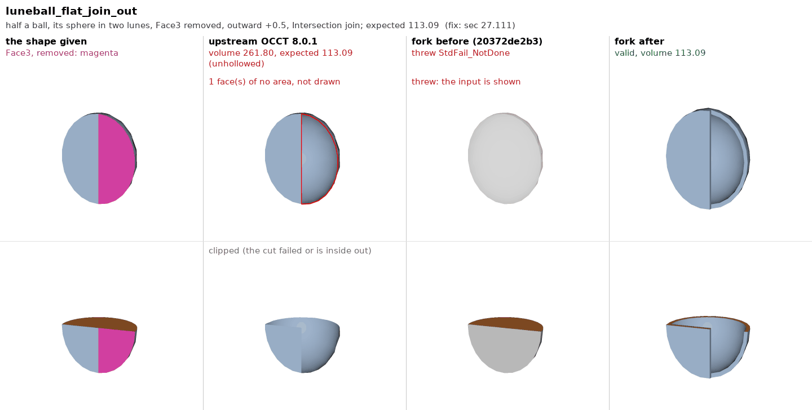

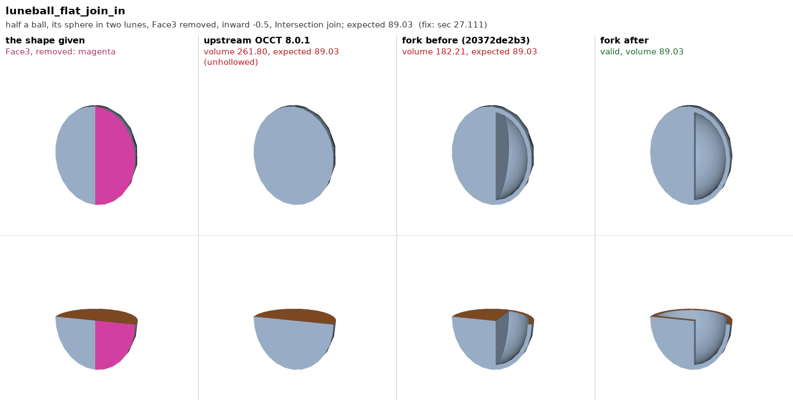

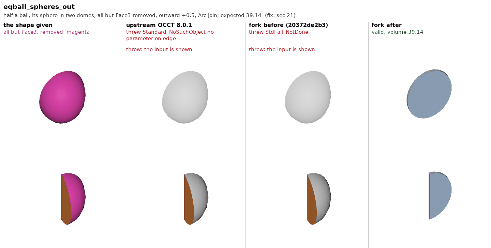

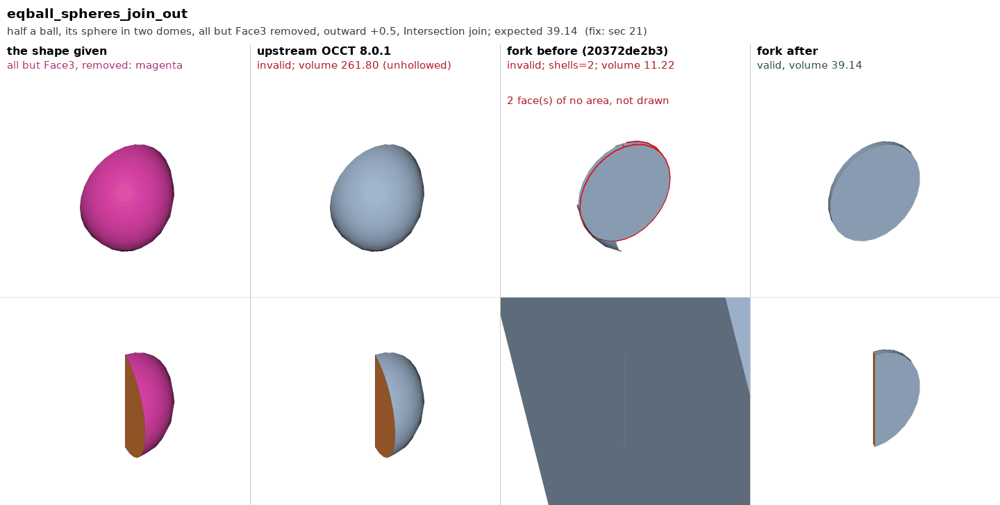

**Known broken**, each marked in the suite with the volume it should give
(8 cases):

- A ball wedge from pole to pole on more than half a turn, its sphere
  removed outward (270 and 240 degrees, both joins: three lunes, refused);
  on 240 degrees inward with the Arc join, a valid solid of 40.4447 for
  39.9613; on 150 degrees outward with the Arc join, refused. Inward with
  the Intersection join the 270 and 240 wedges are right now (41.6307 and
  40.5784), where sec 20 found 298.45.
- The dome with its rim in two arcs and its flat in two halves, one half
  removed with the Intersection join (113.0909, 89.0272): the dome has to
  grow below its rim beside the wall that closes the tangent edge between
  the halves, and the wall comes out outside its band -- refused.

**Found beside these, not fixed, and not in the suite.** The half ball with
its sphere in two domes, one dome alone removed outward with the Arc join, comes
back as a valid solid of a volume of -1.3e100; the other three ways it is
refused, as is one lune of two removed, every way. No hand value was worked
for them.

A ball wedge whose sphere is given on an axis through the middle of the
face -- a ball made on that axis, cut by the wedge that is missing, 270 or
240 degrees left -- has a seam and a pole inside its face and a rim that is
no circle of latitude. Its sphere removed is wrong all eight ways tried on
each: invalid or refused, and inward with the Intersection join a valid
solid of 264.29 for 41.6307 (263.24 for 40.5784 on 240 degrees). It is what
turning the wedges of the list above onto their middle would make of them,
so that is no way to answer those as it stands.

## The captured models

The suite's four document cases (realthunder/OCCT#1-#4: an elliptic pad, a
loft, a pad, a revolution) are older fixes, made to the chain on 7.7.2 and
ported. Upstream 8.0.1 gets the three thickness models right too, so they
have no before-and-after here.

## Making the pictures

`tests/thickness/pictures/make_pictures.sh` does it all; about
ten minutes on the dev box, most of it building libraries:

1. `mkold.sh` builds scratch `TKBool`/`TKOffset` libraries -- upstream's
   eleven chain files at `91be8c4c71`, and the fork's sources at each
   stage's "before" commit (`STAGES` in `cases.py`) -- from the build tree's
   own compile commands (`oldbuild.py`).
2. `compute.py` runs every case of `cases.py` under `FreeCADCmd`, once per
   library set (preloaded with `LD_PRELOAD`; the FreeCAD modules carry an
   RPATH, so `LD_LIBRARY_PATH` does not reach them) and once on the fork as
   built, keeping each result as a `.brep` and a `results.json`.
3. `mkjobs.py` and `render.py` draw the panels in the FreeCAD GUI under
   `xvfb-run` -- the shape given with its removed faces in magenta, then
   each result -- and `compose.py` lays them out (Pillow, from the FreeCAD
   conda env).

A case added to `cases.py` with its stage gets its picture on the next run.
`mkpage.py OUTDIR` then builds the "Thickness Before and After" page from
them -- `index.html` and `img/`, one section per fix with its title from the
heading here and its summary from `SUMMARY` in the script, which a new
section adds to -- and the page is published again after every fix
(`THICK_WORK`, `SUITE` and `SWEEP` set give it the counts).
A case listed in `INPUT` is pictured for what the call leaves of its input:
the panels show the input after the thickness, judged against its own volume.
A case in `REFUSED` is right when the call throws; its panels show the input.
The cases run unfrozen, as the suite does. The "after" column is the fork
as installed, and the other two run with the installed `TKTopAlgo`: a fault
that lies there (sec 20's seam tolerance) shows in no column.
The renderer turns the transaction log off; the pictures need no history.
(While drawing, the log's worker once crashed writing a shape the viewer
was meshing: FreeCAD's docs/TransactionLog.md sec 27.97, fixed in sec 27.98.)
